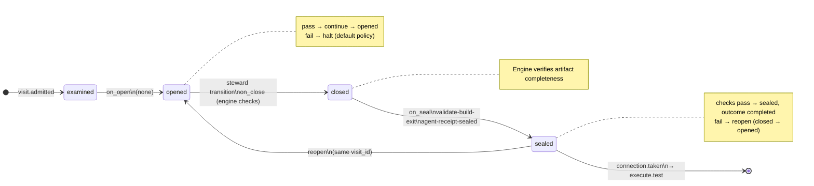

# Node: `execute.build`

Status: **generated**

Flow: `implementation` in [factory-flow.yaml](../../../flows/factory-flow.yaml).

Build graph work items — builders commit via CLI

## Lifecycle

Admission is an event (`visit.admitted`), not a lifecycle state. See [visit lifecycle](../concepts/visits-lifecycle.md).

| Hook | Authored checks | Engine-implicit |
|---|---|---|
| `on_examine` | `execution-graph-set`, `feature-branch-set` | — |
| `on_open` | *(empty)* | — |
| `on_close` | *(empty)* | Declared artifact completeness |
| `on_seal` | `validate-build-exit`, `agent-receipt-sealed` | — |

## References

- **Instructions:** [registry:steps/execute-build.md](../../../steps/execute-build.md)
- **Schemas:**
  - [registry:schemas/agent-receipt.schema.json](../../../schemas/agent-receipt.schema.json)
- **Catalog index:** [execute.build.index.yaml](../../../catalog/nodes/execute.build.index.yaml)

## Artifacts

_No work artifacts declared._

## Receipts

| Schema | Role |
|---|---|
| [registry:schemas/agent-receipt.schema.json](../../../schemas/agent-receipt.schema.json) | Worker completion evidence (`agent-receipt-sealed` on `on_seal`) |

## Worker

_No worker bound._

## Connections

### Incoming

- `execute.plan-to-execute.build`: [execute.plan](execute.plan.md) → **execute.build**
- `execute.repair.limit.gate-to-execute.build-proceed`: [execute.repair.limit.gate](execute.repair.limit.gate.md) → **execute.build**, loop: `repair`

### Outgoing

- `execute.build-to-execute.test`: **execute.build** → [execute.test](execute.test.md) (`on.outcomes: ['completed']`)

## Concepts

- **Lifecycle:** [Visit lifecycle](../concepts/visits-lifecycle.md)
- **Connections:** [Graph and routing](../concepts/graph.md)
- **Permissions:** [Reads and allow](../concepts/capabilities.md)
- **Receipts:** [Receipts vs artifacts](../concepts/artifacts.md)
- **Checks:** [Control plane](../concepts/control-plane.md)

## Node summary

| Field | Value |
|---|---|
| **id** | `execute.build` |
| **kind** | `step` |
| **title** | Build graph work items — builders commit via CLI |
