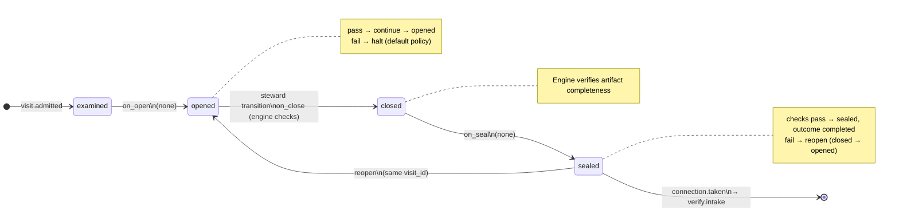

# Node: `execute.commit.gate`

Status: **generated**

Flow: `implementation` in [factory-flow.yaml](../../../flows/factory-flow.yaml).

Execute commit recorded

## Lifecycle

Admission is an event (`visit.admitted`), not a lifecycle state. See [visit lifecycle](../concepts/visits-lifecycle.md).

| Hook | Authored checks | Engine-implicit |
|---|---|---|
| `on_examine` | `reverify-within-limit`, `prior-execute-commit-sealed`, `final-commit-recorded` | — |
| `on_open` | *(empty)* | — |
| `on_close` | *(empty)* | Declared artifact completeness |
| `on_seal` | *(empty)* | — |

## References

- **Gate prompt:** `Machine gate. Final execute.commit must record a commit on the feature branch (empty commit allowed).`
- **Catalog index:** [execute.commit.gate.index.yaml](../../../catalog/nodes/execute.commit.gate.index.yaml)

## Artifacts

_No work artifacts declared._

## Receipts

_No receipts declared._

## Connections

### Incoming

- `execute.commit-to-execute.commit.gate`: [execute.commit](execute.commit.md) → **execute.commit.gate**

### Outgoing

- `execute.commit.gate-to-verify.intake-pass`: **execute.commit.gate** → [verify.intake](verify.intake.md) (`on.outcomes: ['completed']`)

## Concepts

- **Lifecycle:** [Visit lifecycle](../concepts/visits-lifecycle.md)
- **Connections:** [Graph and routing](../concepts/graph.md)
- **Checks:** [Control plane](../concepts/control-plane.md)
- **Gate decisions:** [Gate nodes](../concepts/graph.md)

## Node summary

| Field | Value |
|---|---|
| **id** | `execute.commit.gate` |
| **kind** | `gate` |
| **title** | Execute commit recorded |
