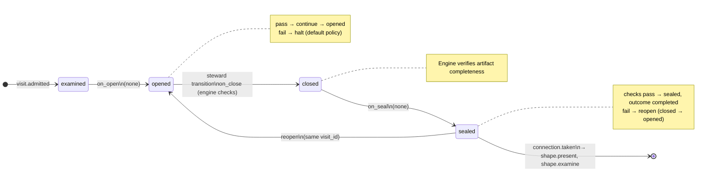

# Node: `shape.examine.gate`

Status: **draft**

Flow: `implementation` in [factory-flow.yaml](../../../flows/factory-flow.yaml).

User gate after shape.examine when open clarifying questions remain. The steward presents examination state from reads (open questions, assumptions, draft AC) in a two-turn gate pattern, then records accept-or-reject via gate decide.


## Contents

- [Lifecycle](#lifecycle)
- [Sequence](#sequence)
- [Ledger excerpt](#ledger-excerpt)
- [References](#references)
- [Permissions](#permissions)
- [Artifacts](#artifacts)
- [Receipts](#receipts)
- [Worker](#worker)
- [Connections](#connections)
- [Check catalog](#check-catalog)
- [Gaps](#gaps)

---

## Lifecycle

Admission is an event (`visit.admitted`), not a lifecycle state. See [visit lifecycle](../concepts/visits-lifecycle.md).



| Hook | Authored checks | Engine-implicit |
|---|---|---|
| `on_examine` | `prior-examine-sealed` | — |
| `on_open` | *(empty)* | — |
| `on_close` | *(empty)* | Declared artifact completeness |
| `on_seal` | *(empty)* | — |

## Sequence

```mermaid
sequenceDiagram
  autonumber
  participant U as User
  participant S as Steward (shape parent)
  participant CLI as foundry CLI
  participant E as Engine

  S->>CLI: run context --markdown
  CLI-->>S: steward packet (reads.state + options + inlined instructions)

  S->>U: Turn 1 — open questions, assumptions, draft AC; STOP
  U-->>S: accept or reject
  S->>CLI: gate decide --decision accept|reject
  CLI->>E: gate.resolved, close, seal, route by on.decisions
  CLI-->>S: sealed, next visit shape.present or shape.examine
```

## References

- **Instructions:** [registry:nodes/shape.examine.gate/instructions.md](../../../nodes/shape.examine.gate/instructions.md)
- **Gate prompt:** `Examination still has open clarifying questions. Reject to continue questioning, or accept to proceed to present the plan with the remaining assumptions visible.`
- **Catalog index:** [shape.examine.gate.index.yaml](../../../catalog/nodes/shape.examine.gate.index.yaml)

## Ownership

| Role | Owner |
|---|---|
| **worker** | none |
| **steward** | shape parent agent |
| **engine** | on_examine prior-examine-sealed, gate.presented at admission, connection routing by decision |

## Permissions

### `reads`

| Namespace | Paths |
|---|---|
| `state` | `draft_ac`, `clarifying_questions`, `open_clarifying_questions_count`, `assumptions`, `examination_decisions` |

### `allow`

| Namespace | Grant | Purpose |
|---|---|---|
| — | *(none declared)* | — |

### Engine-only surfaces

| Surface | Trigger | Maps to |
|---|---|---|
| `foundry run create` | New run bootstrap | Admit entry visit, run `on_open` |
| `prior-examine-sealed` | `on_examine` hook | `on_examine` check `prior-examine-sealed` |
| Artifact completeness | `close_request` before `closed` | Every `produces.artifacts` declaration satisfied |
| Connection selection | After `visit.sealed` | Routes to `shape.present`, `shape.examine` |

## Artifacts

_No work artifacts declared._

## Receipts

_No receipts declared._

## Connections

### Incoming

- `shape.examine-to-shape.examine.gate`: [shape.examine](shape.examine.md) → **shape.examine.gate**

### Outgoing

- `shape.examine.gate-to-shape.present-present`: **shape.examine.gate** → [shape.present](shape.present.md) (`on.outcomes: ['completed']`)
- `shape.examine.gate-to-shape.examine-continue`: **shape.examine.gate** → [shape.examine](shape.examine.md) (`on.outcomes: ['completed']`)

## Check catalog

### `prior-examine-sealed`

| Property | Value |
|---|---|
| **Body** | `when` |
| **Expression** | `history.last('visit.sealed', node_id='shape.examine') != null && history.last('visit.sealed', node_id='shape.examine').outcome == 'completed'` |
| **Hook** | `on_examine` |

## Concepts

- **Lifecycle:** [Visit lifecycle](../concepts/visits-lifecycle.md)
- **Connections:** [Graph and routing](../concepts/graph.md)
- **Permissions:** [Reads and allow](../concepts/capabilities.md)
- **Checks:** [Control plane](../concepts/control-plane.md)
- **Gate decisions:** [Gate nodes](../concepts/graph.md)

## Node summary

| Field | Value |
|---|---|
| **id** | `shape.examine.gate` |
| **kind** | `gate` |
| **title** | Open questions remain — present anyway or continue examination |
