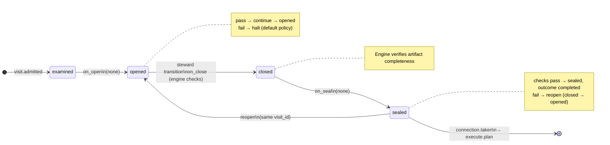

# Node: `execute.branch`

Status: **generated**

Flow: `implementation` in [factory-flow.yaml](../../../../../flows/factory-flow.yaml).

Create the feature branch

## Lifecycle

Admission is an event (`visit.admitted`), not a lifecycle state. See [visit lifecycle](../concepts/visits-lifecycle.md).

| Hook | Authored checks | Engine-implicit |
|---|---|---|
| `on_examine` | `prior-execute-intake-sealed` | — |
| `on_open` | *(empty)* | — |
| `on_close` | *(empty)* | Declared artifact completeness |
| `on_seal` | *(empty)* | — |

## References

- **Instructions:** [registry:steps/execute-branch.md](../../../../../steps/execute-branch.md)
- **Catalog index:** [execute.branch.index.yaml](../../../../../catalog/nodes/execute.branch.index.yaml)

## Artifacts

_No work artifacts declared._

## Receipts

_No receipts declared._

## Worker

_No worker bound._

## Connections

### Incoming

- `execute.intake.gate-to-execute.branch-pass`: [execute.intake.gate](execute.intake.gate.md) → **execute.branch**

### Outgoing

- `execute.branch-to-execute.plan`: **execute.branch** → [execute.plan](execute.plan.md) (`on.outcomes: ['completed']`)

## Concepts

- **Lifecycle:** [Visit lifecycle](../concepts/visits-lifecycle.md)
- **Connections:** [Graph and routing](../concepts/graph.md)
- **Permissions:** [Reads and allow](../concepts/capabilities.md)
- **Checks:** [Control plane](../concepts/control-plane.md)

## Node summary

| Field | Value |
|---|---|
| **id** | `execute.branch` |
| **kind** | `step` |
| **title** | Create the feature branch |
