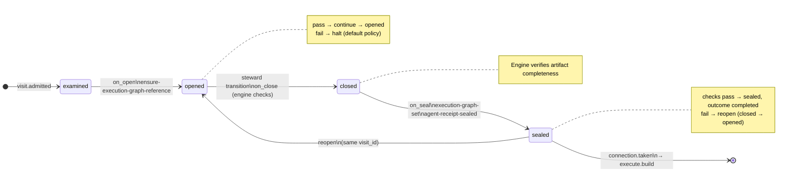
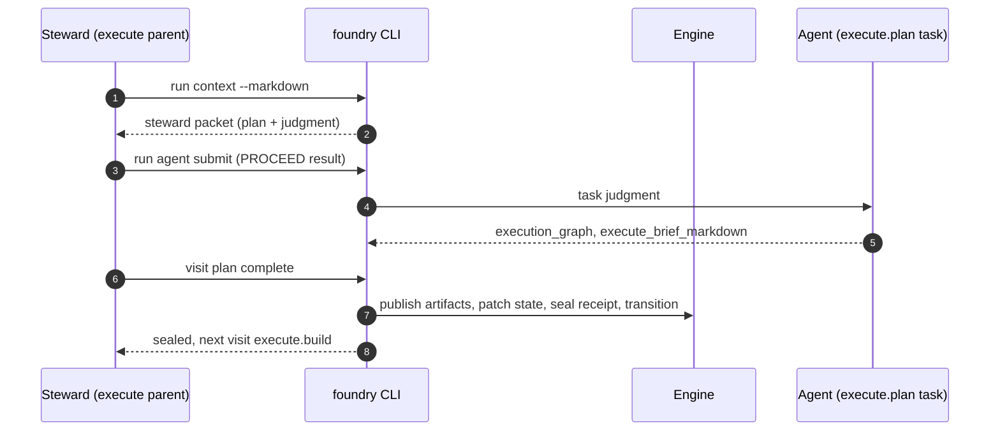

# Node: `execute.plan`

Status: **implemented**

Flow: `implementation` in [factory-flow.yaml](../../../../../flows/factory-flow.yaml).

Plan step. Steward runs the execute.plan task, submits structured judgment, and calls visit plan complete. Engine publishes execution graph and execute brief, patches graph state, seals agent receipt, and routes to execute.build.

## Contents

- [Lifecycle](#lifecycle)
- [Sequence](#sequence)
- [Ledger excerpt](#ledger-excerpt)
- [References](#references)
- [Permissions](#permissions)
- [Artifacts](#artifacts)
- [Receipts](#receipts)
- [Worker](#worker)
- [Connections](#connections)
- [Check catalog](#check-catalog)
- [Gaps](#gaps)

---

## Lifecycle

Admission is an event (`visit.admitted`), not a lifecycle state. See [visit lifecycle](../concepts/visits-lifecycle.md).

| Hook | Authored checks | Engine-implicit |
|---|---|---|
| `on_examine` | `feature-branch-set` | — |
| `on_open` | `ensure-execution-graph-reference` | — |
| `on_close` | *(empty)* | Declared artifact completeness |
| `on_seal` | `execution-graph-set`, `agent-receipt-sealed` | — |

## Sequence

## References

- **Instructions:** [registry:nodes/execute.plan/judgment.md](../../../../../nodes/execute.plan/judgment.md)
- **Schemas:**
  - [registry:schemas/agent-receipt.schema.json](../../../../../schemas/agent-receipt.schema.json)
- **Catalog index:** [execute.plan.index.yaml](../../../../../catalog/nodes/execute.plan.index.yaml)

## Ownership

| Role | Owner |
|---|---|
| **task** | execute.plan |
| **steward** | execute parent agent |
| **engine** | on_examine feature-branch-set, visit plan complete, on_seal execution-graph-set and agent-receipt checks |

## Permissions

### `reads`

| Namespace | Paths |
|---|---|
| `state` | `approved_ac`, `approved_ac_digest`, `feature_branch`, `execution_graph_id` |
| `artifacts` | `shape.record.plan` |

### `allow`

| Namespace | Grant | Purpose |
|---|---|---|
| `cli` | `run.agent.submit`, `visit.plan.complete` | Steward CLI capabilities |

### Steward CLI capabilities

| Capability |
|---|
| `run.agent.submit` |
| `visit.plan.complete` |

### Engine-only surfaces

| Surface | Trigger | Maps to |
|---|---|---|
| `foundry run create` | New run bootstrap | Admit entry visit, run `on_open` |
| `feature-branch-set` | `on_examine` hook | `on_examine` check `feature-branch-set` |
| `ensure-execution-graph-reference` | `on_open` hook | `on_open` check `ensure-execution-graph-reference` |
| `execution-graph-set` | `on_seal` hook | `on_seal` check `execution-graph-set` |
| `agent-receipt-sealed` | `on_seal` hook | `on_seal` check `agent-receipt-sealed` |
| Artifact completeness | `close_request` before `closed` | Every `produces.artifacts` declaration satisfied |
| Connection selection | After `visit.sealed` | Routes to `execute.build` |

## Artifacts

### Work artifact: `execution-graph`

| Field | Value |
|---|---|
| **Logical id** | `execution-graph` |
| **Qualified ref** | `execute.plan.execution-graph` |
| **Kind** | `document` |
| **URI** | `run:artifacts/{visit_id}/execution-graph.json` |
| **Media type** | `application/json` |

### Work artifact: `execute-brief`

| Field | Value |
|---|---|
| **Logical id** | `execute-brief` |
| **Qualified ref** | `execute.plan.execute-brief` |
| **Kind** | `document` |
| **URI** | `run:artifacts/{visit_id}/execute-brief.md` |
| **Media type** | `text/markdown` |

#### Downstream consumption

- [execute.build](execute.build.md) reads `execute.plan.execution-graph` via `nearest_sealed_ancestor`
- [execute.commit](execute.commit.md) reads `execute.plan.execution-graph` via `nearest_sealed_ancestor`
- [execute.test](execute.test.md) reads `execute.plan.execution-graph` via `nearest_sealed_ancestor`

## Receipts

| Schema | Role |
|---|---|
| [registry:schemas/agent-receipt.schema.json](../../../../../schemas/agent-receipt.schema.json) | Worker completion evidence (`agent-receipt-sealed` on `on_seal`) |

## Worker

_No worker bound._

## Connections

### Incoming

- `execute.branch-to-execute.plan`: [execute.branch](execute.branch.md) → **execute.plan**
- `verify.acceptance.gate-to-execute.plan-replan`: [verify.acceptance.gate](verify.acceptance.gate.md) → **execute.plan**, loop: `reexecute`

### Outgoing

- `execute.plan-to-execute.build`: **execute.plan** → [execute.build](execute.build.md) (`on.outcomes: ['completed']`)

## Check catalog

### `feature-branch-set`

| Property | Value |
|---|---|
| **Body** | `when` |
| **Expression** | `state.feature_branch != null` |
| **Hook** | `on_examine` |

### `ensure-execution-graph-reference`

| Property | Value |
|---|---|
| **Body** | `command: ensure_execution_graph_reference` |
| **Hook** | `on_open` |

### `execution-graph-set`

| Property | Value |
|---|---|
| **Body** | `when` |
| **Expression** | `state.execution_graph_id != null` |
| **Hook** | `on_seal` |

### `agent-receipt-sealed`

| Property | Value |
|---|---|
| **Body** | `when` |
| **Expression** | `history.count('receipt.linked', visit_id=visit.id, schema='registry:schemas/agent-receipt.schema.json') >= 1` |
| **Hook** | `on_seal` |

## Concepts

- **Lifecycle:** [Visit lifecycle](../concepts/visits-lifecycle.md)
- **Connections:** [Graph and routing](../concepts/graph.md)
- **Permissions:** [Reads and allow](../concepts/capabilities.md)
- **Artifacts:** [Artifact publication](../concepts/artifacts.md)
- **Receipts:** [Receipts vs artifacts](../concepts/artifacts.md)
- **Checks:** [Control plane](../concepts/control-plane.md)

## Node summary

| Field | Value |
|---|---|
| **id** | `execute.plan` |
| **kind** | `step` |
| **title** | Execution graph and phase-scoped internal brief |
