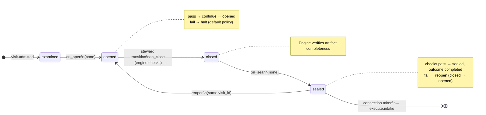
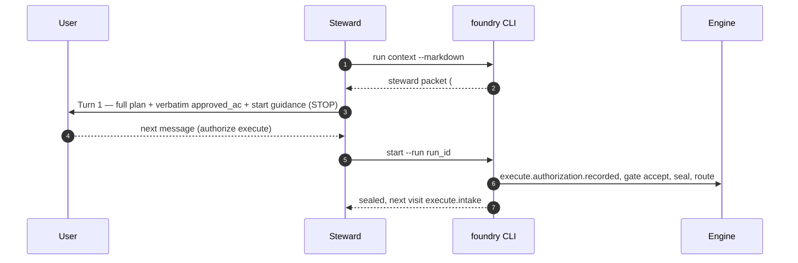

# Node: `execute.start`

Status: **ok**

Flow: `implementation` in [factory-flow.yaml](../../../../../flows/factory-flow.yaml).

User gate after shape.record.gate accept. Frozen plan and approved_ac are shown; explicit Execute authorization via foundry start (not gate decide).

## Contents

- [Lifecycle](#lifecycle)
- [Sequence](#sequence)
- [Ledger excerpt](#ledger-excerpt)
- [References](#references)
- [Permissions](#permissions)
- [Artifacts](#artifacts)
- [Receipts](#receipts)
- [Worker](#worker)
- [Connections](#connections)
- [Check catalog](#check-catalog)
- [Gaps](#gaps)

---

## Lifecycle

Admission is an event (`visit.admitted`), not a lifecycle state. See [visit lifecycle](../concepts/visits-lifecycle.md).

| Hook | Authored checks | Engine-implicit |
|---|---|---|
| `on_examine` | `prior-shape-record-sealed`, `approved-ac-recorded` | — |
| `on_open` | *(empty)* | — |
| `on_close` | *(empty)* | Declared artifact completeness |
| `on_seal` | *(empty)* | — |

## Sequence

## References

- **Instructions:** [registry:nodes/execute.start/instructions.md](../../../../../nodes/execute.start/instructions.md)
- **Gate prompt:** `Frozen plan recorded. Run `foundry start` on this run to authorize Execute and advance to execute.intake on your feature branch.`
- **Catalog index:** [execute.start.index.yaml](../../../../../catalog/nodes/execute.start.index.yaml)

## Ownership

| Role | Owner |
|---|---|
| **worker** | none |
| **steward** | execute parent / craft steward |
| **engine** | on_examine prior-shape-record-sealed and approved-ac-recorded, decision wait, execute_start_authorization, route to execute.intake |

## Permissions

### `reads`

| Namespace | Paths |
|---|---|
| `state` | `approved_ac`, `plan_path` |
| `artifacts` | `shape.record.plan` |

### `allow`

| Namespace | Grant | Purpose |
|---|---|---|
| — | *(none declared)* | — |

### Engine-only surfaces

| Surface | Trigger | Maps to |
|---|---|---|
| `foundry run create` | New run bootstrap | Admit entry visit, run `on_open` |
| `prior-shape-record-sealed` | `on_examine` hook | `on_examine` check `prior-shape-record-sealed` |
| `approved-ac-recorded` | `on_examine` hook | `on_examine` check `approved-ac-recorded` |
| Artifact completeness | `close_request` before `closed` | Every `produces.artifacts` declaration satisfied |
| Connection selection | After `visit.sealed` | Routes to `execute.intake` |

## Artifacts

_No work artifacts declared._

## Receipts

_No receipts declared._

## Connections

### Incoming

- `shape.record.gate-to-execute.start-record`: [shape.record.gate](shape.record.gate.md) → **execute.start**

### Outgoing

- `execute.start-to-execute.intake-start`: **execute.start** → [execute.intake](execute.intake.md) (`on.outcomes: ['completed']`)

## Check catalog

### `prior-shape-record-sealed`

| Property | Value |
|---|---|
| **Body** | `when` |
| **Expression** | `history.last('visit.sealed', node_id='shape.record') != null && history.last('visit.sealed', node_id='shape.record').outcome == 'completed'` |
| **Hook** | `on_examine` |

### `approved-ac-recorded`

| Property | Value |
|---|---|
| **Body** | `when` |
| **Expression** | `state.approved_ac_version >= 1` |
| **Hook** | `on_examine` |

## Concepts

- **Lifecycle:** [Visit lifecycle](../concepts/visits-lifecycle.md)
- **Connections:** [Graph and routing](../concepts/graph.md)
- **Permissions:** [Reads and allow](../concepts/capabilities.md)
- **Checks:** [Control plane](../concepts/control-plane.md)
- **Gate decisions:** [Gate nodes](../concepts/graph.md)

## Node summary

| Field | Value |
|---|---|
| **id** | `execute.start` |
| **kind** | `gate` |
| **title** | Start execute phase |
