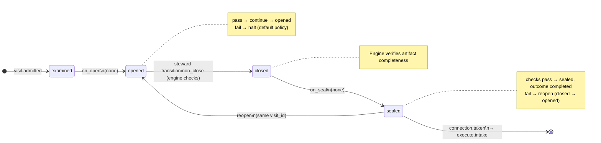

# Node: `execute.start`

Status: **generated**

Flow: `implementation` in [factory-flow.yaml](../../../../../flows/factory-flow.yaml).

Start execute phase

## Lifecycle

Admission is an event (`visit.admitted`), not a lifecycle state. See [visit lifecycle](../../../../../cli/docs/concepts/visits-lifecycle.md).

| Hook | Authored checks | Engine-implicit |
|---|---|---|
| `on_examine` | `approved-ac-recorded` | — |
| `on_open` | *(empty)* | — |
| `on_close` | *(empty)* | Declared artifact completeness |
| `on_seal` | *(empty)* | — |

## References

- **Gate prompt:** `Frozen plan recorded. Run `foundry start` on this run to authorize Execute and advance to execute.intake on your feature branch.`
- **Catalog index:** [execute.start.index.yaml](../../../../../catalog/nodes/execute.start.index.yaml)

## Artifacts

_No work artifacts declared._

## Receipts

_No receipts declared._

## Connections

### Incoming

- `shape.record.gate-to-execute.start-record`: [shape.record.gate](shape.record.gate.md) → **execute.start**

### Outgoing

- `execute.start-to-execute.intake-start`: **execute.start** → [execute.intake](execute.intake.md) (`on.outcomes: ['completed']`)

## Concepts

- **Lifecycle:** [Visit lifecycle](../../../../../cli/docs/concepts/visits-lifecycle.md)
- **Connections:** [Graph and routing](../../../../../cli/docs/concepts/graph.md)
- **Permissions:** [Reads and allow](../../../../../cli/docs/concepts/capabilities.md)
- **Checks:** [Control plane](../../../../../cli/docs/concepts/control-plane.md)
- **Gate decisions:** [Gate nodes](../../../../../cli/docs/concepts/graph.md)

## Node summary

| Field | Value |
|---|---|
| **id** | `execute.start` |
| **kind** | `gate` |
| **title** | Start execute phase |
