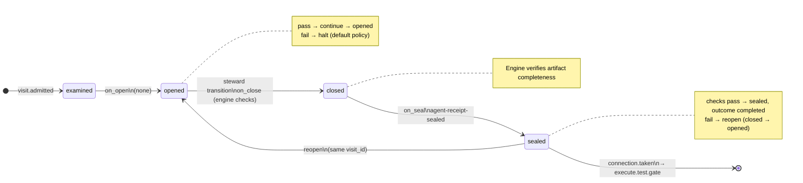
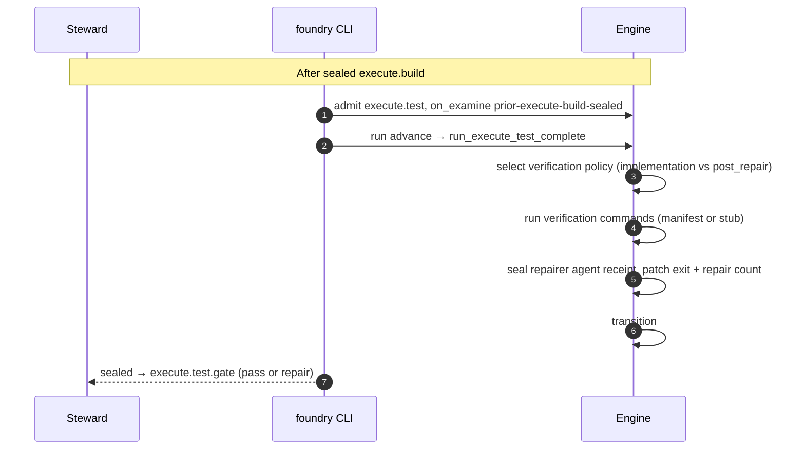

# Node: `execute.test`

Status: **ok**

Flow: `implementation` in [factory-flow.yaml](../../../../../flows/factory-flow.yaml).

Host-owned verification step after execute.build. Runs manifest or stub test commands, seals a repairer-labeled agent receipt (repair mode) with exit codes and verification policy, patches last_test_exit_code and repair_loop_count, and routes to execute.test.gate.

## Contents

- [Lifecycle](#lifecycle)
- [Sequence](#sequence)
- [Ledger excerpt](#ledger-excerpt)
- [References](#references)
- [Permissions](#permissions)
- [Artifacts](#artifacts)
- [Receipts](#receipts)
- [Worker](#worker)
- [Connections](#connections)
- [Check catalog](#check-catalog)
- [Gaps](#gaps)

---

## Lifecycle

Admission is an event (`visit.admitted`), not a lifecycle state. See [visit lifecycle](../concepts/visits-lifecycle.md).

| Hook | Authored checks | Engine-implicit |
|---|---|---|
| `on_examine` | `prior-execute-build-sealed` | — |
| `on_open` | *(empty)* | — |
| `on_close` | *(empty)* | Declared artifact completeness |
| `on_seal` | `agent-receipt-sealed` | — |

## Sequence

## References

- **Schemas:**
  - [registry:schemas/agent-receipt.schema.json](../../../../../schemas/agent-receipt.schema.json)
- **Catalog index:** [execute.test.index.yaml](../../../../../catalog/nodes/execute.test.index.yaml)

## Ownership

| Role | Owner |
|---|---|
| **steward** | execute parent / craft steward — use run advance only; do not bind repairer task on the default path |
| **engine** | on_examine prior-execute-build-sealed; run_execute_test_complete via run advance |

## Permissions

### `reads`

| Namespace | Paths |
|---|---|
| `config` | `verification` |
| `state` | `execution_graph_id`, `feature_branch` |
| `artifacts` | `execute.plan.execution-graph` |

### `allow`

| Namespace | Grant | Purpose |
|---|---|---|
| `state` | `last_test_exit_code`, `repair_loop_count`, `state.nodes.execute.test.*` | Domain fields |

### Engine-only surfaces

| Surface | Trigger | Maps to |
|---|---|---|
| `foundry run create` | New run bootstrap | Admit entry visit, run `on_open` |
| `prior-execute-build-sealed` | `on_examine` hook | `on_examine` check `prior-execute-build-sealed` |
| `agent-receipt-sealed` | `on_seal` hook | `on_seal` check `agent-receipt-sealed` |
| Artifact completeness | `close_request` before `closed` | Every `produces.artifacts` declaration satisfied |
| Connection selection | After `visit.sealed` | Routes to `execute.test.gate` |

## Artifacts

_No work artifacts declared._

## Receipts

| Schema | Role |
|---|---|
| [registry:schemas/agent-receipt.schema.json](../../../../../schemas/agent-receipt.schema.json) | Worker completion evidence (`agent-receipt-sealed` on `on_seal`) |

## Worker

_No worker bound._

## Connections

### Incoming

- `execute.build-to-execute.test`: [execute.build](execute.build.md) → **execute.test**

### Outgoing

- `execute.test-to-execute.test.gate`: **execute.test** → [execute.test.gate](execute.test.gate.md) (`on.outcomes: ['completed']`)

## Check catalog

### `prior-execute-build-sealed`

| Property | Value |
|---|---|
| **Body** | `when` |
| **Expression** | `history.last('visit.sealed', node_id='execute.build') != null && history.last('visit.sealed', node_id='execute.build').outcome == 'completed'` |
| **Hook** | `on_examine` |

### `agent-receipt-sealed`

| Property | Value |
|---|---|
| **Body** | `when` |
| **Expression** | `history.count('receipt.linked', visit_id=visit.id, schema='registry:schemas/agent-receipt.schema.json') >= 1` |
| **Hook** | `on_seal` |

## Gaps

- failed verification does not reopen execute.test; repair routing is execute.test.gate only

## Concepts

- **Lifecycle:** [Visit lifecycle](../concepts/visits-lifecycle.md)
- **Connections:** [Graph and routing](../concepts/graph.md)
- **Permissions:** [Reads and allow](../concepts/capabilities.md)
- **Receipts:** [Receipts vs artifacts](../concepts/artifacts.md)
- **Checks:** [Control plane](../concepts/control-plane.md)

## Node summary

| Field | Value |
|---|---|
| **id** | `execute.test` |
| **kind** | `step` |
| **title** | Run repo verification and repair loop |
