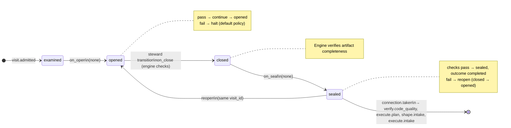

# Node: `verify.acceptance.gate`

Status: **generated**

Flow: `implementation` in [factory-flow.yaml](../../../../../flows/factory-flow.yaml).

Acceptance result routing

## Lifecycle

Admission is an event (`visit.admitted`), not a lifecycle state. See [visit lifecycle](../../../../../cli/docs/concepts/visits-lifecycle.md).

| Hook | Authored checks | Engine-implicit |
|---|---|---|
| `on_examine` | `prior-verify-acceptance-sealed` | — |
| `on_open` | *(empty)* | — |
| `on_close` | *(empty)* | Declared artifact completeness |
| `on_seal` | *(empty)* | — |

## References

- **Gate prompt:** `Route the verified acceptance result to quality review, replanning, reshaping, or execution rework.`
- **Catalog index:** [verify.acceptance.gate.index.yaml](../../../../../catalog/nodes/verify.acceptance.gate.index.yaml)

## Artifacts

_No work artifacts declared._

## Receipts

_No receipts declared._

## Connections

### Incoming

- `verify.acceptance-to-verify.acceptance.gate`: [verify.acceptance](verify.acceptance.md) → **verify.acceptance.gate**

### Outgoing

- `verify.acceptance.gate-to-verify.code_quality-pass`: **verify.acceptance.gate** → [verify.code_quality](verify.code_quality.md) (`on.outcomes: ['completed']`)
- `verify.acceptance.gate-to-execute.plan-replan`: **verify.acceptance.gate** → [execute.plan](execute.plan.md) (`on.outcomes: ['completed']`)
- `verify.acceptance.gate-to-shape.intake-reshape`: **verify.acceptance.gate** → [shape.intake](shape.intake.md) (`on.outcomes: ['completed']`)
- `verify.acceptance.gate-to-execute.intake-rework_execute`: **verify.acceptance.gate** → [execute.intake](execute.intake.md) (`on.outcomes: ['completed']`)

## Concepts

- **Lifecycle:** [Visit lifecycle](../../../../../cli/docs/concepts/visits-lifecycle.md)
- **Connections:** [Graph and routing](../../../../../cli/docs/concepts/graph.md)
- **Checks:** [Control plane](../../../../../cli/docs/concepts/control-plane.md)
- **Gate decisions:** [Gate nodes](../../../../../cli/docs/concepts/graph.md)

## Node summary

| Field | Value |
|---|---|
| **id** | `verify.acceptance.gate` |
| **kind** | `gate` |
| **title** | Acceptance result routing |
