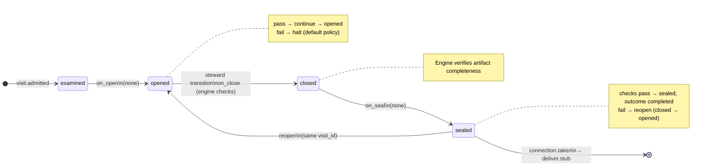

# Node: `verify.complete.gate`

Status: **generated**

Flow: `implementation` in [factory-flow.yaml](../../../../../flows/factory-flow.yaml).

Verify complete

## Lifecycle

Admission is an event (`visit.admitted`), not a lifecycle state. See [visit lifecycle](../../../../../cli/docs/concepts/visits-lifecycle.md).

| Hook | Authored checks | Engine-implicit |
|---|---|---|
| `on_examine` | *(empty)* | — |
| `on_open` | *(empty)* | — |
| `on_close` | *(empty)* | Declared artifact completeness |
| `on_seal` | *(empty)* | — |

## References

- **Instructions:** [registry:nodes/verify.complete.gate/instructions.md](../../../../../nodes/verify.complete.gate/instructions.md)
- **Gate prompt:** `User accepts the implementation. Accept to end the verify phase and proceed to deliver.`
- **Catalog index:** [verify.complete.gate.index.yaml](../../../../../catalog/nodes/verify.complete.gate.index.yaml)

## Artifacts

_No work artifacts declared._

## Receipts

_No receipts declared._

## Connections

### Incoming

- `verify.complete-to-verify.complete.gate`: [verify.complete](verify.complete.md) → **verify.complete.gate**

### Outgoing

- `verify.complete.gate-to-deliver.stub-complete`: **verify.complete.gate** → [deliver.stub](deliver.stub.md) (`on.outcomes: ['completed']`)

## Concepts

- **Lifecycle:** [Visit lifecycle](../../../../../cli/docs/concepts/visits-lifecycle.md)
- **Connections:** [Graph and routing](../../../../../cli/docs/concepts/graph.md)
- **Permissions:** [Reads and allow](../../../../../cli/docs/concepts/capabilities.md)
- **Gate decisions:** [Gate nodes](../../../../../cli/docs/concepts/graph.md)

## Node summary

| Field | Value |
|---|---|
| **id** | `verify.complete.gate` |
| **kind** | `gate` |
| **title** | Verify complete |
