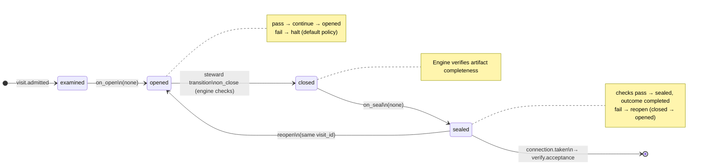

# Node: `verify.intake.gate`

Status: **generated**

Flow: `implementation` in [factory-flow.yaml](../../../../../flows/factory-flow.yaml).

Verify intake blocked check

## Lifecycle

Admission is an event (`visit.admitted`), not a lifecycle state. See [visit lifecycle](../../../../../cli/docs/concepts/visits-lifecycle.md).

| Hook | Authored checks | Engine-implicit |
|---|---|---|
| `on_examine` | `prior-verify-intake-sealed`, `intake-receipt-sealed` | — |
| `on_open` | *(empty)* | — |
| `on_close` | *(empty)* | Declared artifact completeness |
| `on_seal` | *(empty)* | — |

## References

- **Gate prompt:** `Machine gate. Intake receipt must exit 0 — CLI checks plus agent assessment when configured.`
- **Catalog index:** [verify.intake.gate.index.yaml](../../../../../catalog/nodes/verify.intake.gate.index.yaml)

## Artifacts

_No work artifacts declared._

## Receipts

_No receipts declared._

## Connections

### Incoming

- `verify.intake-to-verify.intake.gate`: [verify.intake](verify.intake.md) → **verify.intake.gate**

### Outgoing

- `verify.intake.gate-to-verify.acceptance-pass`: **verify.intake.gate** → [verify.acceptance](verify.acceptance.md) (`on.outcomes: ['completed']`)

## Concepts

- **Lifecycle:** [Visit lifecycle](../../../../../cli/docs/concepts/visits-lifecycle.md)
- **Connections:** [Graph and routing](../../../../../cli/docs/concepts/graph.md)
- **Checks:** [Control plane](../../../../../cli/docs/concepts/control-plane.md)
- **Gate decisions:** [Gate nodes](../../../../../cli/docs/concepts/graph.md)

## Node summary

| Field | Value |
|---|---|
| **id** | `verify.intake.gate` |
| **kind** | `gate` |
| **title** | Verify intake blocked check |
