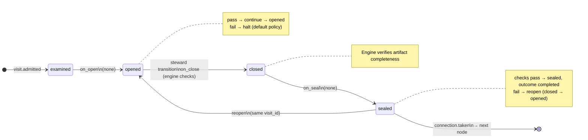

# Node: `deliver.stub`

Status: **generated**

Flow: `implementation` in [factory-flow.yaml](../../.cursor/foundry/flows/factory-flow.yaml).

Deliver phase stub (terminal)

## Lifecycle

Admission is an event (`visit.admitted`), not a lifecycle state. See [visit lifecycle](../concepts/visits-lifecycle.md).

| Hook | Authored checks | Engine-implicit |
|---|---|---|
| `on_examine` | *(empty)* | — |
| `on_open` | *(empty)* | — |
| `on_close` | *(empty)* | Declared artifact completeness |
| `on_seal` | *(empty)* | — |

## References

- **Instructions:** [registry:steps/deliver-stub.md](../../.cursor/foundry/steps/deliver-stub.md)
- **Catalog index:** [deliver.stub.index.yaml](../../.cursor/foundry/catalog/nodes/deliver.stub.index.yaml)

## Artifacts

_No work artifacts declared._

## Receipts

_No receipts declared._

## Worker

_No worker bound._

## Connections

### Incoming

- `verify.complete.gate-to-deliver.stub-complete`: [verify.complete.gate](verify.complete.gate.md) → **deliver.stub**

### Outgoing

_No outgoing connections._

## Concepts

- **Lifecycle:** [Visit lifecycle](../concepts/visits-lifecycle.md)
- **Connections:** [Graph and routing](../concepts/graph.md)

## Node summary

| Field | Value |
|---|---|
| **id** | `deliver.stub` |
| **kind** | `step` |
| **title** | Deliver phase stub (terminal) |
| **terminal** | Yes |
