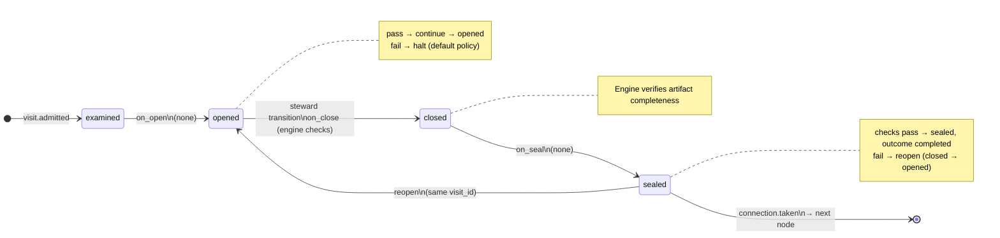

# Node: `deliver.stub`

Status: **ok**

Flow: `implementation` in [flows/implementation/registry.yaml](../../.cursor/foundry/flows/implementation/registry.yaml).

Terminal deliver-phase stub. Records deliver handoff state and ends the implementation flow.

## Contents

- [Lifecycle](#lifecycle)
- [Sequence](#sequence)
- [Ledger excerpt](#ledger-excerpt)
- [References](#references)
- [Permissions](#permissions)
- [Artifacts](#artifacts)
- [Receipts](#receipts)
- [Connections](#connections)
- [Check catalog](#check-catalog)
- [Gaps](#gaps)

---

## Lifecycle

Admission is an event (`visit.admitted`), not a lifecycle state. See [visit lifecycle](../concepts/visits-lifecycle.md).

| Hook | Authored checks | Engine-implicit |
|---|---|---|
| `on_examine` | *(empty)* | — |
| `on_open` | *(empty)* | — |
| `on_close` | *(empty)* | Declared artifact completeness |
| `on_seal` | *(empty)* | — |

## Sequence

_Sequence diagram not authored in `doc.yaml`._

## References

- **Catalog index:** [deliver.stub.index.yaml](../catalog/implementation/nodes/deliver.stub.index.yaml)

## Permissions

### `reads`

| Namespace | Paths |
|---|---|
| — | *(none declared)* |

### `allow`

| Namespace | Grant | Purpose |
|---|---|---|
| `state` | `deliver_handoff_message`, `state.nodes.deliver.stub.*` | Domain fields |

### Engine-only surfaces

| Surface | Trigger | Maps to |
|---|---|---|
| `foundry run create` | New run bootstrap | Admit entry visit, run `on_open` |
| Artifact completeness | `close_request` before `closed` | Every `produces.artifacts` declaration satisfied |

## Artifacts

_No work artifacts declared._

## Receipts

_No receipts declared._

## Connections

### Incoming

- `verify.complete.gate-to-deliver.stub-complete`: [verify.complete.gate](verify.complete.gate.md) → **deliver.stub**

### Outgoing

_No outgoing connections._

## Gaps

- deliver mechanics beyond state patch are not implemented on this node

## Concepts

- **Lifecycle:** [Visit lifecycle](../concepts/visits-lifecycle.md)
- **Connections:** [Graph and routing](../concepts/graph.md)
- **Permissions:** [Reads and allow](../concepts/capabilities.md)

## Node summary

| Field | Value |
|---|---|
| **id** | `deliver.stub` |
| **kind** | `step` |
| **title** | Deliver phase stub (terminal) |
| **terminal** | Yes |
