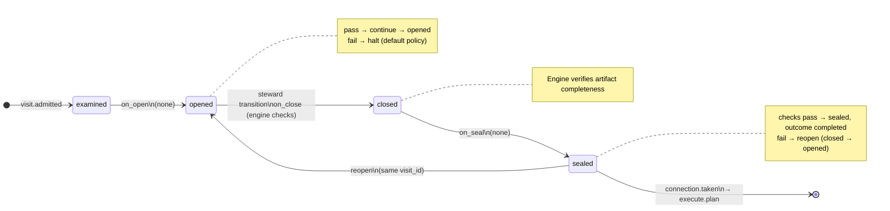

# Node: `execute.branch`

Status: **ok**

Flow: `implementation` in [flows/implementation/registry.yaml](../../.cursor/foundry/flows/implementation/registry.yaml).

Host-owned deterministic git step after execute intake gate pass. Computes the foundry/* feature branch name, checks out or creates the branch, records branch and execution graph reference state, and routes to execute.plan.

## Contents

- [Lifecycle](#lifecycle)
- [Sequence](#sequence)
- [Ledger excerpt](#ledger-excerpt)
- [References](#references)
- [Permissions](#permissions)
- [Artifacts](#artifacts)
- [Receipts](#receipts)
- [Worker](#worker)
- [Connections](#connections)
- [Check catalog](#check-catalog)
- [Gaps](#gaps)

---

## Lifecycle

Admission is an event (`visit.admitted`), not a lifecycle state. See [visit lifecycle](../concepts/visits-lifecycle.md).

| Hook | Authored checks | Engine-implicit |
|---|---|---|
| `on_examine` | `prior-execute-intake-sealed` | — |
| `on_open` | *(empty)* | — |
| `on_close` | *(empty)* | Declared artifact completeness |
| `on_seal` | *(empty)* | — |

## Sequence

_Sequence diagram not authored in `doc.yaml`._

## References

- **Catalog index:** [execute.branch.index.yaml](../catalog/implementation/nodes/execute.branch.index.yaml)

## Permissions

### `reads`

| Namespace | Paths |
|---|---|
| `config` | `git` |
| `state` | `run_slug`, `developer_first_name` |

### `allow`

| Namespace | Grant | Purpose |
|---|---|---|
| `state` | `default_branch`, `feature_branch`, `feature_branch_head`, `execution_graph_id`, `state.nodes.execute.branch.*` | Domain fields |

### Engine-only surfaces

| Surface | Trigger | Maps to |
|---|---|---|
| `foundry run create` | New run bootstrap | Admit entry visit, run `on_open` |
| `prior-execute-intake-sealed` | `on_examine` hook | `on_examine` check `prior-execute-intake-sealed` |
| Artifact completeness | `close_request` before `closed` | Every `produces.artifacts` declaration satisfied |
| Connection selection | After `visit.sealed` | Routes to `execute.plan` |

## Artifacts

_No work artifacts declared._

## Receipts

_No receipts declared._

## Worker

_No worker bound._

## Connections

### Incoming

- `execute.intake.gate-to-execute.branch-pass`: [execute.intake.gate](execute.intake.gate.md) → **execute.branch**

### Outgoing

- `execute.branch-to-execute.plan`: **execute.branch** → [execute.plan](execute.plan.md) (`on.outcomes: ['completed']`)

## Check catalog

### `prior-execute-intake-sealed`

| Property | Value |
|---|---|
| **Body** | `when` |
| **Expression** | `history.last('visit.sealed', node_id='execute.intake') != null && history.last('visit.sealed', node_id='execute.intake').outcome == 'completed'` |
| **Hook** | `on_examine` |

## Gaps

- optional developer_first_name prefix in branch name is state-driven only
- no receipts on this step (state-only contract)

## Concepts

- **Lifecycle:** [Visit lifecycle](../concepts/visits-lifecycle.md)
- **Connections:** [Graph and routing](../concepts/graph.md)
- **Permissions:** [Reads and allow](../concepts/capabilities.md)
- **Checks:** [Control plane](../concepts/control-plane.md)

## Node summary

| Field | Value |
|---|---|
| **id** | `execute.branch` |
| **kind** | `step` |
| **title** | Create the feature branch |
