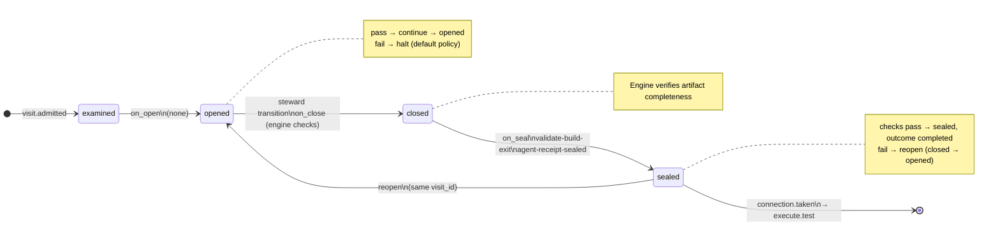

# Node: `execute.build`

Status: **ok**

Flow: `implementation` in [flows/implementation/registry.yaml](../../.cursor/foundry/flows/implementation/registry.yaml).

Host-owned deterministic build step after execute.plan (or repair re-entry). Runs manifest or stub build commands, seals a feature-builder agent receipt with exit codes, enforces validate-build-exit on seal, and routes to execute.test.

## Contents

- [Lifecycle](#lifecycle)
- [Sequence](#sequence)
- [Ledger excerpt](#ledger-excerpt)
- [References](#references)
- [Permissions](#permissions)
- [Artifacts](#artifacts)
- [Receipts](#receipts)
- [Worker](#worker)
- [Connections](#connections)
- [Check catalog](#check-catalog)
- [Gaps](#gaps)

---

## Lifecycle

Admission is an event (`visit.admitted`), not a lifecycle state. See [visit lifecycle](../concepts/visits-lifecycle.md).

| Hook | Authored checks | Engine-implicit |
|---|---|---|
| `on_examine` | `execution-graph-set`, `feature-branch-set` | — |
| `on_open` | *(empty)* | — |
| `on_close` | *(empty)* | Declared artifact completeness |
| `on_seal` | `validate-build-exit`, `agent-receipt-sealed` | — |

## Sequence

_Sequence diagram not authored in `doc.yaml`._

## References

- **Schemas:**
  - [registry:schemas/agent-receipt.schema.json](../../.cursor/foundry/schemas/agent-receipt.schema.json)
- **Catalog index:** [execute.build.index.yaml](../catalog/implementation/nodes/execute.build.index.yaml)

## Permissions

### `reads`

| Namespace | Paths |
|---|---|
| `config` | `builders`, `git` |
| `state` | `execution_graph_id`, `approved_ac`, `feature_branch` |
| `artifacts` | `execute.plan.execution-graph` |

### `allow`

| Namespace | Grant | Purpose |
|---|---|---|
| `state` | `last_build_exit_code`, `state.nodes.execute.build.*` | Domain fields |

### Engine-only surfaces

| Surface | Trigger | Maps to |
|---|---|---|
| `foundry run create` | New run bootstrap | Admit entry visit, run `on_open` |
| `execution-graph-set` | `on_examine` hook | `on_examine` check `execution-graph-set` |
| `feature-branch-set` | `on_examine` hook | `on_examine` check `feature-branch-set` |
| `validate-build-exit` | `on_seal` hook | `on_seal` check `validate-build-exit` |
| `agent-receipt-sealed` | `on_seal` hook | `on_seal` check `agent-receipt-sealed` |
| Artifact completeness | `close_request` before `closed` | Every `produces.artifacts` declaration satisfied |
| Connection selection | After `visit.sealed` | Routes to `execute.test` |

## Artifacts

_No work artifacts declared._

## Receipts

| Schema | Role |
|---|---|
| [registry:schemas/agent-receipt.schema.json](../../.cursor/foundry/schemas/agent-receipt.schema.json) | Worker completion evidence (`agent-receipt-sealed` on `on_seal`) |

## Worker

_No worker bound._

## Connections

### Incoming

- `execute.plan-to-execute.build`: [execute.plan](execute.plan.md) → **execute.build**
- `execute.repair.limit.gate-to-execute.build-proceed`: [execute.repair.limit.gate](execute.repair.limit.gate.md) → **execute.build**, loop: `repair`

### Outgoing

- `execute.build-to-execute.test`: **execute.build** → [execute.test](execute.test.md) (`on.outcomes: ['completed']`)

## Check catalog

### `execution-graph-set`

| Property | Value |
|---|---|
| **Body** | `when` |
| **Expression** | `state.execution_graph_id != null` |
| **Hook** | `on_examine` |

### `feature-branch-set`

| Property | Value |
|---|---|
| **Body** | `when` |
| **Expression** | `state.feature_branch != null` |
| **Hook** | `on_examine` |

### `validate-build-exit`

| Property | Value |
|---|---|
| **Body** | `command: validate_build_exit` |
| **Hook** | `on_seal` |
| **on_fail** | `reopen` — Build exit validation failed |

### `agent-receipt-sealed`

| Property | Value |
|---|---|
| **Body** | `when` |
| **Expression** | `history.count('receipt.linked', visit_id=visit.id, schema='registry:schemas/agent-receipt.schema.json') >= 1` |
| **Hook** | `on_seal` |

## Gaps

- execution-graph work items are not proven against filesystem changes (product gap)
- repair loop re-enters via execute.repair.limit.gate without re-running execute.plan

## Concepts

- **Lifecycle:** [Visit lifecycle](../concepts/visits-lifecycle.md)
- **Connections:** [Graph and routing](../concepts/graph.md)
- **Permissions:** [Reads and allow](../concepts/capabilities.md)
- **Receipts:** [Receipts vs artifacts](../concepts/artifacts.md)
- **Checks:** [Control plane](../concepts/control-plane.md)

## Node summary

| Field | Value |
|---|---|
| **id** | `execute.build` |
| **kind** | `step` |
| **title** | Build graph work items — builders commit via CLI |
