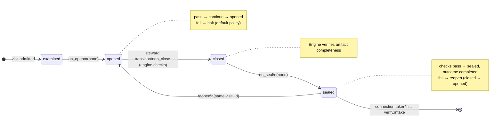

# Node: `execute.commit.gate`

Status: **ok**

Flow: `implementation` in [flows/implementation/registry.yaml](../../.cursor/foundry/flows/implementation/registry.yaml).

Engine gate after execute.commit when final_commit_sha is recorded and the commit-agent receipt is sealed. The host or steward uses run advance to resolve pass and route to verify.intake. No user gate decide and no worker.

## Contents

- [Lifecycle](#lifecycle)
- [Sequence](#sequence)
- [Ledger excerpt](#ledger-excerpt)
- [References](#references)
- [Permissions](#permissions)
- [Artifacts](#artifacts)
- [Receipts](#receipts)
- [Connections](#connections)
- [Check catalog](#check-catalog)
- [Gaps](#gaps)

---

## Lifecycle

Admission is an event (`visit.admitted`), not a lifecycle state. See [visit lifecycle](../concepts/visits-lifecycle.md).

| Hook | Authored checks | Engine-implicit |
|---|---|---|
| `on_examine` | `reverify-within-limit`, `prior-execute-commit-sealed`, `final-commit-recorded` | — |
| `on_open` | *(empty)* | — |
| `on_close` | *(empty)* | Declared artifact completeness |
| `on_seal` | *(empty)* | — |

## Sequence

_Sequence diagram not authored in `doc.yaml`._

## References

- **Gate prompt:** `Machine gate. Final execute.commit must record a commit on the feature branch (empty commit allowed).`
- **Catalog index:** [execute.commit.gate.index.yaml](../catalog/implementation/nodes/execute.commit.gate.index.yaml)

## Permissions

### `reads`

| Namespace | Paths |
|---|---|
| — | *(none declared)* |

### `allow`

| Namespace | Grant | Purpose |
|---|---|---|
| — | *(none declared)* | — |

### Engine-only surfaces

| Surface | Trigger | Maps to |
|---|---|---|
| `foundry run create` | New run bootstrap | Admit entry visit, run `on_open` |
| `reverify-within-limit` | `on_examine` hook | `on_examine` check `reverify-within-limit` |
| `prior-execute-commit-sealed` | `on_examine` hook | `on_examine` check `prior-execute-commit-sealed` |
| `final-commit-recorded` | `on_examine` hook | `on_examine` check `final-commit-recorded` |
| Artifact completeness | `close_request` before `closed` | Every `produces.artifacts` declaration satisfied |
| Connection selection | After `visit.sealed` | Routes to `verify.intake` |

## Artifacts

_No work artifacts declared._

## Receipts

_No receipts declared._

## Connections

### Incoming

- `execute.commit-to-execute.commit.gate`: [execute.commit](execute.commit.md) → **execute.commit.gate**

### Outgoing

- `execute.commit.gate-to-verify.intake-pass`: **execute.commit.gate** → [verify.intake](verify.intake.md) (`on.outcomes: ['completed']`)

## Check catalog

### `reverify-within-limit`

| Property | Value |
|---|---|
| **Body** | `when` |
| **Expression** | `history.count('visit.sealed', node_id='verify.intake') <= config.limits.reverify` |
| **Hook** | `on_examine` |
| **on_fail** | `escalate` — Re-verify loop limit reached |
| **Runtime** | `loop_limits.evaluate_limit_flow_check` in hooks and `resolve_engine_gate`; live ledger eval when examine checks are not yet recorded |

### `prior-execute-commit-sealed`

| Property | Value |
|---|---|
| **Body** | `when` |
| **Expression** | `history.last('visit.sealed', node_id='execute.commit') != null && history.last('visit.sealed', node_id='execute.commit').outcome == 'completed'` |
| **Hook** | `on_examine` |

### `final-commit-recorded`

| Property | Value |
|---|---|
| **Body** | `when` |
| **Expression** | `state.final_commit_sha != null` |
| **Hook** | `on_examine` |

## Concepts

- **Lifecycle:** [Visit lifecycle](../concepts/visits-lifecycle.md)
- **Connections:** [Graph and routing](../concepts/graph.md)
- **Checks:** [Control plane](../concepts/control-plane.md)
- **Gate decisions:** [Gate nodes](../concepts/graph.md)

## Node summary

| Field | Value |
|---|---|
| **id** | `execute.commit.gate` |
| **kind** | `gate` |
| **title** | Execute commit recorded |
