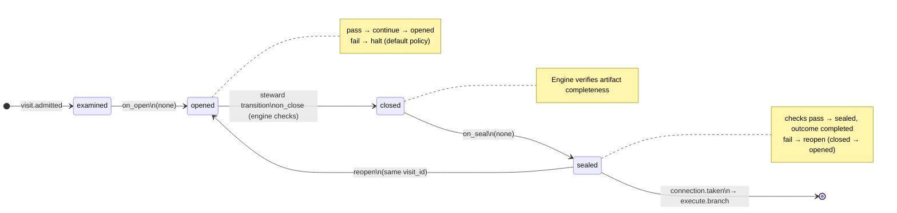

# Node: `execute.intake.gate`

Status: **ok**

Flow: `implementation` in [flows/implementation/registry.yaml](../../.cursor/foundry/flows/implementation/registry.yaml).

Engine gate after execute.intake when intake receipts are sealed. The host or steward uses run advance to resolve pass from the intake receipt status and route to execute.branch. No user gate decide and no worker.

## Contents

- [Lifecycle](#lifecycle)
- [Sequence](#sequence)
- [Ledger excerpt](#ledger-excerpt)
- [References](#references)
- [Permissions](#permissions)
- [Artifacts](#artifacts)
- [Receipts](#receipts)
- [Connections](#connections)
- [Check catalog](#check-catalog)
- [Gaps](#gaps)

---

## Lifecycle

Admission is an event (`visit.admitted`), not a lifecycle state. See [visit lifecycle](../concepts/visits-lifecycle.md).

| Hook | Authored checks | Engine-implicit |
|---|---|---|
| `on_examine` | `prior-execute-intake-sealed`, `intake-receipt-sealed` | — |
| `on_open` | *(empty)* | — |
| `on_close` | *(empty)* | Declared artifact completeness |
| `on_seal` | *(empty)* | — |

## Sequence

_Sequence diagram not authored in `doc.yaml`._

## References

- **Gate prompt:** `Engine gate. Confirms the sealed execute.intake receipt status is passed before branching.`
- **Catalog index:** [execute.intake.gate.index.yaml](../catalog/implementation/nodes/execute.intake.gate.index.yaml)

## Permissions

### `reads`

| Namespace | Paths |
|---|---|
| `state` | `intake_path` |

### `allow`

| Namespace | Grant | Purpose |
|---|---|---|
| — | *(none declared)* | — |

### Engine-only surfaces

| Surface | Trigger | Maps to |
|---|---|---|
| `foundry run create` | New run bootstrap | Admit entry visit, run `on_open` |
| `prior-execute-intake-sealed` | `on_examine` hook | `on_examine` check `prior-execute-intake-sealed` |
| `intake-receipt-sealed` | `on_examine` hook | `on_examine` check `intake-receipt-sealed` |
| Artifact completeness | `close_request` before `closed` | Every `produces.artifacts` declaration satisfied |
| Connection selection | After `visit.sealed` | Routes to `execute.branch` |

## Artifacts

_No work artifacts declared._

## Receipts

_No receipts declared._

## Connections

### Incoming

- `execute.intake-to-execute.intake.gate`: [execute.intake](execute.intake.md) → **execute.intake.gate**

### Outgoing

- `execute.intake.gate-to-execute.branch-pass`: **execute.intake.gate** → [execute.branch](execute.branch.md) (`on.outcomes: ['completed']`)

## Check catalog

### `prior-execute-intake-sealed`

| Property | Value |
|---|---|
| **Body** | `when` |
| **Expression** | `history.last('visit.sealed', node_id='execute.intake') != null && history.last('visit.sealed', node_id='execute.intake').outcome == 'completed'` |
| **Hook** | `on_examine` |

### `intake-receipt-sealed`

| Property | Value |
|---|---|
| **Body** | `when` |
| **Expression** | `history.count('receipt.linked', visit_id=visit.id, schema='registry:schemas/intake-receipt.schema.json') >= 1` |
| **Hook** | `on_examine` |
| **on_fail** | `halt` — Intake receipt failed |

## Concepts

- **Lifecycle:** [Visit lifecycle](../concepts/visits-lifecycle.md)
- **Connections:** [Graph and routing](../concepts/graph.md)
- **Permissions:** [Reads and allow](../concepts/capabilities.md)
- **Checks:** [Control plane](../concepts/control-plane.md)
- **Gate decisions:** [Gate nodes](../concepts/graph.md)

## Node summary

| Field | Value |
|---|---|
| **id** | `execute.intake.gate` |
| **kind** | `gate` |
| **title** | Execute intake blocked check |
