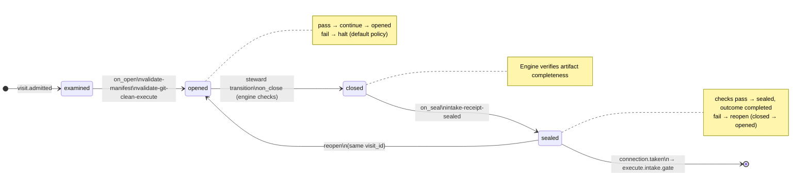

# Node: `execute.intake`

Status: **generated**

Flow: `implementation` in [factory-flow.yaml](../../.cursor/foundry/flows/factory-flow.yaml).

Execute intake — plan alignment and clean git tree

## Lifecycle

Admission is an event (`visit.admitted`), not a lifecycle state. See [visit lifecycle](../../.cursor/foundry/cli/docs/concepts/visits-lifecycle.md).

| Hook | Authored checks | Engine-implicit |
|---|---|---|
| `on_examine` | `approved-ac-recorded`, `prior-shape-record-sealed` | — |
| `on_open` | `validate-manifest`, `validate-git-clean-execute` | — |
| `on_close` | *(empty)* | Declared artifact completeness |
| `on_seal` | `intake-receipt-sealed` | — |

## References

- **Instructions:** [registry:steps/execute-intake.md](../../.cursor/foundry/steps/execute-intake.md)
- **Schemas:**
  - [registry:schemas/agent-receipt.schema.json](../../.cursor/foundry/schemas/agent-receipt.schema.json)
  - [registry:schemas/intake-receipt.schema.json](../../.cursor/foundry/schemas/intake-receipt.schema.json)
- **Catalog index:** [execute.intake.index.yaml](../../.cursor/foundry/catalog/nodes/execute.intake.index.yaml)

## Artifacts

_No work artifacts declared._

## Receipts

| Schema | Role |
|---|---|
| [registry:schemas/agent-receipt.schema.json](../../.cursor/foundry/schemas/agent-receipt.schema.json) | Worker completion evidence (`agent-receipt-sealed` on `on_seal`) |
| [registry:schemas/intake-receipt.schema.json](../../.cursor/foundry/schemas/intake-receipt.schema.json) | Intake evidence (`intake-receipt-sealed` on `on_seal`) |

## Worker

| Field | Value |
|---|---|
| **Worker id** | `intake-checker.execute` |
| **Mode** | `execute` |
| **Prompt** | [registry:agents/intake-checker.execute.md](../../.cursor/agents/intake-checker.execute.md) |
| **Contract** | [registry:workers/intake-checker.execute/contract.yaml](../../.cursor/foundry/workers/intake-checker.execute/contract.yaml) |
| **Generated worker doc** | [intake-checker.execute](../catalog/workers/intake-checker.execute.md) |

#### Worker concern ownership

| Concern | Owner |
|---|---|
| `on_examine` / `on_open` / `on_seal` checks | Engine |
| Intake receipt `checks[]` | Steward — from ledger when sealing |
| Work artifact publication | Steward — `artifact.publish` |
| Receipts | Steward — `receipt.link` |
| Worker assessment and proceed/blocked judgment | intake-checker.execute |

## Connections

### Incoming

- `execute.start-to-execute.intake-start`: [execute.start](execute.start.md) → **execute.intake**
- `verify.acceptance.gate-to-execute.intake-rework_execute`: [verify.acceptance.gate](verify.acceptance.gate.md) → **execute.intake**, loop: `reexecute`

### Outgoing

- `execute.intake-to-execute.intake.gate`: **execute.intake** → [execute.intake.gate](execute.intake.gate.md) (`on.outcomes: ['completed']`)

## Concepts

- **Lifecycle:** [Visit lifecycle](../../.cursor/foundry/cli/docs/concepts/visits-lifecycle.md)
- **Connections:** [Graph and routing](../../.cursor/foundry/cli/docs/concepts/graph.md)
- **Permissions:** [Reads and allow](../../.cursor/foundry/cli/docs/concepts/capabilities.md)
- **Receipts:** [Receipts vs artifacts](../../.cursor/foundry/cli/docs/concepts/artifacts.md)
- **Checks:** [Control plane](../../.cursor/foundry/cli/docs/concepts/control-plane.md)

## Node summary

| Field | Value |
|---|---|
| **id** | `execute.intake` |
| **kind** | `step` |
| **title** | Execute intake — plan alignment and clean git tree |
