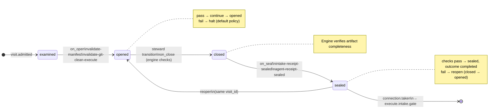

# Node: `execute.intake`

Status: **ok**

Flow: `implementation` in [flows/implementation/registry.yaml](../../.cursor/foundry/flows/implementation/registry.yaml).

Host-owned deterministic intake at Execute entry. Validates frozen shape artifacts and git cleanliness on admit; seals intake and agent receipts; routes to execute.intake.gate on pass.

## Contents

- [Lifecycle](#lifecycle)
- [Sequence](#sequence)
- [Ledger excerpt](#ledger-excerpt)
- [References](#references)
- [Permissions](#permissions)
- [Artifacts](#artifacts)
- [Receipts](#receipts)
- [Connections](#connections)
- [Check catalog](#check-catalog)
- [Gaps](#gaps)

---

## Lifecycle

Admission is an event (`visit.admitted`), not a lifecycle state. See [visit lifecycle](../concepts/visits-lifecycle.md).

| Hook | Authored checks | Engine-implicit |
|---|---|---|
| `on_examine` | `approved-ac-recorded`, `prior-shape-record-sealed` | — |
| `on_open` | `validate-manifest`, `validate-git-clean-execute` | — |
| `on_close` | *(empty)* | Declared artifact completeness |
| `on_seal` | `intake-receipt-sealed`, `agent-receipt-sealed` | — |

## Sequence

_Sequence diagram not authored in `doc.yaml`._

## References

- **Schemas:**
  - [registry:schemas/agent-receipt.schema.json](../../.cursor/foundry/schemas/agent-receipt.schema.json)
  - [registry:schemas/intake-receipt.schema.json](../../.cursor/foundry/schemas/intake-receipt.schema.json)
- **Catalog index:** [execute.intake.index.yaml](../catalog/implementation/nodes/execute.intake.index.yaml)

## Permissions

### `reads`

| Namespace | Paths |
|---|---|
| `config` | `workspace` |
| `state` | `approved_ac`, `plan_path`, `intake_path`, `entry_reason` |
| `artifacts` | `shape.record.plan` |

### `allow`

| Namespace | Grant | Purpose |
|---|---|---|
| `state` | `intake_path`, `entry_reason`, `state.nodes.execute.intake.*` | Domain fields |

### Engine-only surfaces

| Surface | Trigger | Maps to |
|---|---|---|
| `foundry run create` | New run bootstrap | Admit entry visit, run `on_open` |
| `approved-ac-recorded` | `on_examine` hook | `on_examine` check `approved-ac-recorded` |
| `prior-shape-record-sealed` | `on_examine` hook | `on_examine` check `prior-shape-record-sealed` |
| `validate-manifest` | `on_open` hook | `command: validate_manifest` → `foundry app validate` |
| `validate-git-clean-execute` | `on_open` hook | `on_open` check `validate-git-clean-execute` |
| `intake-receipt-sealed` | `on_seal` hook | `on_seal` check `intake-receipt-sealed` |
| `agent-receipt-sealed` | `on_seal` hook | `on_seal` check `agent-receipt-sealed` |
| Artifact completeness | `close_request` before `closed` | Every `produces.artifacts` declaration satisfied |
| Connection selection | After `visit.sealed` | Routes to `execute.intake.gate` |

## Artifacts

_No work artifacts declared._

## Receipts

| Schema | Role |
|---|---|
| [registry:schemas/agent-receipt.schema.json](../../.cursor/foundry/schemas/agent-receipt.schema.json) | Worker completion evidence (`agent-receipt-sealed` on `on_seal`) |
| [registry:schemas/intake-receipt.schema.json](../../.cursor/foundry/schemas/intake-receipt.schema.json) | Intake evidence (`intake-receipt-sealed` on `on_seal`) |

## Connections

### Incoming

- `execute.start-to-execute.intake-start`: [execute.start](execute.start.md) → **execute.intake**
- `verify.acceptance.gate-to-execute.intake-rework_execute`: [verify.acceptance.gate](verify.acceptance.gate.md) → **execute.intake**, loop: `reexecute`

### Outgoing

- `execute.intake-to-execute.intake.gate`: **execute.intake** → [execute.intake.gate](execute.intake.gate.md) (`on.outcomes: ['completed']`)

## Check catalog

### `approved-ac-recorded`

| Property | Value |
|---|---|
| **Body** | `when` |
| **Expression** | `state.approved_ac_version >= 1` |
| **Hook** | `on_examine` |

### `prior-shape-record-sealed`

| Property | Value |
|---|---|
| **Body** | `when` |
| **Expression** | `history.last('visit.sealed', node_id='shape.record') != null && history.last('visit.sealed', node_id='shape.record').outcome == 'completed'` |
| **Hook** | `on_examine` |

### `validate-manifest`

| Property | Value |
|---|---|
| **Body** | `command: validate_manifest` |
| **Probe** | `foundry app validate` ([app-manifest.schema.json](../../.cursor/foundry/schemas/app-manifest.schema.json)) |
| **Hook** | `on_open` |

### `validate-git-clean-execute`

| Property | Value |
|---|---|
| **Body** | `command: validate_git_clean_execute` |
| **Hook** | `on_open` |

### `intake-receipt-sealed`

| Property | Value |
|---|---|
| **Body** | `when` |
| **Expression** | `history.count('receipt.linked', visit_id=visit.id, schema='registry:schemas/intake-receipt.schema.json') >= 1` |
| **Hook** | `on_seal` |
| **on_fail** | `reopen` — Execute intake receipt not sealed |

### `agent-receipt-sealed`

| Property | Value |
|---|---|
| **Body** | `when` |
| **Expression** | `history.count('receipt.linked', visit_id=visit.id, schema='registry:schemas/agent-receipt.schema.json') >= 1` |
| **Hook** | `on_seal` |
| **on_fail** | `reopen` — Agent receipt not sealed |

## Gaps

- rework_execute loop re-enters without execute.start; entry_reason may differ from execute_start
- steward markdown packet has no living-plan inline (plan validated from state paths on host)

## Concepts

- **Lifecycle:** [Visit lifecycle](../concepts/visits-lifecycle.md)
- **Connections:** [Graph and routing](../concepts/graph.md)
- **Permissions:** [Reads and allow](../concepts/capabilities.md)
- **Receipts:** [Receipts vs artifacts](../concepts/artifacts.md)
- **Checks:** [Control plane](../concepts/control-plane.md)

## Node summary

| Field | Value |
|---|---|
| **id** | `execute.intake` |
| **kind** | `step` |
| **title** | Execute intake — plan alignment and clean git tree |
