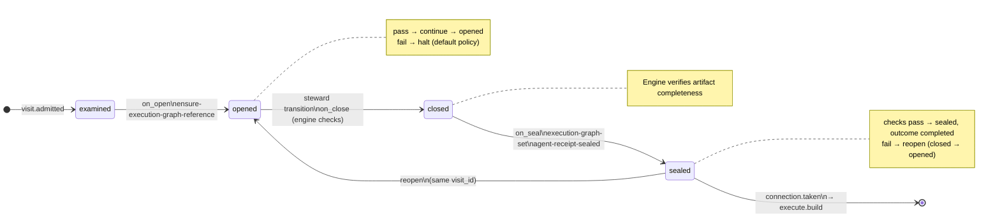

# Node: `execute.plan`

Status: **generated**

Flow: `implementation` in [factory-flow.yaml](../../.cursor/foundry/flows/factory-flow.yaml).

Execution graph and phase-scoped internal brief

## Lifecycle

Admission is an event (`visit.admitted`), not a lifecycle state. See [visit lifecycle](../concepts/visits-lifecycle.md).

| Hook | Authored checks | Engine-implicit |
|---|---|---|
| `on_examine` | `feature-branch-set` | — |
| `on_open` | `ensure-execution-graph-reference` | — |
| `on_close` | *(empty)* | Declared artifact completeness |
| `on_seal` | `execution-graph-set`, `agent-receipt-sealed` | — |

## References

- **Instructions:** [registry:steps/execute-plan.md](../../.cursor/foundry/steps/execute-plan.md)
- **Schemas:**
  - [registry:schemas/agent-receipt.schema.json](../../.cursor/foundry/schemas/agent-receipt.schema.json)
- **Catalog index:** [execute.plan.index.yaml](../../.cursor/foundry/catalog/nodes/execute.plan.index.yaml)

## Artifacts

### Work artifact: `execution-graph`

| Field | Value |
|---|---|
| **Logical id** | `execution-graph` |
| **Qualified ref** | `execute.plan.execution-graph` |
| **Kind** | `document` |
| **URI** | `run:artifacts/{visit_id}/execution-graph.json` |
| **Media type** | `application/json` |

### Work artifact: `execute-brief`

| Field | Value |
|---|---|
| **Logical id** | `execute-brief` |
| **Qualified ref** | `execute.plan.execute-brief` |
| **Kind** | `document` |
| **URI** | `run:artifacts/{visit_id}/execute-brief.md` |
| **Media type** | `text/markdown` |

#### Downstream consumption

- [execute.build](execute.build.md) reads `execute.plan.execution-graph` via `nearest_sealed_ancestor`
- [execute.commit](execute.commit.md) reads `execute.plan.execution-graph` via `nearest_sealed_ancestor`
- [execute.test](execute.test.md) reads `execute.plan.execution-graph` via `nearest_sealed_ancestor`

## Receipts

| Schema | Role |
|---|---|
| [registry:schemas/agent-receipt.schema.json](../../.cursor/foundry/schemas/agent-receipt.schema.json) | Worker completion evidence (`agent-receipt-sealed` on `on_seal`) |

## Worker

| Field | Value |
|---|---|
| **Worker id** | `planner` |
| **Mode** | `plan` |
| **Prompt** | [registry:agents/planner.md](../../.cursor/agents/planner.md) |
| **Contract** | [registry:workers/planner/contract.yaml](../../.cursor/foundry/workers/planner/contract.yaml) |
| **Generated worker doc** | [planner](../catalog/workers/planner.md) |

#### Worker concern ownership

| Concern | Owner |
|---|---|
| `on_examine` / `on_open` / `on_seal` checks | Engine |
| Intake receipt `checks[]` | Steward — from ledger when sealing |
| Work artifact publication | Steward — `artifact.publish` |
| Receipts | Steward — `receipt.link` |
| Worker assessment and proceed/blocked judgment | planner |

## Connections

### Incoming

- `execute.branch-to-execute.plan`: [execute.branch](execute.branch.md) → **execute.plan**
- `verify.acceptance.gate-to-execute.plan-replan`: [verify.acceptance.gate](verify.acceptance.gate.md) → **execute.plan**, loop: `reexecute`

### Outgoing

- `execute.plan-to-execute.build`: **execute.plan** → [execute.build](execute.build.md) (`on.outcomes: ['completed']`)

## Concepts

- **Lifecycle:** [Visit lifecycle](../concepts/visits-lifecycle.md)
- **Connections:** [Graph and routing](../concepts/graph.md)
- **Permissions:** [Reads and allow](../concepts/capabilities.md)
- **Artifacts:** [Artifact publication](../concepts/artifacts.md)
- **Receipts:** [Receipts vs artifacts](../concepts/artifacts.md)
- **Checks:** [Control plane](../concepts/control-plane.md)

## Node summary

| Field | Value |
|---|---|
| **id** | `execute.plan` |
| **kind** | `step` |
| **title** | Execution graph and phase-scoped internal brief |
