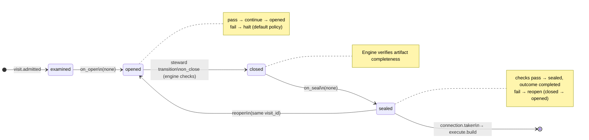
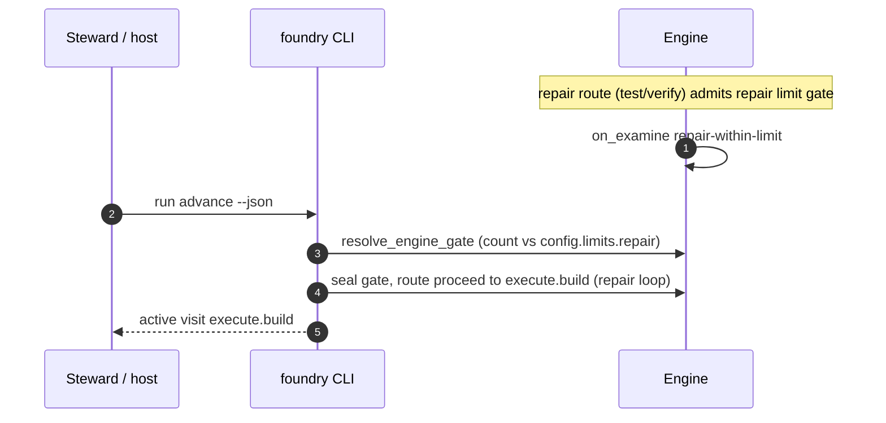

# Node: `execute.repair.limit.gate`

Status: **ok**

Flow: `implementation` in [factory-flow.yaml](../../.cursor/foundry/flows/factory-flow.yaml).

Engine gate where all repair routes converge. Counts prior repair-loop connection.taken events against config.limits.repair; on_examine repair-within-limit escalates when over limit. The host or steward uses run advance to resolve proceed and re-enter execute.build. No user gate decide and no worker.

## Contents

- [Lifecycle](#lifecycle)
- [Sequence](#sequence)
- [Ledger excerpt](#ledger-excerpt)
- [References](#references)
- [Permissions](#permissions)
- [Artifacts](#artifacts)
- [Receipts](#receipts)
- [Worker](#worker)
- [Connections](#connections)
- [Check catalog](#check-catalog)
- [Gaps](#gaps)

---

## Lifecycle

Admission is an event (`visit.admitted`), not a lifecycle state. See [visit lifecycle](../concepts/visits-lifecycle.md).

| Hook | Authored checks | Engine-implicit |
|---|---|---|
| `on_examine` | `repair-within-limit` | — |
| `on_open` | *(empty)* | — |
| `on_close` | *(empty)* | Declared artifact completeness |
| `on_seal` | *(empty)* | — |

## Sequence

## References

- **Gate prompt:** `Machine gate. All repair routes converge here. Count prior repair loops; escalate when config.limits.repair is exceeded so the operator can resume when ready.`
- **Catalog index:** [execute.repair.limit.gate.index.yaml](../../.cursor/foundry/catalog/nodes/execute.repair.limit.gate.index.yaml)

## Ownership

| Role | Owner |
|---|---|
| **worker** | none |
| **steward** | execute parent / craft steward |
| **engine** | on_examine repair-within-limit (escalate on_fail), resolve_engine_gate proceed, route to execute.build |

## Permissions

### `reads`

| Namespace | Paths |
|---|---|
| — | *(none declared)* |

### `allow`

| Namespace | Grant | Purpose |
|---|---|---|
| — | *(none declared)* | — |

### Engine-only surfaces

| Surface | Trigger | Maps to |
|---|---|---|
| `foundry run create` | New run bootstrap | Admit entry visit, run `on_open` |
| `repair-within-limit` | `on_examine` hook | `on_examine` check `repair-within-limit` |
| Artifact completeness | `close_request` before `closed` | Every `produces.artifacts` declaration satisfied |
| Connection selection | After `visit.sealed` | Routes to `execute.build` |

## Artifacts

_No work artifacts declared._

## Receipts

_No receipts declared._

## Connections

### Incoming

- `execute.test.gate-to-execute.repair.limit.gate-repair`: [execute.test.gate](execute.test.gate.md) → **execute.repair.limit.gate**
- `verify.code_quality.gate-to-execute.repair.limit.gate-repair`: [verify.code_quality.gate](verify.code_quality.gate.md) → **execute.repair.limit.gate**
- `verify.code_review.gate-to-execute.repair.limit.gate-repair`: [verify.code_review.gate](verify.code_review.gate.md) → **execute.repair.limit.gate**

### Outgoing

- `execute.repair.limit.gate-to-execute.build-proceed`: **execute.repair.limit.gate** → [execute.build](execute.build.md) (`on.outcomes: ['completed']`)

## Check catalog

### `repair-within-limit`

| Property | Value |
|---|---|
| **Body** | `when` |
| **Expression** | `history.count('connection.taken', loop='repair') <= config.limits.repair` |
| **Hook** | `on_examine` |
| **on_fail** | `escalate` — Repair loop limit reached |

## Concepts

- **Lifecycle:** [Visit lifecycle](../concepts/visits-lifecycle.md)
- **Connections:** [Graph and routing](../concepts/graph.md)
- **Checks:** [Control plane](../concepts/control-plane.md)
- **Gate decisions:** [Gate nodes](../concepts/graph.md)

## Node summary

| Field | Value |
|---|---|
| **id** | `execute.repair.limit.gate` |
| **kind** | `gate` |
| **title** | Repair loop guard — count prior repair cycles before build |
