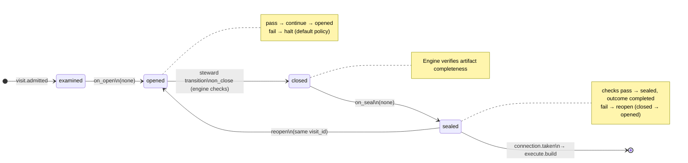

# Node: `execute.repair.limit.gate`

Status: **generated**

Flow: `implementation` in [factory-flow.yaml](../../.cursor/foundry/flows/factory-flow.yaml).

Repair loop guard — count prior repair cycles before build

## Lifecycle

Admission is an event (`visit.admitted`), not a lifecycle state. See [visit lifecycle](../../.cursor/foundry/cli/docs/concepts/visits-lifecycle.md).

| Hook | Authored checks | Engine-implicit |
|---|---|---|
| `on_examine` | `repair-within-limit` | — |
| `on_open` | *(empty)* | — |
| `on_close` | *(empty)* | Declared artifact completeness |
| `on_seal` | *(empty)* | — |

## References

- **Gate prompt:** `Machine gate. All repair routes converge here. Count prior repair loops; escalate when config.limits.repair is exceeded so the operator can resume when ready.`
- **Catalog index:** [execute.repair.limit.gate.index.yaml](../../.cursor/foundry/catalog/nodes/execute.repair.limit.gate.index.yaml)

## Artifacts

_No work artifacts declared._

## Receipts

_No receipts declared._

## Connections

### Incoming

- `execute.test.gate-to-execute.repair.limit.gate-repair`: [execute.test.gate](execute.test.gate.md) → **execute.repair.limit.gate**
- `verify.code_quality.gate-to-execute.repair.limit.gate-repair`: [verify.code_quality.gate](verify.code_quality.gate.md) → **execute.repair.limit.gate**
- `verify.code_review.gate-to-execute.repair.limit.gate-repair`: [verify.code_review.gate](verify.code_review.gate.md) → **execute.repair.limit.gate**

### Outgoing

- `execute.repair.limit.gate-to-execute.build-proceed`: **execute.repair.limit.gate** → [execute.build](execute.build.md) (`on.outcomes: ['completed']`)

## Concepts

- **Lifecycle:** [Visit lifecycle](../../.cursor/foundry/cli/docs/concepts/visits-lifecycle.md)
- **Connections:** [Graph and routing](../../.cursor/foundry/cli/docs/concepts/graph.md)
- **Checks:** [Control plane](../../.cursor/foundry/cli/docs/concepts/control-plane.md)
- **Gate decisions:** [Gate nodes](../../.cursor/foundry/cli/docs/concepts/graph.md)

## Node summary

| Field | Value |
|---|---|
| **id** | `execute.repair.limit.gate` |
| **kind** | `gate` |
| **title** | Repair loop guard — count prior repair cycles before build |
