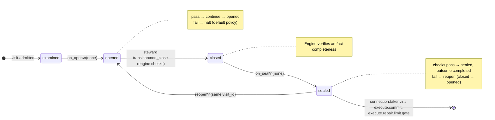

# Node: `execute.test.gate`

Status: **generated**

Flow: `implementation` in [factory-flow.yaml](../../.cursor/foundry/flows/factory-flow.yaml).

Execute test pass

## Lifecycle

Admission is an event (`visit.admitted`), not a lifecycle state. See [visit lifecycle](../concepts/visits-lifecycle.md).

| Hook | Authored checks | Engine-implicit |
|---|---|---|
| `on_examine` | `prior-execute-test-sealed` | — |
| `on_open` | *(empty)* | — |
| `on_close` | *(empty)* | Declared artifact completeness |
| `on_seal` | *(empty)* | — |

## References

- **Gate prompt:** `Machine gate. Repo verification commands must pass or route to repair.`
- **Catalog index:** [execute.test.gate.index.yaml](../../.cursor/foundry/catalog/nodes/execute.test.gate.index.yaml)

## Artifacts

_No work artifacts declared._

## Receipts

_No receipts declared._

## Connections

### Incoming

- `execute.test-to-execute.test.gate`: [execute.test](execute.test.md) → **execute.test.gate**

### Outgoing

- `execute.test.gate-to-execute.commit-pass`: **execute.test.gate** → [execute.commit](execute.commit.md) (`on.outcomes: ['completed']`)
- `execute.test.gate-to-execute.repair.limit.gate-repair`: **execute.test.gate** → [execute.repair.limit.gate](execute.repair.limit.gate.md) (`on.outcomes: ['completed']`)

## Concepts

- **Lifecycle:** [Visit lifecycle](../concepts/visits-lifecycle.md)
- **Connections:** [Graph and routing](../concepts/graph.md)
- **Checks:** [Control plane](../concepts/control-plane.md)
- **Gate decisions:** [Gate nodes](../concepts/graph.md)

## Node summary

| Field | Value |
|---|---|
| **id** | `execute.test.gate` |
| **kind** | `gate` |
| **title** | Execute test pass |
