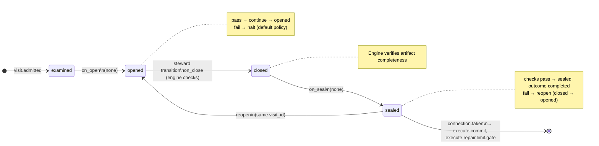

# Node: `execute.test.gate`

Status: **ok**

Flow: `implementation` in [flows/implementation/registry.yaml](../../.cursor/foundry/flows/implementation/registry.yaml).

Engine gate after execute.test when the agent receipt is sealed. The host or steward uses run advance to resolve pass or repair from command exit codes and route to execute.commit or execute.repair.limit.gate. No user gate decide and no worker.

## Contents

- [Lifecycle](#lifecycle)
- [Sequence](#sequence)
- [Ledger excerpt](#ledger-excerpt)
- [References](#references)
- [Permissions](#permissions)
- [Artifacts](#artifacts)
- [Receipts](#receipts)
- [Connections](#connections)
- [Check catalog](#check-catalog)
- [Gaps](#gaps)

---

## Lifecycle

Admission is an event (`visit.admitted`), not a lifecycle state. See [visit lifecycle](../concepts/visits-lifecycle.md).

| Hook | Authored checks | Engine-implicit |
|---|---|---|
| `on_examine` | `prior-execute-test-sealed` | — |
| `on_open` | *(empty)* | — |
| `on_close` | *(empty)* | Declared artifact completeness |
| `on_seal` | *(empty)* | — |

## Sequence

_Sequence diagram not authored in `doc.yaml`._

## References

- **Gate prompt:** `Engine gate. Maps sealed execute.test agent receipt command exit codes to pass or repair.`
- **Catalog index:** [execute.test.gate.index.yaml](../catalog/implementation/nodes/execute.test.gate.index.yaml)

## Permissions

### `reads`

| Namespace | Paths |
|---|---|
| `state` | `last_test_exit_code` |

### `allow`

| Namespace | Grant | Purpose |
|---|---|---|
| — | *(none declared)* | — |

### Engine-only surfaces

| Surface | Trigger | Maps to |
|---|---|---|
| `foundry run create` | New run bootstrap | Admit entry visit, run `on_open` |
| `prior-execute-test-sealed` | `on_examine` hook | `on_examine` check `prior-execute-test-sealed` |
| Artifact completeness | `close_request` before `closed` | Every `produces.artifacts` declaration satisfied |
| Connection selection | After `visit.sealed` | Routes to `execute.commit`, `execute.repair.limit.gate` |

## Artifacts

_No work artifacts declared._

## Receipts

_No receipts declared._

## Connections

### Incoming

- `execute.test-to-execute.test.gate`: [execute.test](execute.test.md) → **execute.test.gate**

### Outgoing

- `execute.test.gate-to-execute.commit-pass`: **execute.test.gate** → [execute.commit](execute.commit.md) (`on.outcomes: ['completed']`)
- `execute.test.gate-to-execute.repair.limit.gate-repair`: **execute.test.gate** → [execute.repair.limit.gate](execute.repair.limit.gate.md) (`on.outcomes: ['completed']`)

## Check catalog

### `prior-execute-test-sealed`

| Property | Value |
|---|---|
| **Body** | `when` |
| **Expression** | `history.last('visit.sealed', node_id='execute.test') != null && history.last('visit.sealed', node_id='execute.test').outcome == 'completed'` |
| **Hook** | `on_examine` |

## Concepts

- **Lifecycle:** [Visit lifecycle](../concepts/visits-lifecycle.md)
- **Connections:** [Graph and routing](../concepts/graph.md)
- **Permissions:** [Reads and allow](../concepts/capabilities.md)
- **Checks:** [Control plane](../concepts/control-plane.md)
- **Gate decisions:** [Gate nodes](../concepts/graph.md)

## Node summary

| Field | Value |
|---|---|
| **id** | `execute.test.gate` |
| **kind** | `gate` |
| **title** | Execute test pass |
