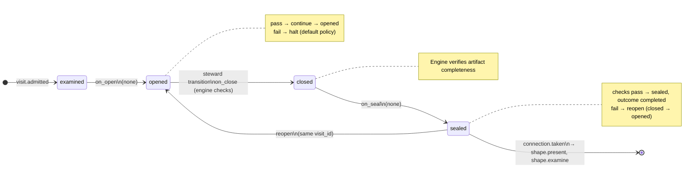

# Node: `shape.examine.gate`

Status: **generated**

Flow: `implementation` in [factory-flow.yaml](../../.cursor/foundry/flows/factory-flow.yaml).

Examination ready — present plan or continue questioning

## Lifecycle

Admission is an event (`visit.admitted`), not a lifecycle state. See [visit lifecycle](../concepts/visits-lifecycle.md).

| Hook | Authored checks | Engine-implicit |
|---|---|---|
| `on_examine` | `prior-examine-sealed` | — |
| `on_open` | *(empty)* | — |
| `on_close` | *(empty)* | Declared artifact completeness |
| `on_seal` | *(empty)* | — |

## References

- **Gate prompt:** `Examination still has open clarifying questions. Continue questioning, or explicitly proceed to present the plan with the remaining assumptions visible.`
- **Catalog index:** [shape.examine.gate.index.yaml](../../.cursor/foundry/catalog/nodes/shape.examine.gate.index.yaml)

## Artifacts

_No work artifacts declared._

## Receipts

_No receipts declared._

## Connections

### Incoming

- `shape.examine-to-shape.examine.gate`: [shape.examine](shape.examine.md) → **shape.examine.gate**

### Outgoing

- `shape.examine.gate-to-shape.present-present`: **shape.examine.gate** → [shape.present](shape.present.md) (`on.outcomes: ['completed']`)
- `shape.examine.gate-to-shape.examine-continue`: **shape.examine.gate** → [shape.examine](shape.examine.md) (`on.outcomes: ['completed']`)

## Concepts

- **Lifecycle:** [Visit lifecycle](../concepts/visits-lifecycle.md)
- **Connections:** [Graph and routing](../concepts/graph.md)
- **Permissions:** [Reads and allow](../concepts/capabilities.md)
- **Checks:** [Control plane](../concepts/control-plane.md)
- **Gate decisions:** [Gate nodes](../concepts/graph.md)

## Node summary

| Field | Value |
|---|---|
| **id** | `shape.examine.gate` |
| **kind** | `gate` |
| **title** | Examination ready — present plan or continue questioning |
