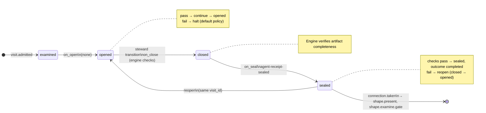

# Node: `shape.examine`

Status: **draft**

Flow: `implementation` in [flows/implementation/registry.yaml](../../.cursor/foundry/flows/implementation/registry.yaml).

Judgment-bounded examination step. The model produces a structured examination result; the engine patches state, manages the clarifying-question loop, seals the agent receipt on visit examine complete (or run advance), and routes to present or examine.gate. Steward manual receipt/transition paths were removed from the flow contract.

## Contents

- [Lifecycle](#lifecycle)
- [Sequence](#sequence)
- [Ledger excerpt](#ledger-excerpt)
- [References](#references)
- [Permissions](#permissions)
- [Artifacts](#artifacts)
- [Receipts](#receipts)
- [Worker](#worker)
- [Connections](#connections)
- [Check catalog](#check-catalog)
- [Gaps](#gaps)

---

## Lifecycle

Admission is an event (`visit.admitted`), not a lifecycle state. See [visit lifecycle](../concepts/visits-lifecycle.md).

| Hook | Authored checks | Engine-implicit |
|---|---|---|
| `on_examine` | `prior-shape-intake-sealed` | — |
| `on_open` | *(empty)* | — |
| `on_close` | *(empty)* | Declared artifact completeness |
| `on_seal` | `agent-receipt-sealed` | — |

## Sequence

_Sequence diagram not authored in `doc.yaml`._

## References

- **Instructions:** [registry:nodes/shape.examine/judgment.md](../../.cursor/foundry/nodes/shape.examine/judgment.md)
- **Schemas:**
  - [registry:schemas/agent-receipt.schema.json](../../.cursor/foundry/schemas/agent-receipt.schema.json)
- **Catalog index:** [shape.examine.index.yaml](../catalog/implementation/nodes/shape.examine.index.yaml)

## Permissions

### `reads`

| Namespace | Paths |
|---|---|
| `config` | `foundry.shape` |
| `state` | `ticket`, `approved_ac`, `clarifying_questions`, `examination_round`, `open_clarifying_questions_count`, `examination_decisions`, `assumptions`, `draft_ac` |
| `artifacts` | `shape.intake.ticket` |

### `allow`

| Namespace | Grant | Purpose |
|---|---|---|
| `cli` | `run.agent.submit`, `visit.examine.complete` | Steward CLI capabilities |

### Steward CLI capabilities

| Capability |
|---|
| `run.agent.submit` |
| `visit.examine.complete` |

### Engine-only surfaces

| Surface | Trigger | Maps to |
|---|---|---|
| `foundry run create` | New run bootstrap | Admit entry visit, run `on_open` |
| `prior-shape-intake-sealed` | `on_examine` hook | `on_examine` check `prior-shape-intake-sealed` |
| `agent-receipt-sealed` | `on_seal` hook | `on_seal` check `agent-receipt-sealed` |
| Artifact completeness | `close_request` before `closed` | Every `produces.artifacts` declaration satisfied |
| Connection selection | After `visit.sealed` | Routes to `shape.present`, `shape.examine.gate` |

## Artifacts

_No work artifacts declared._

## Receipts

| Schema | Role |
|---|---|
| [registry:schemas/agent-receipt.schema.json](../../.cursor/foundry/schemas/agent-receipt.schema.json) | Worker completion evidence (`agent-receipt-sealed` on `on_seal`) |

## Worker

_No worker bound._

## Connections

### Incoming

- `shape.intake-to-shape.examine`: [shape.intake](shape.intake.md) → **shape.examine**
- `shape.examine.gate-to-shape.examine-continue`: [shape.examine.gate](shape.examine.gate.md) → **shape.examine**
- `shape.present.gate-to-shape.examine-refine`: [shape.present.gate](shape.present.gate.md) → **shape.examine**

### Outgoing

- `shape.examine-to-shape.present`: **shape.examine** → [shape.present](shape.present.md) (`on.outcomes: ['completed']`)
- `shape.examine-to-shape.examine.gate`: **shape.examine** → [shape.examine.gate](shape.examine.gate.md) (`on.outcomes: ['completed']`)

## Check catalog

### `prior-shape-intake-sealed`

| Property | Value |
|---|---|
| **Body** | `when` |
| **Expression** | `history.last('visit.sealed', node_id='shape.intake') != null && history.last('visit.sealed', node_id='shape.intake').outcome == 'completed'` |
| **Hook** | `on_examine` |

### `agent-receipt-sealed`

| Property | Value |
|---|---|
| **Body** | `when` |
| **Expression** | `history.count('receipt.linked', visit_id=visit.id, schema='registry:schemas/agent-receipt.schema.json') >= 1` |
| **Hook** | `on_seal` |
| **on_fail** | `reopen` — Examination not ready to seal |

## Gaps

- reads.state.ticket is canonical until artifact resolution ships; reads.artifacts nearest_sealed_ancestor is declared but not materialized in the context packet yet

## Concepts

- **Lifecycle:** [Visit lifecycle](../concepts/visits-lifecycle.md)
- **Connections:** [Graph and routing](../concepts/graph.md)
- **Permissions:** [Reads and allow](../concepts/capabilities.md)
- **Receipts:** [Receipts vs artifacts](../concepts/artifacts.md)
- **Checks:** [Control plane](../concepts/control-plane.md)

## Node summary

| Field | Value |
|---|---|
| **id** | `shape.examine` |
| **kind** | `step` |
| **title** | Shape examination — draft AC and clarifying questions |
