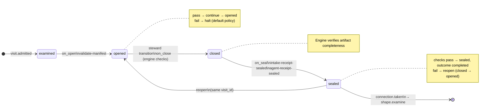

# Node: `shape.intake`

Status: **draft**

Flow: `implementation` in [factory-flow.yaml](../../.cursor/foundry/flows/factory-flow.yaml).

Entry step for the implementation flow. Validates workspace manifest, captures the work request as a ticket artifact, and seals intake and agent receipts before routing to shape.examine.


## Contents

- [Lifecycle](#lifecycle)
- [Sequence](#sequence)
- [Ledger excerpt](#ledger-excerpt)
- [References](#references)
- [Permissions](#permissions)
- [Artifacts](#artifacts)
- [Receipts](#receipts)
- [Worker](#worker)
- [Connections](#connections)
- [Check catalog](#check-catalog)
- [Gaps](#gaps)

---

## Lifecycle

Admission is an event (`visit.admitted`), not a lifecycle state. See [visit lifecycle](../concepts/visits-lifecycle.md).



| Hook | Authored checks | Engine-implicit |
|---|---|---|
| `on_examine` | *(empty)* | — |
| `on_open` | `validate-manifest` | — |
| `on_close` | *(empty)* | Declared artifact completeness |
| `on_seal` | `intake-receipt-sealed`, `agent-receipt-sealed` | — |

## Sequence

```mermaid
sequenceDiagram
  autonumber
  participant U as User
  participant S as Steward (shape parent)
  participant CLI as foundry CLI
  participant E as Engine (foundry.intake)

  U->>S: foundry shape + work prompt
  S->>CLI: run create --flow implementation
  CLI->>E: admit shape.intake, on_open validate-manifest
  CLI-->>S: visit opened

  S->>U: confirm work request / repo root when ambiguous (steward-ux)
  S->>CLI: visit intake complete (work_prompt, source metadata)
  CLI->>E: ticket, ledger checks, intake + agent receipts, seal
  alt intake passed
    E->>E: publish ticket, transition
    CLI-->>S: passed, next visit shape.examine
  else intake blocked
    E->>E: seal blocked intake only (no transition)
    CLI-->>S: blocked — INTAKE_BLOCKED if transition attempted
  end

  Note over S,E: intake-checker.shape worker is legacy and unbound; happy path does not invoke it.
```

## Ledger excerpt

Fixture `porcelain-0007-v001` visit `v-001` (compact).

| seq | type | summary |
|---:|---|---|
| 1 | `run.status_changed` | running ← (new) |
| 2 | `visit.admitted` | source: entry |
| 3 | `lifecycle.changed` | admitted → examined |
| 4 | `check.recorded` | on_open: validate-manifest → pass |
| 5 | `policy.applied` | validate-manifest → continue |
| 6 | `lifecycle.changed` | examined → opened |
| 7 | `artifact.linked` | ticket → run:artifacts/v-001/ticket.json |
| 8 | `receipt.linked` | intake-receipt.schema.json |
| 9 | `receipt.linked` | agent-receipt.schema.json |
| 10 | `check.recorded` | on_close: (step checks) → pass |
| 11 | `policy.applied` | on_close → continue |
| 12 | `lifecycle.changed` | opened → closed |
| 13 | `check.recorded` | on_seal: intake-receipt-sealed → pass |
| 14 | `policy.applied` | intake-receipt-sealed → continue |
| 15 | `check.recorded` | on_seal: agent-receipt-sealed → pass |
| 16 | `policy.applied` | agent-receipt-sealed → continue |
| 17 | `lifecycle.changed` | closed → sealed |
| 18 | `visit.sealed` | outcome: completed |
| 19 | `connection.taken` | shape.intake-to-shape.examine → shape.examine |

## References

- **Schemas:**
  - [registry:schemas/agent-receipt.schema.json](../../.cursor/foundry/schemas/agent-receipt.schema.json)
  - [registry:schemas/intake-receipt.schema.json](../../.cursor/foundry/schemas/intake-receipt.schema.json)
  - [registry:schemas/ticket.schema.json](../../.cursor/foundry/schemas/ticket.schema.json)
- **Catalog index:** [shape.intake.index.yaml](../../.cursor/foundry/catalog/nodes/shape.intake.index.yaml)

## Ownership

| Role | Owner |
|---|---|
| **worker** | legacy intake-checker.shape (unbound — not on happy path) |
| **steward** | shape parent agent per steward-ux — visit intake complete; optional visit state patch for app_folder; re-run complete when blocked |
| **engine** | admission, on_open manifest gate, visit intake complete (foundry.intake), artifact completeness on close, on_seal receipt checks, INTAKE_BLOCKED transition policy |

## Permissions

### `reads`

| Namespace | Paths |
|---|---|
| `config` | `workspace` |
| `state` | `app_folder` |

### `allow`

| Namespace | Grant | Purpose |
|---|---|---|
| `state` | `app_folder`, `state.nodes.shape.intake.*` | Domain fields |
| `cli` | `visit.intake.complete`, `visit.state_patch` | Steward CLI capabilities |

### Steward CLI capabilities

| Capability |
|---|
| `visit.intake.complete` |
| `visit.state_patch` |

### Engine-only surfaces

| Surface | Trigger | Maps to |
|---|---|---|
| `foundry run create` | New run bootstrap | Admit entry visit, run `on_open` |
| `validate-manifest` | `on_open` hook | `command: validate_manifest` → `foundry app validate` |
| `intake-receipt-sealed` | `on_seal` hook | `on_seal` check `intake-receipt-sealed` |
| `agent-receipt-sealed` | `on_seal` hook | `on_seal` check `agent-receipt-sealed` |
| Artifact completeness | `close_request` before `closed` | Every `produces.artifacts` declaration satisfied |
| Connection selection | After `visit.sealed` | Routes to `shape.examine` |

## Artifacts

### Work artifact: `ticket`

| Field | Value |
|---|---|
| **Logical id** | `ticket` |
| **Qualified ref** | `shape.intake.ticket` |
| **Kind** | `document` |
| **URI** | `run:artifacts/{visit_id}/ticket.json` |
| **Schema** | [registry:schemas/ticket.schema.json](../../.cursor/foundry/schemas/ticket.schema.json) |
| **Media type** | `application/json` |


#### Ticket fields

| Field | Required | Description |
|---|---|:---:|
| `schema_version` | yes | `2.2.0` |
| `raw_input` | yes | Verbatim or faithful capture of user-supplied input. |
| `normalized_translation` | no | Optional normalized summary; examination may fill when intake only captured verbatim input. |
| `source_type` | yes | How the work request was supplied. |
| `source_ref` | no | File path, URL, or ticket filename when applicable; otherwise null. |
| `issue_key` | no | External issue key when applicable; null in v1 (Jira deferred). |

#### Downstream consumption

- [shape.examine](shape.examine.md) reads `shape.intake.ticket` via `nearest_sealed_ancestor`

## Receipts

| Schema | Role |
|---|---|
| [registry:schemas/intake-receipt.schema.json](../../.cursor/foundry/schemas/intake-receipt.schema.json) | Intake evidence (`intake-receipt-sealed` on `on_seal`) |
| [registry:schemas/agent-receipt.schema.json](../../.cursor/foundry/schemas/agent-receipt.schema.json) | Worker completion evidence (`agent-receipt-sealed` on `on_seal`) |

## Worker

_No worker bound._

## Connections

### Incoming

- Flow entry (`flow.entry`)
- `verify.code_review.gate-to-shape.intake-reshape`: [verify.code_review.gate](verify.code_review.gate.md) → **shape.intake**, loop: `reshape`
- `verify.acceptance.gate-to-shape.intake-reshape`: [verify.acceptance.gate](verify.acceptance.gate.md) → **shape.intake**, loop: `reshape`

### Outgoing

- `shape.intake-to-shape.examine`: **shape.intake** → [shape.examine](shape.examine.md) (`on.outcomes: ['completed']`)

## Check catalog

### `validate-manifest`

| Property | Value |
|---|---|
| **Body** | `command: validate_manifest` |
| **Probe** | `foundry app validate` ([app-manifest.schema.json](../../.cursor/foundry/schemas/app-manifest.schema.json)) |
| **Hook** | `on_open` |

### `intake-receipt-sealed`

| Property | Value |
|---|---|
| **Body** | `when` |
| **Expression** | `history.count('receipt.linked', visit_id=visit.id, schema='registry:schemas/intake-receipt.schema.json') >= 1` |
| **Hook** | `on_seal` |
| **on_fail** | `reopen` — Intake receipt not sealed |

### `agent-receipt-sealed`

| Property | Value |
|---|---|
| **Body** | `when` |
| **Expression** | `history.count('receipt.linked', visit_id=visit.id, schema='registry:schemas/agent-receipt.schema.json') >= 1` |
| **Hook** | `on_seal` |
| **on_fail** | `reopen` — Agent receipt not sealed |

## Gaps

- on_close ledger label shows (step checks) but registry has no authored on_close checks
- reshape loop admission source differs from entry but phases B–F are identical

## Concepts

- **Lifecycle:** [Visit lifecycle](../concepts/visits-lifecycle.md)
- **Connections:** [Graph and routing](../concepts/graph.md)
- **Permissions:** [Reads and allow](../concepts/capabilities.md)
- **Artifacts:** [Artifact publication](../concepts/artifacts.md)
- **Receipts:** [Receipts vs artifacts](../concepts/artifacts.md)
- **Checks:** [Control plane](../concepts/control-plane.md)

## Node summary

| Field | Value |
|---|---|
| **id** | `shape.intake` |
| **kind** | `step` |
| **title** | Shape intake — validate app manifest and capture work request |
| **entry point** | Yes — `flow.entry` |
