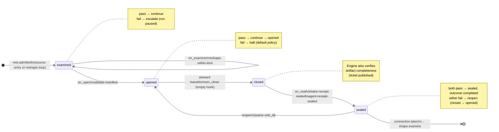
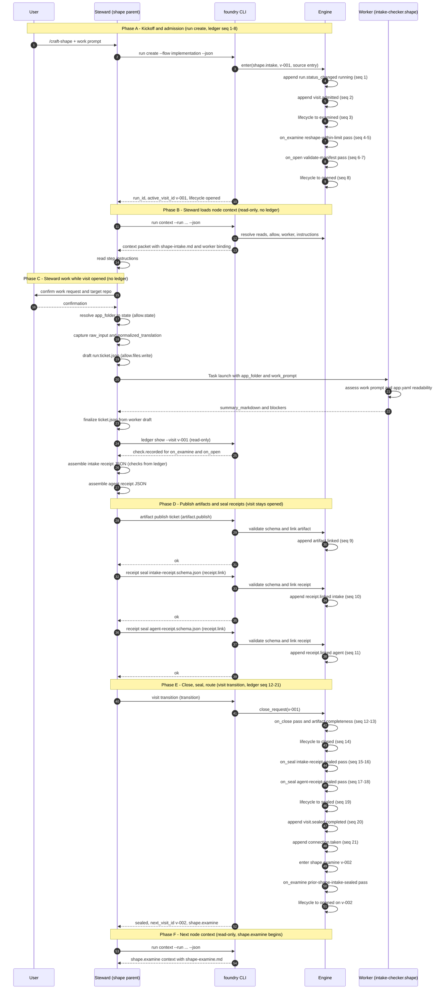

# Node: `shape.intake`

Status: **draft node reference** (template for future node docs)

Flow: `implementation` in [factory-flow.yaml](../../.cursor/foundry/flows/factory-flow.yaml). Spec: [workflow-schema-v1](../workflow-schema-v1/README.md). CLI walkthrough: [cli-walkthrough.md](../cli-v1/cli-walkthrough.md) (visit `v-001`).

## Contents

- [1. Lifecycle](#1-lifecycle)
- [2. Sequence](#2-sequence)
- [3. Ledger excerpt](#3-ledger-excerpt)
- [4. References](#4-references)
- [5. Artifacts](#5-artifacts)
- [6. Node summary](#6-node-summary)
- [7. Check catalog entries](#7-check-catalog-entries)
- [8. Gaps / not yet defined](#8-gaps--not-yet-defined)
- [Template notes](#template-notes-for-future-nodes)

---

## 1. Lifecycle

Admission is an event (`visit.admitted`), not a lifecycle state.



| Hook | Authored checks | Engine-implicit |
|---|---|---|
| `on_examine` | `reshape-within-limit` | — |
| `on_open` | `validate-manifest` | — |
| `on_close` | *(empty — succeeds immediately)* | Declared artifact completeness ([artifacts.md](../workflow-schema-v1/artifacts.md)) |
| `on_seal` | `intake-receipt-sealed`, `agent-receipt-sealed` | — |

---

## 2. Sequence

Happy-path first visit (`v-001`). `foundry` argv names follow [cli.md](../cli-v1/cli.md); capability ids in parentheses. Ledger seq numbers in **bold** map to [§3](#3-ledger-excerpt). Read-only CLI calls append no ledger events.

Between CLI boundaries the steward works in chat (user turns, file writes under `allow.files.write`, state under `allow.state`). The engine is synchronous inside each mutating CLI call; it does not run while the visit is `opened` and the steward is working.



| Phase | Who acts | Ledger | Visit lifecycle |
|---|---|---|---|
| A — Kickoff | Engine (inside `run create`) | seq 1–8 appended | `examined` → `opened` |
| B — Context | Steward reads | none | stays `opened` |
| C — Work | Steward + user + worker | none | stays `opened` |
| D — Evidence | Steward + engine (publish/seal) | seq 9–11 appended | stays `opened` |
| E — Close | Engine (inside `transition`) | seq 12–21 appended | `opened` → `closed` → `sealed`; admits v-002 |
| F — Handoff | Steward reads next node | none | v-002 `opened` |

**Reshape loop** (`v-001b`, …): phases B–F are the same. Phase A differs only at admission: `source: reshape` via a `loop: reshape` connection instead of `source: entry`. `on_examine` counts prior `connection.taken` events with `loop='reshape'` against `config.limits.reshape` (default `2`). Exceeding the limit → `escalate` → run `paused` before the visit opens.

**Blocked intake:** if the worker verdict is BLOCKED, the steward seals intake receipt with `status: blocked` and does **not** call `transition` until the user resolves the blocker or abandons the run.

**`on_seal` reopen:** if receipt checks fail at phase E, policy `reopen` returns the visit to `opened` on the **same** `visit_id`. Steward fixes evidence (phase D) and calls `transition` again.

---

## 3. Ledger excerpt

Successful visit `v-001` (`porcelain-0007`), seq 1–21. Based on [cli-walkthrough.md](../cli-v1/cli-walkthrough.md) with seq 17–18 added for `agent-receipt-sealed`. Seq 22+ belong to `shape.examine`.

```text
$ foundry ledger show --run porcelain-0007 --from-seq 1 --to-seq 21

seq  at                        visit  node          type               detail
───  ────────────────────────  ─────  ────────────  ─────────────────  ─────────────────────────────────────────────
  1  2026-09-24T14:00:00Z      —      —             run.status_changed running ← (new)
  2  2026-09-24T14:00:00Z      v-001  shape.intake  visit.admitted     source: entry
  3  2026-09-24T14:00:00Z      v-001  shape.intake  lifecycle.changed  admitted → examined
  4  2026-09-24T14:00:00Z      v-001  shape.intake  check.recorded     on_examine: reshape-within-limit → pass
  5  2026-09-24T14:00:00Z      v-001  shape.intake  policy.applied     reshape-within-limit → continue
  6  2026-09-24T14:00:01Z      v-001  shape.intake  check.recorded     on_open: validate-manifest → pass
  7  2026-09-24T14:00:01Z      v-001  shape.intake  policy.applied     validate-manifest → continue
  8  2026-09-24T14:00:01Z      v-001  shape.intake  lifecycle.changed  examined → opened
  9  2026-09-24T14:02:10Z      v-001  shape.intake  artifact.linked    ticket → run:ticket.json
 10  2026-09-24T14:03:05Z      v-001  shape.intake  receipt.linked     intake-receipt.schema.json
 11  2026-09-24T14:03:06Z      v-001  shape.intake  receipt.linked     agent-receipt.schema.json
 12  2026-09-24T14:03:30Z      v-001  shape.intake  check.recorded     on_close: (step checks) → pass
 13  2026-09-24T14:03:30Z      v-001  shape.intake  policy.applied     on_close → continue
 14  2026-09-24T14:03:30Z      v-001  shape.intake  lifecycle.changed  opened → closed
 15  2026-09-24T14:03:31Z      v-001  shape.intake  check.recorded     on_seal: intake-receipt-sealed → pass
 16  2026-09-24T14:03:31Z      v-001  shape.intake  policy.applied     intake-receipt-sealed → continue
 17  2026-09-24T14:03:31Z      v-001  shape.intake  check.recorded     on_seal: agent-receipt-sealed → pass
 18  2026-09-24T14:03:31Z      v-001  shape.intake  policy.applied     agent-receipt-sealed → continue
 19  2026-09-24T14:03:31Z      v-001  shape.intake  lifecycle.changed  closed → sealed
 20  2026-09-24T14:03:31Z      v-001  shape.intake  visit.sealed       outcome: completed
 21  2026-09-24T14:03:31Z      v-001  shape.intake  connection.taken   shape.intake-to-shape.examine → shape.examine
```

Seq 12 `(step checks)` is the engine artifact-completeness pass ([artifacts.md](../workflow-schema-v1/artifacts.md)), not an authored `on_close` catalog check. [cli-walkthrough.md](../cli-v1/cli-walkthrough.md) v-001 predates seq 17–18 and should be updated when the walkthrough is next edited.

---

## 4. References

### Registry paths

Paths resolve under `.cursor/foundry/` unless noted.

| Registry path | Role | Exists |
|---|---|:---:|
| `registry:steps/shape-intake.md` | Steward/worker step instructions | **Yes** — `.cursor/foundry/steps/shape-intake.md` |
| `registry:agents/intake-checker.shape.md` | Worker prompt | **Yes** — `.cursor/agents/intake-checker.shape.md` |
| `registry:contracts/intake-checker.shape.yaml` | Worker contract (`valid_next_states: [shape.examine]`) | **Yes** |
| `registry:schemas/intake-receipt.schema.json` | Intake evidence schema | **Yes** |
| `registry:schemas/agent-receipt.schema.json` | Subagent completion evidence | **Yes** |
| `registry:schemas/ticket.schema.json` | Declared artifact schema (`produces.artifacts[].schema`) | **Yes** |
| `registry:schemas/app-manifest.schema.json` | `validate-manifest` probe target (`.foundry/app.yaml`) | **Yes** — v1 port from POC; no `documentation` section |
| `registry:schemas/agent-contract.schema.json` | Contract JSON Schema | **Yes** |
| `registry:schemas/factory-flow.schema.json` | Flow registry schema | **Yes** |

### Permissions (`reads` vs `allow`)

Per [capabilities.md](../workflow-schema-v1/capabilities.md): **`reads`** supplies steward/worker context; **`allow`** grants mutation and CLI invocation. Checks are engine-owned and do not inherit `allow`.

#### `reads` (context supplied)

| Namespace | Paths | Purpose |
|---|---|---|
| `config` | `workspace` | Application repo root for manifest validation and ticket resolution |
| `state` | `ticket`, `app_folder` | Run-scoped ticket payload and resolved app folder |

No `reads.artifacts` — this is the first shape step; the ticket is produced here, not consumed.

No `reads.files` — workspace paths are reached via `config.workspace` and worker instructions.

#### `allow` (steward may change or invoke)

| Namespace | Grant | Purpose |
|---|---|---|
| `state` | `ticket`, `app_folder`, `run_slug`, `clarifying_questions`, `questions_asked_total`, `examination_round`, `open_clarifying_questions_count` | Domain fields; examination counters primary owner is `shape.examine` (reshape reset deferred) |
| `files.write` | `run:ticket.json`, `run:artifacts/{visit_id}/ticket.json` | Draft and published ticket locations |
| `cli` | `artifact.publish`, `receipt.link`, `transition` | Publish `ticket`; seal receipts; request close |

**Implicit grants** (not listed in YAML, per capabilities defaults):

- `state.nodes.shape.intake.*` — node-scoped state bucket
- Bound `worker` (`intake-checker.shape`) — authorized without `allow.agents`

**Not granted:**

- `app.validate` — manifest gate is an engine `on_open` check, not a steward capability on this node

#### Steward CLI and ledger events

| Capability id | CLI argv | When | Ledger |
|---|---|---|---|
| `artifact.publish` | `foundry artifact publish --artifact ticket --source <path>` | After ticket content is ready | `artifact.linked` |
| `receipt.link` | `foundry receipt seal --schema <registry path> --file <path>` | After intake + agent receipt JSON ready | `receipt.linked` |
| `transition` | `foundry visit transition --summary <text>` | Work and evidence complete | Triggers `on_close`, completeness, `on_seal`, routing |

Optional flags per [cli-visit.md](../cli-v1/cli-visit.md): `--receipt` may proxy `receipt seal` before close — interaction with `allow.cli` is unresolved ([cli.md](../cli-v1/cli.md) open question §8).

#### Engine-only (not steward capabilities on this node)

| Surface | Trigger | Maps to |
|---|---|---|
| `foundry run create` | New run bootstrap | Admit entry visit, run `on_examine` + `on_open` |
| `validate-manifest` | `on_open` hook | `command: validate_manifest` → `foundry app validate` |
| `reshape-within-limit` | `on_examine` hook | History expression |
| `intake-receipt-sealed` | `on_seal` hook | History expression |
| `agent-receipt-sealed` | `on_seal` hook | History expression |
| Artifact completeness | `close_request` before `closed` | [engine.md](../workflow-schema-v1/engine.md) — every `produces.artifacts` declaration satisfied |
| Connection selection | After `visit.sealed` | `shape.intake-to-shape.examine` when `outcome: completed` |

### Worker (`intake-checker.shape`)

Bound worker for this node. Prompt and contract in registry paths above.

| Concern | Owner |
|---|---|
| `on_examine` / `on_open` checks | Engine — see [§7](#7-check-catalog-entries) |
| Intake receipt `checks[]` | Steward — from ledger when sealing (Path B; worker does not receive or return checks) |
| `ticket` artifact publication | Steward — `artifact.publish` |
| Receipts | Steward — `receipt.link` for intake + agent schemas ([§5 Receipts](#receipts-evidence)) |
| Manifest readability, ticket synthesis, proceed/blocked judgment | Worker — `agent_assessment` only |

Worker launches after visit `opened` ([§2 Sequence](#2-sequence), steps 89–90). Assessment feeds intake receipt `agent_assessment` and agent receipt `outputs.summary_markdown`. Full worker instructions: `registry:agents/intake-checker.shape.md`. Multi-mode history: [intake-checker.md](../transitions/intake-checker.md).

---

## 5. Artifacts

Work artifacts are declared under `produces.artifacts` and published via `artifact.publish`. Receipts are evidence, not work artifacts ([artifacts.md](../workflow-schema-v1/artifacts.md)).

### Work artifact: `ticket`

| Field | Value |
|---|---|
| **Logical id** | `ticket` |
| **Qualified ref** | `shape.intake.ticket` (for downstream `reads.artifacts`) |
| **Kind** | `document` |
| **URI** | `run:artifacts/{visit_id}/ticket.json` |
| **Schema** | `registry:schemas/ticket.schema.json` |
| **Media type** | `application/json` |
| **Draft path** | `run:ticket.json` (`allow.files.write`) |
| **Publish** | `foundry artifact publish --artifact ticket --source run:ticket.json` |
| **Ledger** | `artifact.linked` (seq 9) |

#### `ticket.json` fields

| Field | Required | Description |
|---|---|:---:|
| `schema_version` | yes | `2.2.0` |
| `raw_input` | yes | Verbatim or faithful capture of user-supplied input |
| `normalized_translation` | yes | Steward/worker summary for downstream shape steps |
| `source_type` | yes | `chat`, `paste`, `file`, `url`, or `repo_inference` |
| `source_ref` | no | File path, URL, or filename when applicable; otherwise `null` |
| `issue_key` | no | External issue key; `null` in v1 (Jira deferred) |

#### Downstream consumption

`shape.examine` reads `shape.intake.ticket` via `nearest_sealed_ancestor` — the closest sealed `shape.intake` visit on the route with a published `ticket` artifact. Requires this visit to seal `completed` before `prior-shape-intake-sealed` passes on examine.

### Receipts (evidence)

| Schema | Role | Seal check | Ledger |
|---|---|---|---|
| `registry:schemas/intake-receipt.schema.json` | CLI check results + agent assessment overlay | `intake-receipt-sealed` (`on_seal`) | `receipt.linked` (seq 10) |
| `registry:schemas/agent-receipt.schema.json` | `intake-checker.shape` worker completion | `agent-receipt-sealed` (`on_seal`) | `receipt.linked` (seq 11) |

Intake receipt `checks[].status` uses catalog vocabulary: `pass`, `fail`, `not_applicable`. Top-level intake `status` is `passed`, `blocked`, or `failed`.

Seal via `receipt.link` (`foundry receipt seal --schema <registry path> --file <path>`). Visit association (`visit_id`, `node_id`) is recorded on the ledger event, not inside the receipt JSON body.

---

## 6. Node summary

| Field | Value |
|---|---|
| **id** | `shape.intake` |
| **kind** | `step` |
| **title** | Shape intake — validates inputs, prerequisites, and configuration |
| **entry point** | Yes — `flow.entry` for `implementation` |
| **terminal** | No |
| **worker** | `registry:agents/intake-checker.shape.md` / `registry:contracts/intake-checker.shape.yaml` |
| **produces.artifacts** | `ticket` (`document`, `run:artifacts/{visit_id}/ticket.json`, `application/json`) |
| **receipts** | `registry:schemas/agent-receipt.schema.json`, `registry:schemas/intake-receipt.schema.json` |
| **outgoing connections** | `shape.intake-to-shape.examine` → `shape.examine` (`on.outcomes: [completed]`) |
| **incoming connections** | Flow entry; reshape loops: `verify.acceptance.gate-to-shape.intake-reshape`, `verify.code_review.gate-to-shape.intake-reshape` (`loop: reshape`) |

---

## 7. Check catalog entries

Definitions from `flow.checks` in [factory-flow.yaml](../../.cursor/foundry/flows/factory-flow.yaml). Policies from node `lifecycle` overrides; unset results use [control-plane.md](../workflow-schema-v1/control-plane.md) defaults (`pass` → `continue`, `fail` → `halt`).

### `reshape-within-limit`

| Property | Value |
|---|---|
| **Body** | `when` |
| **Expression** | `history.count('connection.taken', loop='reshape') <= config.limits.reshape` |
| **Hook** | `on_examine` |
| **Default limit** | `config.limits.reshape` = `2` ([control-plane.md](../workflow-schema-v1/control-plane.md)) |
| **on_fail** | `escalate` — reason: *Reshape loop limit reached* |
| **on_pass** | `continue` (default) |

Counts classified reshape connections taken **before** this visit is examined. Fresh entry (no prior reshape) → count `0` → pass.

### `validate-manifest`

| Property | Value |
|---|---|
| **Body** | `command: validate_manifest` |
| **Probe** | `foundry app validate` ([cli-app.md](../cli-v1/cli-app.md), [cli-check.md](../cli-v1/cli-check.md)) |
| **Hook** | `on_open` |
| **on_fail** | *(default)* `halt` |
| **on_pass** | `continue` (default) |

Engine-only at hook time. Stewards may call `foundry check eval --check validate-manifest` for debugging; that is not a granted capability on this node.

### `intake-receipt-sealed`

| Property | Value |
|---|---|
| **Body** | `when` |
| **Expression** | `history.count('receipt.linked', visit_id=visit.id, schema='registry:schemas/intake-receipt.schema.json') >= 1` |
| **Hook** | `on_seal` |
| **on_fail** | `reopen` — reason: *Intake receipt not sealed* |
| **on_pass** | `continue` (default) |

Visit-scoped: the receipt must be linked on **this** visit id. See [gaps.md](../cli-v1/gaps.md) §3 for gate nodes that reuse this check with a different visit id.

### `agent-receipt-sealed`

| Property | Value |
|---|---|
| **Body** | `when` |
| **Expression** | `history.count('receipt.linked', visit_id=visit.id, schema='registry:schemas/agent-receipt.schema.json') >= 1` |
| **Hook** | `on_seal` (after `intake-receipt-sealed`) |
| **on_fail** | `reopen` — reason: *Agent receipt not sealed* |
| **on_pass** | `continue` (default) |

Requires the steward to seal the `intake-checker.shape` worker receipt via `receipt.link` before `transition`. Both receipt checks run at `on_seal` after receipts are linked during `opened` (ledger seq 10–11).

---

## 8. Gaps / not yet defined

Do not treat the following as implemented behavior.

### Registry and schemas

| Item | Status |
|---|---|
| `foundry` CLI implementation | **Not documented as shipped** — all `foundry …` argv in this doc are capability specs ([cli.md](../cli-v1/cli.md) status: draft) |

### Hook and policy gaps

| Item | Detail |
|---|---|
| **`on_close` ledger label** | Walkthrough shows `on_close: (step checks)`; registry has no authored `on_close` checks. Completeness is engine-implicit per [engine.md](../workflow-schema-v1/engine.md). |
| **Walkthrough ledger seq** | v-001 excerpt omits `agent-receipt-sealed` `on_seal` events (seq 17–18 in §3). |

### [gaps.md](../cli-v1/gaps.md) items affecting this node

| § | Conflict |
|---|---|
| **§2 Steward commands vs `allow.cli`** | Walkthrough still lists `app validate` as steward command; engine owns `validate-manifest` on `on_open`. |
| **§3 `intake-receipt-sealed` visit scope** | Check uses `visit_id=visit.id`. Correct for this step; breaks downstream gate visits that reuse the same check id. |
| **§8 Receipt and artifact paths** | Three stories for `ticket.json`: YAML `run:artifacts/{visit_id}/ticket.json`, product spec `{run_dir}/ticket.json`, CLI samples under `workspace:.foundry/tmp/…`. Ledger seq 9 shows `ticket → run:ticket.json`. |
| **§6 / §7** | Run snapshot vs ledger; `/craft-*` product commands — shape intake is entry for `/craft-shape` but binding is unspecified. |

### Product spec ([v1-spec.md](../v1-spec.md)) vs registry

- **Requires:** user work prompt (inline, paste, file, URL, repo inference) — not expressed in `reads` / `allow` / checks.
- **Git:** not required clean (unlike `execute.intake`).
- **Agent:** `intake-checker.shape` — Path B (no `checks[]` on worker); steward builds receipt checks from ledger. Design history: [intake-checker.md](../transitions/intake-checker.md).

---

## Template notes (for future nodes)

When adding `docs/nodes/<node-id>.md`:

1. **Top:** table of contents → lifecycle → sequence → ledger → references → artifacts.
2. **After artifacts:** node summary, check catalog, gaps.
3. Always separate **authored lifecycle checks** from **engine-implicit** completeness.
4. Steward table: **only** `allow.cli` ids; put probes under engine-only.
5. End with **Gaps** — cite [gaps.md](../cli-v1/gaps.md) and YAML/doc conflicts; do not invent CLI behavior.
