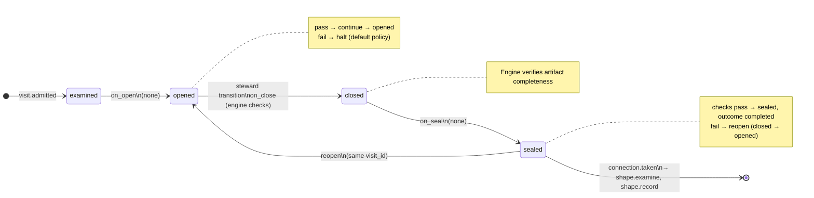

# Node: `shape.present.gate`

Status: **ok**

Flow: `implementation` in [flows/implementation/registry.yaml](../../.cursor/foundry/flows/implementation/registry.yaml).

User gate after shape.present when the plan has been presented. The steward uses a two-turn pattern: full plan presentation from the context packet, then gate decide to reject (refine) or accept (record AC).

## Contents

- [Lifecycle](#lifecycle)
- [Sequence](#sequence)
- [Ledger excerpt](#ledger-excerpt)
- [References](#references)
- [Permissions](#permissions)
- [Artifacts](#artifacts)
- [Receipts](#receipts)
- [Worker](#worker)
- [Connections](#connections)
- [Check catalog](#check-catalog)
- [Gaps](#gaps)

---

## Lifecycle

Admission is an event (`visit.admitted`), not a lifecycle state. See [visit lifecycle](../concepts/visits-lifecycle.md).

| Hook | Authored checks | Engine-implicit |
|---|---|---|
| `on_examine` | `prior-present-sealed` | — |
| `on_open` | *(empty)* | — |
| `on_close` | *(empty)* | Declared artifact completeness |
| `on_seal` | *(empty)* | — |

## Sequence

_Sequence diagram not authored in `doc.yaml`._

## References

- **Instructions:** [registry:nodes/shape.present.gate/instructions.md](../../.cursor/foundry/nodes/shape.present.gate/instructions.md)
- **Gate prompt:** `Succinct plan presentation shown. Reject to return to examination, or accept to record acceptance criteria.`
- **Catalog index:** [shape.present.gate.index.yaml](../catalog/implementation/nodes/shape.present.gate.index.yaml)

## Permissions

### `reads`

| Namespace | Paths |
|---|---|
| `state` | `presented_ac`, `presentation_artifact_path` |
| `artifacts` | `shape.present.presentation` |

### `allow`

| Namespace | Grant | Purpose |
|---|---|---|
| — | *(none declared)* | — |

### Engine-only surfaces

| Surface | Trigger | Maps to |
|---|---|---|
| `foundry run create` | New run bootstrap | Admit entry visit, run `on_open` |
| `prior-present-sealed` | `on_examine` hook | `on_examine` check `prior-present-sealed` |
| Artifact completeness | `close_request` before `closed` | Every `produces.artifacts` declaration satisfied |
| Connection selection | After `visit.sealed` | Routes to `shape.examine`, `shape.record` |

## Artifacts

_No work artifacts declared._

## Receipts

_No receipts declared._

## Connections

### Incoming

- `shape.present-to-shape.present.gate`: [shape.present](shape.present.md) → **shape.present.gate**

### Outgoing

- `shape.present.gate-to-shape.examine-refine`: **shape.present.gate** → [shape.examine](shape.examine.md) (`on.outcomes: ['completed']`)
- `shape.present.gate-to-shape.record-record`: **shape.present.gate** → [shape.record](shape.record.md) (`on.outcomes: ['completed']`)

## Check catalog

### `prior-present-sealed`

| Property | Value |
|---|---|
| **Body** | `when` |
| **Expression** | `history.last('visit.sealed', node_id='shape.present') != null && history.last('visit.sealed', node_id='shape.present').outcome == 'completed'` |
| **Hook** | `on_examine` |

## Concepts

- **Lifecycle:** [Visit lifecycle](../concepts/visits-lifecycle.md)
- **Connections:** [Graph and routing](../concepts/graph.md)
- **Permissions:** [Reads and allow](../concepts/capabilities.md)
- **Checks:** [Control plane](../concepts/control-plane.md)
- **Gate decisions:** [Gate nodes](../concepts/graph.md)

## Node summary

| Field | Value |
|---|---|
| **id** | `shape.present.gate` |
| **kind** | `gate` |
| **title** | Plan presentation — refine or record acceptance criteria |
