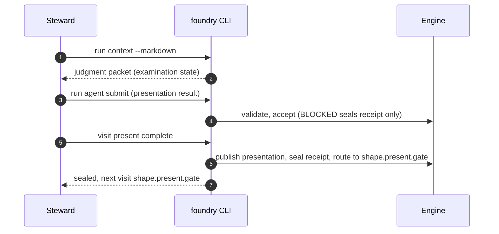

# Node: `shape.present`

Status: **draft**

Flow: `implementation` in [factory-flow.yaml](../../.cursor/foundry/flows/factory-flow.yaml).

Presentation judgment step. Model proposes presentation markdown and presented_ac (PROCEED or BLOCKED). Engine publishes the artifact, seals agent receipt, and transitions to the presentation gate on complete.

## Contents

- [Lifecycle](#lifecycle)
- [Sequence](#sequence)
- [Ledger excerpt](#ledger-excerpt)
- [References](#references)
- [Permissions](#permissions)
- [Artifacts](#artifacts)
- [Receipts](#receipts)
- [Worker](#worker)
- [Connections](#connections)
- [Check catalog](#check-catalog)
- [Gaps](#gaps)

---

## Lifecycle

Admission is an event (`visit.admitted`), not a lifecycle state. See [visit lifecycle](../../.cursor/foundry/cli/docs/concepts/visits-lifecycle.md).

| Hook | Authored checks | Engine-implicit |
|---|---|---|
| `on_examine` | `prior-examine-sealed` | — |
| `on_open` | *(empty)* | — |
| `on_close` | *(empty)* | Declared artifact completeness |
| `on_seal` | `agent-receipt-sealed` | — |

## Sequence

## References

- **Instructions:** [registry:nodes/shape.present/judgment.md](../../.cursor/foundry/nodes/shape.present/judgment.md)
- **Schemas:**
  - [registry:schemas/agent-receipt.schema.json](../../.cursor/foundry/schemas/agent-receipt.schema.json)
- **Catalog index:** [shape.present.index.yaml](../../.cursor/foundry/catalog/nodes/shape.present.index.yaml)

## Ownership

| Role | Owner |
|---|---|
| **model** | shape.present task (judgment.md + shape-presentation-result schema) |
| **steward** | run agent submit; visit present complete or run advance after PROCEED |
| **engine** | prior-examine-sealed, artifact completeness on close, on_seal agent-receipt check |

## Permissions

### `reads`

| Namespace | Paths |
|---|---|
| `state` | `draft_ac`, `assumptions`, `ticket`, `examination_decisions`, `clarifying_questions`, `examination_round`, `approved_ac` |

### `allow`

| Namespace | Grant | Purpose |
|---|---|---|
| `cli` | `run.agent.submit`, `visit.present.complete` | Steward CLI capabilities |

### Steward CLI capabilities

| Capability |
|---|
| `run.agent.submit` |
| `visit.present.complete` |

### Engine-only surfaces

| Surface | Trigger | Maps to |
|---|---|---|
| `foundry run create` | New run bootstrap | Admit entry visit, run `on_open` |
| `prior-examine-sealed` | `on_examine` hook | `on_examine` check `prior-examine-sealed` |
| `agent-receipt-sealed` | `on_seal` hook | `on_seal` check `agent-receipt-sealed` |
| Artifact completeness | `close_request` before `closed` | Every `produces.artifacts` declaration satisfied |
| Connection selection | After `visit.sealed` | Routes to `shape.present.gate` |

## Artifacts

### Work artifact: `presentation`

| Field | Value |
|---|---|
| **Logical id** | `presentation` |
| **Qualified ref** | `shape.present.presentation` |
| **Kind** | `document` |
| **URI** | `run:artifacts/{visit_id}/presentation.md` |
| **Media type** | `text/markdown` |

#### Downstream consumption

- [shape.present.gate](shape.present.gate.md) reads `shape.present.presentation` via `nearest_sealed_ancestor`
- [shape.record](shape.record.md) reads `shape.present.presentation` via `nearest_sealed_ancestor`

## Receipts

| Schema | Role |
|---|---|
| [registry:schemas/agent-receipt.schema.json](../../.cursor/foundry/schemas/agent-receipt.schema.json) | Worker completion evidence (`agent-receipt-sealed` on `on_seal`) |

## Worker

_No worker bound._

## Connections

### Incoming

- `shape.examine-to-shape.present`: [shape.examine](shape.examine.md) → **shape.present**
- `shape.examine.gate-to-shape.present-present`: [shape.examine.gate](shape.examine.gate.md) → **shape.present**
- `shape.record.gate-to-shape.present-reshape_plan`: [shape.record.gate](shape.record.gate.md) → **shape.present**, loop: `reshape_plan`

### Outgoing

- `shape.present-to-shape.present.gate`: **shape.present** → [shape.present.gate](shape.present.gate.md) (`on.outcomes: ['completed']`)

## Check catalog

### `prior-examine-sealed`

| Property | Value |
|---|---|
| **Body** | `when` |
| **Expression** | `history.last('visit.sealed', node_id='shape.examine') != null && history.last('visit.sealed', node_id='shape.examine').outcome == 'completed'` |
| **Hook** | `on_examine` |

### `agent-receipt-sealed`

| Property | Value |
|---|---|
| **Body** | `when` |
| **Expression** | `history.count('receipt.linked', visit_id=visit.id, schema='registry:schemas/agent-receipt.schema.json') >= 1` |
| **Hook** | `on_seal` |
| **on_fail** | `reopen` — Presentation receipt missing |

## Gaps

- reads.artifacts nearest_sealed_ancestor for ticket is declared in registry but ticket is read from state today

## Concepts

- **Lifecycle:** [Visit lifecycle](../../.cursor/foundry/cli/docs/concepts/visits-lifecycle.md)
- **Connections:** [Graph and routing](../../.cursor/foundry/cli/docs/concepts/graph.md)
- **Permissions:** [Reads and allow](../../.cursor/foundry/cli/docs/concepts/capabilities.md)
- **Artifacts:** [Artifact publication](../../.cursor/foundry/cli/docs/concepts/artifacts.md)
- **Receipts:** [Receipts vs artifacts](../../.cursor/foundry/cli/docs/concepts/artifacts.md)
- **Checks:** [Control plane](../../.cursor/foundry/cli/docs/concepts/control-plane.md)

## Node summary

| Field | Value |
|---|---|
| **id** | `shape.present` |
| **kind** | `step` |
| **title** | Shape present — succinct plan and AC presentation |
