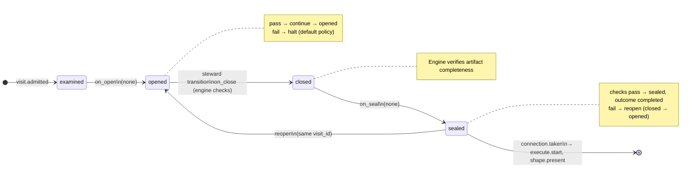
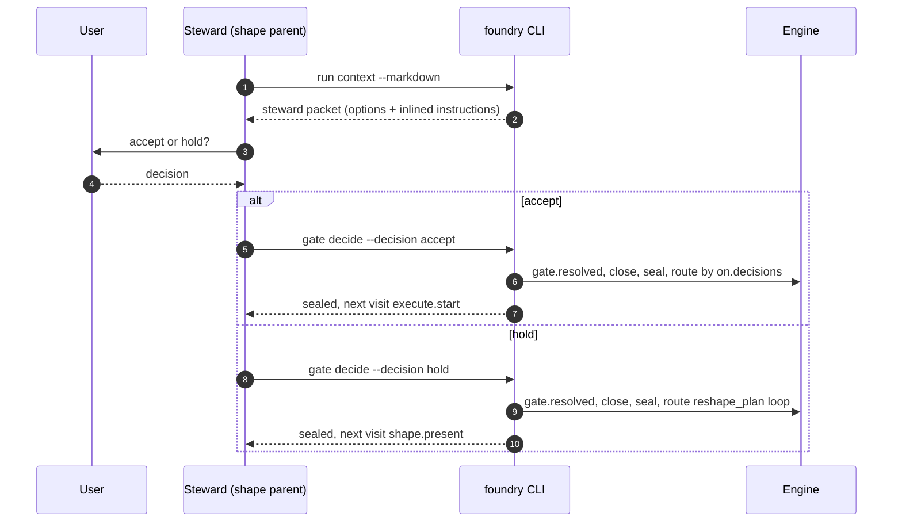

# Node: `shape.record.gate`

Status: **draft**

Flow: `implementation` in [factory-flow.yaml](../../.cursor/foundry/flows/factory-flow.yaml).

User gate after shape.record when the living plan and approved_ac are frozen. The steward presents accept-or-hold options and records accept via gate decide.

## Contents

- [Lifecycle](#lifecycle)
- [Sequence](#sequence)
- [Ledger excerpt](#ledger-excerpt)
- [References](#references)
- [Permissions](#permissions)
- [Artifacts](#artifacts)
- [Receipts](#receipts)
- [Worker](#worker)
- [Connections](#connections)
- [Check catalog](#check-catalog)
- [Gaps](#gaps)

---

## Lifecycle

Admission is an event (`visit.admitted`), not a lifecycle state. See [visit lifecycle](../concepts/visits-lifecycle.md).

| Hook | Authored checks | Engine-implicit |
|---|---|---|
| `on_examine` | `prior-shape-record-sealed`, `approved-ac-recorded` | — |
| `on_open` | *(empty)* | — |
| `on_close` | *(empty)* | Declared artifact completeness |
| `on_seal` | *(empty)* | — |

## Sequence

## References

- **Instructions:** [registry:nodes/shape.record.gate/instructions.md](../../.cursor/foundry/nodes/shape.record.gate/instructions.md)
- **Gate prompt:** `Living plan and approved_ac are frozen. The user accepts shared understanding of acceptance criteria before execute may start, or holds to request changes.`
- **Catalog index:** [shape.record.gate.index.yaml](../../.cursor/foundry/catalog/nodes/shape.record.gate.index.yaml)

## Ownership

| Role | Owner |
|---|---|
| **worker** | none |
| **steward** | shape parent agent |
| **engine** | on_examine prior-shape-record-sealed and approved-ac-recorded, gate.presented at admission, connection routing by decision |

## Permissions

### `reads`

| Namespace | Paths |
|---|---|
| `state` | `approved_ac`, `approved_ac_digest`, `plan_path`, `plan_version` |
| `artifacts` | `shape.record.plan` |

### `allow`

| Namespace | Grant | Purpose |
|---|---|---|
| `state` | `state.nodes.shape.record.gate.*` | Domain fields |

### Engine-only surfaces

| Surface | Trigger | Maps to |
|---|---|---|
| `foundry run create` | New run bootstrap | Admit entry visit, run `on_open` |
| `prior-shape-record-sealed` | `on_examine` hook | `on_examine` check `prior-shape-record-sealed` |
| `approved-ac-recorded` | `on_examine` hook | `on_examine` check `approved-ac-recorded` |
| Artifact completeness | `close_request` before `closed` | Every `produces.artifacts` declaration satisfied |
| Connection selection | After `visit.sealed` | Routes to `execute.start`, `shape.present` |

## Artifacts

_No work artifacts declared._

## Receipts

_No receipts declared._

## Connections

### Incoming

- `shape.record-to-shape.record.gate`: [shape.record](shape.record.md) → **shape.record.gate**

### Outgoing

- `shape.record.gate-to-execute.start-record`: **shape.record.gate** → [execute.start](execute.start.md) (`on.outcomes: ['completed']`)
- `shape.record.gate-to-shape.present-reshape_plan`: **shape.record.gate** → [shape.present](shape.present.md) (`on.outcomes: ['completed']`)

## Check catalog

### `prior-shape-record-sealed`

| Property | Value |
|---|---|
| **Body** | `when` |
| **Expression** | `history.last('visit.sealed', node_id='shape.record') != null && history.last('visit.sealed', node_id='shape.record').outcome == 'completed'` |
| **Hook** | `on_examine` |

### `approved-ac-recorded`

| Property | Value |
|---|---|
| **Body** | `when` |
| **Expression** | `state.approved_ac_version >= 1` |
| **Hook** | `on_examine` |

## Concepts

- **Lifecycle:** [Visit lifecycle](../concepts/visits-lifecycle.md)
- **Connections:** [Graph and routing](../concepts/graph.md)
- **Permissions:** [Reads and allow](../concepts/capabilities.md)
- **Checks:** [Control plane](../concepts/control-plane.md)
- **Gate decisions:** [Gate nodes](../concepts/graph.md)

## Node summary

| Field | Value |
|---|---|
| **id** | `shape.record.gate` |
| **kind** | `gate` |
| **title** | Record acceptance criteria |
