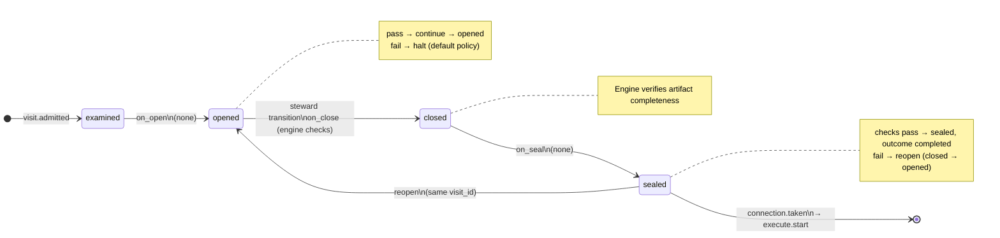

# Node: `shape.record.gate`

Status: **generated**

Flow: `implementation` in [factory-flow.yaml](../../.cursor/foundry/flows/factory-flow.yaml).

Record acceptance criteria

## Lifecycle

Admission is an event (`visit.admitted`), not a lifecycle state. See [visit lifecycle](../concepts/visits-lifecycle.md).

| Hook | Authored checks | Engine-implicit |
|---|---|---|
| `on_examine` | `prior-shape-record-sealed`, `approved-ac-recorded` | — |
| `on_open` | *(empty)* | — |
| `on_close` | *(empty)* | Declared artifact completeness |
| `on_seal` | *(empty)* | — |

## References

- **Gate prompt:** `Record the living plan and approved_ac. The user confirms shared understanding of acceptance criteria before execute may start.`
- **Catalog index:** [shape.record.gate.index.yaml](../../.cursor/foundry/catalog/nodes/shape.record.gate.index.yaml)

## Artifacts

_No work artifacts declared._

## Receipts

_No receipts declared._

## Connections

### Incoming

- `shape.record-to-shape.record.gate`: [shape.record](shape.record.md) → **shape.record.gate**

### Outgoing

- `shape.record.gate-to-execute.start-record`: **shape.record.gate** → [execute.start](execute.start.md) (`on.outcomes: ['completed']`)

## Concepts

- **Lifecycle:** [Visit lifecycle](../concepts/visits-lifecycle.md)
- **Connections:** [Graph and routing](../concepts/graph.md)
- **Permissions:** [Reads and allow](../concepts/capabilities.md)
- **Checks:** [Control plane](../concepts/control-plane.md)
- **Gate decisions:** [Gate nodes](../concepts/graph.md)

## Node summary

| Field | Value |
|---|---|
| **id** | `shape.record.gate` |
| **kind** | `gate` |
| **title** | Record acceptance criteria |
