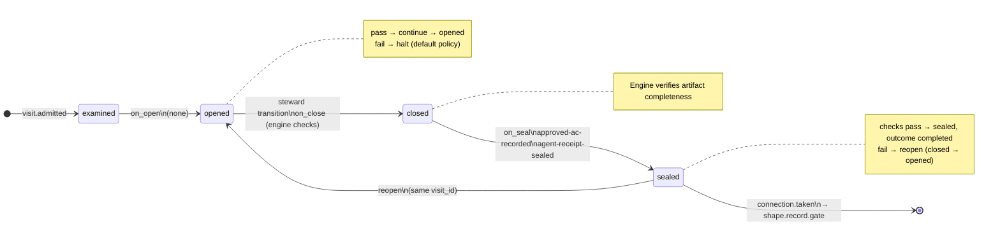
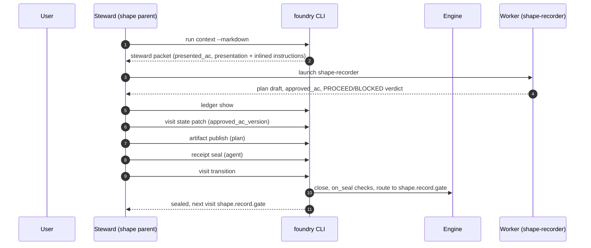

# Node: `shape.record`

Status: **draft**

Flow: `implementation` in [factory-flow.yaml](../../.cursor/foundry/flows/factory-flow.yaml).

Record step. Steward launches shape-recorder to propose approved AC and living plan markdown, writes plan once, publishes the artifact, seals agent receipt, and transitions to the record gate.

## Contents

- [Lifecycle](#lifecycle)
- [Sequence](#sequence)
- [Ledger excerpt](#ledger-excerpt)
- [References](#references)
- [Permissions](#permissions)
- [Artifacts](#artifacts)
- [Receipts](#receipts)
- [Worker](#worker)
- [Connections](#connections)
- [Check catalog](#check-catalog)
- [Gaps](#gaps)

---

## Lifecycle

Admission is an event (`visit.admitted`), not a lifecycle state. See [visit lifecycle](../../.cursor/foundry/cli/docs/concepts/visits-lifecycle.md).

| Hook | Authored checks | Engine-implicit |
|---|---|---|
| `on_examine` | `prior-present-sealed` | — |
| `on_open` | *(empty)* | — |
| `on_close` | *(empty)* | Declared artifact completeness |
| `on_seal` | `approved-ac-recorded`, `agent-receipt-sealed` | — |

## Sequence

## References

- **Instructions:** [registry:nodes/shape.record/instructions.md](../../.cursor/foundry/nodes/shape.record/instructions.md)
- **Schemas:**
  - [registry:schemas/agent-receipt.schema.json](../../.cursor/foundry/schemas/agent-receipt.schema.json)
- **Catalog index:** [shape.record.index.yaml](../../.cursor/foundry/catalog/nodes/shape.record.index.yaml)

## Ownership

| Role | Owner |
|---|---|
| **worker** | shape-recorder |
| **steward** | shape parent agent |
| **engine** | on_examine prior-present-sealed, artifact completeness on close, on_seal approved-ac-recorded and agent-receipt checks |

## Permissions

### `reads`

| Namespace | Paths |
|---|---|
| `state` | `presented_ac`, `presentation_artifact_path` |
| `artifacts` | `shape.present.presentation` |

### `allow`

| Namespace | Grant | Purpose |
|---|---|---|
| `state` | `approved_ac`, `approved_ac_version`, `approved_ac_digest`, `plan_path`, `plan_version`, `state.nodes.shape.record.*` | Domain fields |
| `files.write` | `workspace:plan.md`, `run:artifacts/{visit_id}/plan.md`, `run:receipts/{visit_id}/assessment.md`, `run:receipts/agent.json` | Writable run paths |
| `cli` | `artifact.publish`, `ledger.show`, `receipt.link`, `transition`, `visit.state_patch` | Steward CLI capabilities |
| `worker` | bound worker | Authorized without `allow.agents` |

### Steward CLI capabilities

| Capability |
|---|
| `artifact.publish` |
| `ledger.show` |
| `receipt.link` |
| `transition` |
| `visit.state_patch` |

### Engine-only surfaces

| Surface | Trigger | Maps to |
|---|---|---|
| `foundry run create` | New run bootstrap | Admit entry visit, run `on_open` |
| `prior-present-sealed` | `on_examine` hook | `on_examine` check `prior-present-sealed` |
| `approved-ac-recorded` | `on_seal` hook | `on_seal` check `approved-ac-recorded` |
| `agent-receipt-sealed` | `on_seal` hook | `on_seal` check `agent-receipt-sealed` |
| Artifact completeness | `close_request` before `closed` | Every `produces.artifacts` declaration satisfied |
| Connection selection | After `visit.sealed` | Routes to `shape.record.gate` |

## Artifacts

### Work artifact: `plan`

| Field | Value |
|---|---|
| **Logical id** | `plan` |
| **Qualified ref** | `shape.record.plan` |
| **Kind** | `document` |
| **URI** | `run:artifacts/{visit_id}/plan.md` |
| **Media type** | `text/markdown` |

#### Downstream consumption

- [execute.intake](execute.intake.md) reads `shape.record.plan` via `nearest_sealed_ancestor`
- [execute.plan](execute.plan.md) reads `shape.record.plan` via `nearest_sealed_ancestor`
- [shape.record.gate](shape.record.gate.md) reads `shape.record.plan` via `nearest_sealed_ancestor`
- [verify.acceptance](verify.acceptance.md) reads `shape.record.plan` via `nearest_sealed_ancestor`
- [verify.intake](verify.intake.md) reads `shape.record.plan` via `nearest_sealed_ancestor`

## Receipts

| Schema | Role |
|---|---|
| [registry:schemas/agent-receipt.schema.json](../../.cursor/foundry/schemas/agent-receipt.schema.json) | Worker completion evidence (`agent-receipt-sealed` on `on_seal`) |

## Worker

| Field | Value |
|---|---|
| **Worker id** | `shape-recorder` |
| **Mode** | `shape` |
| **Prompt** | [registry:agents/shape-recorder.md](../../.cursor/agents/shape-recorder.md) |
| **Contract** | [registry:workers/shape-recorder/contract.yaml](../../.cursor/foundry/workers/shape-recorder/contract.yaml) |
| **Generated worker doc** | [shape-recorder](../catalog/workers/shape-recorder.md) |

#### Worker concern ownership

| Concern | Owner |
|---|---|
| `on_examine` / `on_open` / `on_seal` checks | on_examine prior-present-sealed, artifact completeness on close, on_seal approved-ac-recorded and agent-receipt checks |
| Intake receipt `checks[]` | shape parent agent — from ledger when sealing |
| Work artifact publication | shape parent agent — `artifact.publish` |
| Receipts | shape parent agent — `receipt.link` |
| Worker assessment and proceed/blocked judgment | shape-recorder |

## Connections

### Incoming

- `shape.present.gate-to-shape.record-record`: [shape.present.gate](shape.present.gate.md) → **shape.record**

### Outgoing

- `shape.record-to-shape.record.gate`: **shape.record** → [shape.record.gate](shape.record.gate.md) (`on.outcomes: ['completed']`)

## Check catalog

### `prior-present-sealed`

| Property | Value |
|---|---|
| **Body** | `when` |
| **Expression** | `history.last('visit.sealed', node_id='shape.present') != null && history.last('visit.sealed', node_id='shape.present').outcome == 'completed'` |
| **Hook** | `on_examine` |

### `approved-ac-recorded`

| Property | Value |
|---|---|
| **Body** | `when` |
| **Expression** | `state.approved_ac_version >= 1` |
| **Hook** | `on_seal` |
| **on_fail** | `reopen` — approved_ac not recorded |

### `agent-receipt-sealed`

| Property | Value |
|---|---|
| **Body** | `when` |
| **Expression** | `history.count('receipt.linked', visit_id=visit.id, schema='registry:schemas/agent-receipt.schema.json') >= 1` |
| **Hook** | `on_seal` |
| **on_fail** | `reopen` — Shape record receipt not sealed |

## Gaps

- workspace:plan.md mirror write is steward-side; engine tracks run artifact only

## Concepts

- **Lifecycle:** [Visit lifecycle](../../.cursor/foundry/cli/docs/concepts/visits-lifecycle.md)
- **Connections:** [Graph and routing](../../.cursor/foundry/cli/docs/concepts/graph.md)
- **Permissions:** [Reads and allow](../../.cursor/foundry/cli/docs/concepts/capabilities.md)
- **Artifacts:** [Artifact publication](../../.cursor/foundry/cli/docs/concepts/artifacts.md)
- **Receipts:** [Receipts vs artifacts](../../.cursor/foundry/cli/docs/concepts/artifacts.md)
- **Checks:** [Control plane](../../.cursor/foundry/cli/docs/concepts/control-plane.md)

## Node summary

| Field | Value |
|---|---|
| **id** | `shape.record` |
| **kind** | `step` |
| **title** | Shape record — freeze approved_ac and living plan |
