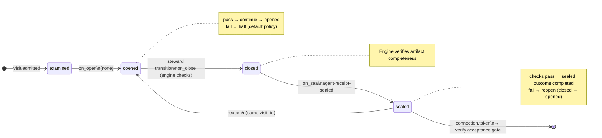

# Node: `verify.acceptance`

Status: **generated**

Flow: `implementation` in [factory-flow.yaml](../../.cursor/foundry/flows/factory-flow.yaml).

Automated acceptance criteria validation

## Lifecycle

Admission is an event (`visit.admitted`), not a lifecycle state. See [visit lifecycle](../../.cursor/foundry/cli/docs/concepts/visits-lifecycle.md).

| Hook | Authored checks | Engine-implicit |
|---|---|---|
| `on_examine` | `prior-verify-intake-sealed` | — |
| `on_open` | *(empty)* | — |
| `on_close` | *(empty)* | Declared artifact completeness |
| `on_seal` | `agent-receipt-sealed` | — |

## References

- **Instructions:** [registry:steps/verify-acceptance.md](../../.cursor/foundry/steps/verify-acceptance.md)
- **Schemas:**
  - [registry:schemas/agent-receipt.schema.json](../../.cursor/foundry/schemas/agent-receipt.schema.json)
- **Catalog index:** [verify.acceptance.index.yaml](../../.cursor/foundry/catalog/nodes/verify.acceptance.index.yaml)

## Artifacts

### Work artifact: `verify-findings`

| Field | Value |
|---|---|
| **Logical id** | `verify-findings` |
| **Qualified ref** | `verify.acceptance.verify-findings` |
| **Kind** | `document` |
| **URI** | `run:artifacts/{visit_id}/verify-findings.json` |
| **Media type** | `application/json` |

#### Downstream consumption

- [verify.code_review](verify.code_review.md) reads `verify.acceptance.verify-findings` via `nearest_sealed_ancestor`

## Receipts

| Schema | Role |
|---|---|
| [registry:schemas/agent-receipt.schema.json](../../.cursor/foundry/schemas/agent-receipt.schema.json) | Worker completion evidence (`agent-receipt-sealed` on `on_seal`) |

## Worker

| Field | Value |
|---|---|
| **Worker id** | `implementation-validator` |
| **Mode** | `validate` |
| **Prompt** | [registry:agents/implementation-validator.md](../../.cursor/agents/implementation-validator.md) |
| **Contract** | [registry:workers/implementation-validator/contract.yaml](../../.cursor/foundry/workers/implementation-validator/contract.yaml) |
| **Generated worker doc** | [implementation-validator](../catalog/workers/implementation-validator.md) |

#### Worker concern ownership

| Concern | Owner |
|---|---|
| `on_examine` / `on_open` / `on_seal` checks | Engine |
| Intake receipt `checks[]` | Steward — from ledger when sealing |
| Work artifact publication | Steward — `artifact.publish` |
| Receipts | Steward — `receipt.link` |
| Worker assessment and proceed/blocked judgment | implementation-validator |

## Connections

### Incoming

- `verify.intake.gate-to-verify.acceptance-pass`: [verify.intake.gate](verify.intake.gate.md) → **verify.acceptance**

### Outgoing

- `verify.acceptance-to-verify.acceptance.gate`: **verify.acceptance** → [verify.acceptance.gate](verify.acceptance.gate.md) (`on.outcomes: ['completed']`)

## Concepts

- **Lifecycle:** [Visit lifecycle](../../.cursor/foundry/cli/docs/concepts/visits-lifecycle.md)
- **Connections:** [Graph and routing](../../.cursor/foundry/cli/docs/concepts/graph.md)
- **Permissions:** [Reads and allow](../../.cursor/foundry/cli/docs/concepts/capabilities.md)
- **Artifacts:** [Artifact publication](../../.cursor/foundry/cli/docs/concepts/artifacts.md)
- **Receipts:** [Receipts vs artifacts](../../.cursor/foundry/cli/docs/concepts/artifacts.md)
- **Checks:** [Control plane](../../.cursor/foundry/cli/docs/concepts/control-plane.md)

## Node summary

| Field | Value |
|---|---|
| **id** | `verify.acceptance` |
| **kind** | `step` |
| **title** | Automated acceptance criteria validation |
