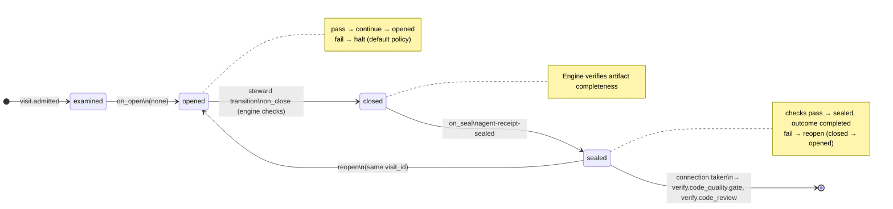

# Node: `verify.code_quality`

Status: **ok**

Flow: `implementation` in [flows/implementation/registry.yaml](../../.cursor/foundry/flows/implementation/registry.yaml).

Host-owned deterministic code-quality checks after verify.acceptance.gate pass when review is enabled. Runs manifest code_quality or lint commands, publishes code-quality-report, seals implementation-validator-labeled agent receipt, routes to verify.code_quality.gate; when review is disabled seals not_applicable and skips to verify.code_review.

## Contents

- [Lifecycle](#lifecycle)
- [Sequence](#sequence)
- [Ledger excerpt](#ledger-excerpt)
- [References](#references)
- [Permissions](#permissions)
- [Artifacts](#artifacts)
- [Receipts](#receipts)
- [Connections](#connections)
- [Check catalog](#check-catalog)
- [Gaps](#gaps)

---

## Lifecycle

Admission is an event (`visit.admitted`), not a lifecycle state. See [visit lifecycle](../concepts/visits-lifecycle.md).

| Hook | Authored checks | Engine-implicit |
|---|---|---|
| `on_examine` | `prior-verify-acceptance-sealed`, `review-enabled` | — |
| `on_open` | *(empty)* | — |
| `on_close` | *(empty)* | Declared artifact completeness |
| `on_seal` | `agent-receipt-sealed` | — |

## Sequence

_Sequence diagram not authored in `doc.yaml`._

## References

- **Schemas:**
  - [registry:schemas/agent-receipt.schema.json](../../.cursor/foundry/schemas/agent-receipt.schema.json)
- **Catalog index:** [verify.code_quality.index.yaml](../catalog/implementation/nodes/verify.code_quality.index.yaml)

## Permissions

### `reads`

| Namespace | Paths |
|---|---|
| `config` | `review`, `verification` |
| `state` | `feature_branch`, `verify_findings` |
| `artifacts` | `verify.intake.branch-diff` |

### `allow`

| Namespace | Grant | Purpose |
|---|---|---|
| — | *(none declared)* | — |

### Engine-only surfaces

| Surface | Trigger | Maps to |
|---|---|---|
| `foundry run create` | New run bootstrap | Admit entry visit, run `on_open` |
| `prior-verify-acceptance-sealed` | `on_examine` hook | `on_examine` check `prior-verify-acceptance-sealed` |
| `review-enabled` | `on_examine` hook | `on_examine` check `review-enabled` |
| `agent-receipt-sealed` | `on_seal` hook | `on_seal` check `agent-receipt-sealed` |
| Artifact completeness | `close_request` before `closed` | Every `produces.artifacts` declaration satisfied |
| Connection selection | After `visit.sealed` | Routes to `verify.code_quality.gate`, `verify.code_review` |

## Artifacts

### Work artifact: `code-quality-report`

| Field | Value |
|---|---|
| **Logical id** | `code-quality-report` |
| **Qualified ref** | `verify.code_quality.code-quality-report` |
| **Kind** | `document` |
| **URI** | `run:artifacts/{visit_id}/code-quality-report.md` |
| **Media type** | `text/markdown` |

## Receipts

| Schema | Role |
|---|---|
| [registry:schemas/agent-receipt.schema.json](../../.cursor/foundry/schemas/agent-receipt.schema.json) | Worker completion evidence (`agent-receipt-sealed` on `on_seal`) |

## Connections

### Incoming

- `verify.acceptance.gate-to-verify.code_quality-pass`: [verify.acceptance.gate](verify.acceptance.gate.md) → **verify.code_quality**

### Outgoing

- `verify.code_quality-to-verify.code_quality.gate`: **verify.code_quality** → [verify.code_quality.gate](verify.code_quality.gate.md) (`on.outcomes: ['completed']`)
- `verify.code_quality-to-verify.code_review-skipped`: **verify.code_quality** → [verify.code_review](verify.code_review.md) (`on.outcomes: ['not_applicable']`)

## Check catalog

### `prior-verify-acceptance-sealed`

| Property | Value |
|---|---|
| **Body** | `when` |
| **Expression** | `history.last('visit.sealed', node_id='verify.acceptance') != null && history.last('visit.sealed', node_id='verify.acceptance').outcome == 'completed'` |
| **Hook** | `on_examine` |

### `review-enabled`

| Property | Value |
|---|---|
| **Body** | `when` |
| **Expression** | `config.review.enabled` |
| **Hook** | `on_examine` |
| **on_fail** | `skip` — Review disabled in app manifest |

### `agent-receipt-sealed`

| Property | Value |
|---|---|
| **Body** | `when` |
| **Expression** | `history.count('receipt.linked', visit_id=visit.id, schema='registry:schemas/agent-receipt.schema.json') >= 1` |
| **Hook** | `on_seal` |

## Gaps

- Bugbot and security-review subagents are not invoked on the default host slice
- production apps must define code_quality or lint in app manifest (non-stub)

## Concepts

- **Lifecycle:** [Visit lifecycle](../concepts/visits-lifecycle.md)
- **Connections:** [Graph and routing](../concepts/graph.md)
- **Permissions:** [Reads and allow](../concepts/capabilities.md)
- **Artifacts:** [Artifact publication](../concepts/artifacts.md)
- **Receipts:** [Receipts vs artifacts](../concepts/artifacts.md)
- **Checks:** [Control plane](../concepts/control-plane.md)

## Node summary

| Field | Value |
|---|---|
| **id** | `verify.code_quality` |
| **kind** | `step` |
| **title** | Automated lint, Bugbot, and security review |
