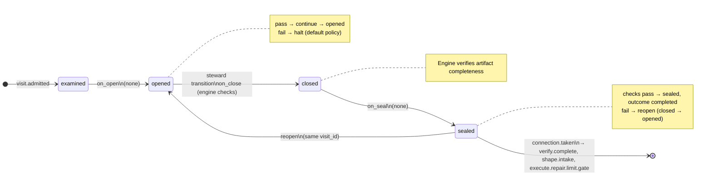

# Node: `verify.code_review.gate`

Status: **ok**

Flow: `implementation` in [flows/implementation/registry.yaml](../../.cursor/foundry/flows/implementation/registry.yaml).

User gate after verify code review. Steward decides accept, reject (repairs), or reshape using the verify notes packet and branch diff evidence inlined in run context.

## Contents

- [Lifecycle](#lifecycle)
- [Sequence](#sequence)
- [Ledger excerpt](#ledger-excerpt)
- [References](#references)
- [Permissions](#permissions)
- [Artifacts](#artifacts)
- [Receipts](#receipts)
- [Connections](#connections)
- [Check catalog](#check-catalog)
- [Gaps](#gaps)

---

## Lifecycle

Admission is an event (`visit.admitted`), not a lifecycle state. See [visit lifecycle](../concepts/visits-lifecycle.md).

| Hook | Authored checks | Engine-implicit |
|---|---|---|
| `on_examine` | `prior-verify-acceptance-sealed` | — |
| `on_open` | *(empty)* | — |
| `on_close` | *(empty)* | Declared artifact completeness |
| `on_seal` | *(empty)* | — |

## Sequence

_Sequence diagram not authored in `doc.yaml`._

## References

- **Instructions:** [registry:nodes/verify.code_review.gate/instructions.md](../../.cursor/foundry/nodes/verify.code_review.gate/instructions.md)
- **Gate prompt:** `Human code review (single turn). Accept verified implementation, reject for repairs (standards), or reshape when acceptance criteria are wrong.`
- **Catalog index:** [verify.code_review.gate.index.yaml](../catalog/implementation/nodes/verify.code_review.gate.index.yaml)

## Permissions

### `reads`

| Namespace | Paths |
|---|---|
| `state` | `approved_ac`, `verify_notes`, `verify_findings`, `feature_branch` |
| `artifacts` | `verify.code_review.verify-notes`, `verify.intake.branch-diff`, `verify.acceptance.verify-findings` |

### `allow`

| Namespace | Grant | Purpose |
|---|---|---|
| — | *(none declared)* | — |

### Engine-only surfaces

| Surface | Trigger | Maps to |
|---|---|---|
| `foundry run create` | New run bootstrap | Admit entry visit, run `on_open` |
| `prior-verify-acceptance-sealed` | `on_examine` hook | `on_examine` check `prior-verify-acceptance-sealed` |
| Artifact completeness | `close_request` before `closed` | Every `produces.artifacts` declaration satisfied |
| Connection selection | After `visit.sealed` | Routes to `verify.complete`, `shape.intake`, `execute.repair.limit.gate` |

## Artifacts

_No work artifacts declared._

## Receipts

_No receipts declared._

## Connections

### Incoming

- `verify.code_review-to-verify.code_review.gate`: [verify.code_review](verify.code_review.md) → **verify.code_review.gate**

### Outgoing

- `verify.code_review.gate-to-verify.complete-approve`: **verify.code_review.gate** → [verify.complete](verify.complete.md) (`on.outcomes: ['completed']`)
- `verify.code_review.gate-to-shape.intake-reshape`: **verify.code_review.gate** → [shape.intake](shape.intake.md) (`on.outcomes: ['completed']`)
- `verify.code_review.gate-to-execute.repair.limit.gate-repair`: **verify.code_review.gate** → [execute.repair.limit.gate](execute.repair.limit.gate.md) (`on.outcomes: ['completed']`)

## Check catalog

### `prior-verify-acceptance-sealed`

| Property | Value |
|---|---|
| **Body** | `when` |
| **Expression** | `history.last('visit.sealed', node_id='verify.acceptance') != null && history.last('visit.sealed', node_id='verify.acceptance').outcome == 'completed'` |
| **Hook** | `on_examine` |

## Concepts

- **Lifecycle:** [Visit lifecycle](../concepts/visits-lifecycle.md)
- **Connections:** [Graph and routing](../concepts/graph.md)
- **Permissions:** [Reads and allow](../concepts/capabilities.md)
- **Checks:** [Control plane](../concepts/control-plane.md)
- **Gate decisions:** [Gate nodes](../concepts/graph.md)

## Node summary

| Field | Value |
|---|---|
| **id** | `verify.code_review.gate` |
| **kind** | `gate` |
| **title** | Human code review decision |
