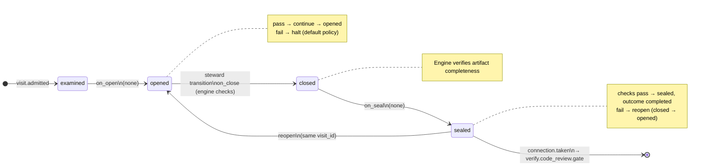

# Node: `verify.code_review`

Status: **generated**

Flow: `implementation` in [factory-flow.yaml](../../.cursor/foundry/flows/factory-flow.yaml).

Human code review — single turn

## Lifecycle

Admission is an event (`visit.admitted`), not a lifecycle state. See [visit lifecycle](../concepts/visits-lifecycle.md).

| Hook | Authored checks | Engine-implicit |
|---|---|---|
| `on_examine` | `acceptance-passed`, `code-quality-done-or-skipped` | — |
| `on_open` | *(empty)* | — |
| `on_close` | *(empty)* | Declared artifact completeness |
| `on_seal` | *(empty)* | — |

## References

- **Instructions:** [registry:steps/verify-code-review.md](../../.cursor/foundry/steps/verify-code-review.md)
- **Catalog index:** [verify.code_review.index.yaml](../../.cursor/foundry/catalog/nodes/verify.code_review.index.yaml)

## Artifacts

### Work artifact: `verify-notes`

| Field | Value |
|---|---|
| **Logical id** | `verify-notes` |
| **Qualified ref** | `verify.code_review.verify-notes` |
| **Kind** | `document` |
| **URI** | `run:artifacts/{visit_id}/verify-notes.md` |
| **Media type** | `text/markdown` |

## Receipts

_No receipts declared._

## Worker

_No worker bound._

## Connections

### Incoming

- `verify.code_quality-to-verify.code_review-skipped`: [verify.code_quality](verify.code_quality.md) → **verify.code_review**
- `verify.code_quality.gate-to-verify.code_review-pass`: [verify.code_quality.gate](verify.code_quality.gate.md) → **verify.code_review**

### Outgoing

- `verify.code_review-to-verify.code_review.gate`: **verify.code_review** → [verify.code_review.gate](verify.code_review.gate.md) (`on.outcomes: ['completed']`)

## Concepts

- **Lifecycle:** [Visit lifecycle](../concepts/visits-lifecycle.md)
- **Connections:** [Graph and routing](../concepts/graph.md)
- **Permissions:** [Reads and allow](../concepts/capabilities.md)
- **Artifacts:** [Artifact publication](../concepts/artifacts.md)
- **Checks:** [Control plane](../concepts/control-plane.md)

## Node summary

| Field | Value |
|---|---|
| **id** | `verify.code_review` |
| **kind** | `step` |
| **title** | Human code review — single turn |
