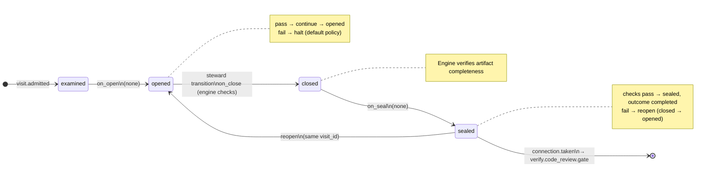

# Node: `verify.code_review`

Status: **ok**

Flow: `implementation` in [flows/implementation/registry.yaml](../../.cursor/foundry/flows/implementation/registry.yaml).

Host-owned deterministic review packet after code quality gate pass or code_quality skip. Publishes verify-notes.md, patches verify_notes state, routes to verify.code_review.gate for human accept, reject, or reshape.

## Contents

- [Lifecycle](#lifecycle)
- [Sequence](#sequence)
- [Ledger excerpt](#ledger-excerpt)
- [References](#references)
- [Permissions](#permissions)
- [Artifacts](#artifacts)
- [Receipts](#receipts)
- [Connections](#connections)
- [Check catalog](#check-catalog)
- [Gaps](#gaps)

---

## Lifecycle

Admission is an event (`visit.admitted`), not a lifecycle state. See [visit lifecycle](../concepts/visits-lifecycle.md).

| Hook | Authored checks | Engine-implicit |
|---|---|---|
| `on_examine` | `acceptance-passed`, `code-quality-done-or-skipped` | — |
| `on_open` | *(empty)* | — |
| `on_close` | *(empty)* | Declared artifact completeness |
| `on_seal` | *(empty)* | — |

## Sequence

_Sequence diagram not authored in `doc.yaml`._

## References

- **Catalog index:** [verify.code_review.index.yaml](../catalog/implementation/nodes/verify.code_review.index.yaml)

## Permissions

### `reads`

| Namespace | Paths |
|---|---|
| `state` | `approved_ac`, `verify_findings`, `branch_diff_artifact_path` |
| `artifacts` | `verify.intake.branch-diff`, `verify.acceptance.verify-findings` |

### `allow`

| Namespace | Grant | Purpose |
|---|---|---|
| — | *(none declared)* | — |

### Engine-only surfaces

| Surface | Trigger | Maps to |
|---|---|---|
| `foundry run create` | New run bootstrap | Admit entry visit, run `on_open` |
| `acceptance-passed` | `on_examine` hook | `on_examine` check `acceptance-passed` |
| `code-quality-done-or-skipped` | `on_examine` hook | `on_examine` check `code-quality-done-or-skipped` |
| Artifact completeness | `close_request` before `closed` | Every `produces.artifacts` declaration satisfied |
| Connection selection | After `visit.sealed` | Routes to `verify.code_review.gate` |

## Artifacts

### Work artifact: `verify-notes`

| Field | Value |
|---|---|
| **Logical id** | `verify-notes` |
| **Qualified ref** | `verify.code_review.verify-notes` |
| **Kind** | `document` |
| **URI** | `run:artifacts/{visit_id}/verify-notes.md` |
| **Media type** | `text/markdown` |

#### Downstream consumption

- [verify.code_review.gate](verify.code_review.gate.md) reads `verify.code_review.verify-notes` via `nearest_sealed_ancestor`

## Receipts

_No receipts declared._

## Connections

### Incoming

- `verify.code_quality-to-verify.code_review-skipped`: [verify.code_quality](verify.code_quality.md) → **verify.code_review**
- `verify.code_quality.gate-to-verify.code_review-pass`: [verify.code_quality.gate](verify.code_quality.gate.md) → **verify.code_review**

### Outgoing

- `verify.code_review-to-verify.code_review.gate`: **verify.code_review** → [verify.code_review.gate](verify.code_review.gate.md) (`on.outcomes: ['completed']`)

## Check catalog

### `acceptance-passed`

| Property | Value |
|---|---|
| **Body** | `when` |
| **Expression** | `history.last('gate.resolved', node_id='verify.acceptance.gate') != null && history.last('gate.resolved', node_id='verify.acceptance.gate').decision == 'pass'` |
| **Hook** | `on_examine` |

### `code-quality-done-or-skipped`

| Property | Value |
|---|---|
| **Body** | `when` |
| **Expression** | `!config.review.enabled || (history.last('visit.sealed', node_id='verify.code_quality') != null && history.last('visit.sealed', node_id='verify.code_quality').outcome in ['completed', 'not_applicable'])` |
| **Hook** | `on_examine` |

## Gaps

- verify-notes content is a minimal host stub; richer diff/AC synthesis is future work

## Concepts

- **Lifecycle:** [Visit lifecycle](../concepts/visits-lifecycle.md)
- **Connections:** [Graph and routing](../concepts/graph.md)
- **Permissions:** [Reads and allow](../concepts/capabilities.md)
- **Artifacts:** [Artifact publication](../concepts/artifacts.md)
- **Checks:** [Control plane](../concepts/control-plane.md)

## Node summary

| Field | Value |
|---|---|
| **id** | `verify.code_review` |
| **kind** | `step` |
| **title** | Human code review — single turn |
