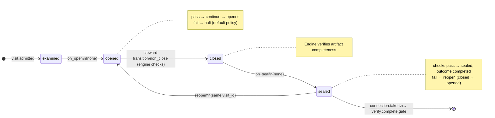

# Node: `verify.complete`

Status: **generated**

Flow: `implementation` in [factory-flow.yaml](../../.cursor/foundry/flows/factory-flow.yaml).

Verify phase complete

## Lifecycle

Admission is an event (`visit.admitted`), not a lifecycle state. See [visit lifecycle](../../.cursor/foundry/cli/docs/concepts/visits-lifecycle.md).

| Hook | Authored checks | Engine-implicit |
|---|---|---|
| `on_examine` | `code-review-approved` | — |
| `on_open` | *(empty)* | — |
| `on_close` | *(empty)* | Declared artifact completeness |
| `on_seal` | *(empty)* | — |

## References

- **Instructions:** [registry:steps/verify-complete.md](../../.cursor/foundry/steps/verify-complete.md)
- **Catalog index:** [verify.complete.index.yaml](../../.cursor/foundry/catalog/nodes/verify.complete.index.yaml)

## Artifacts

_No work artifacts declared._

## Receipts

_No receipts declared._

## Worker

_No worker bound._

## Connections

### Incoming

- `verify.code_review.gate-to-verify.complete-approve`: [verify.code_review.gate](verify.code_review.gate.md) → **verify.complete**

### Outgoing

- `verify.complete-to-verify.complete.gate`: **verify.complete** → [verify.complete.gate](verify.complete.gate.md) (`on.outcomes: ['completed']`)

## Concepts

- **Lifecycle:** [Visit lifecycle](../../.cursor/foundry/cli/docs/concepts/visits-lifecycle.md)
- **Connections:** [Graph and routing](../../.cursor/foundry/cli/docs/concepts/graph.md)
- **Permissions:** [Reads and allow](../../.cursor/foundry/cli/docs/concepts/capabilities.md)
- **Checks:** [Control plane](../../.cursor/foundry/cli/docs/concepts/control-plane.md)

## Node summary

| Field | Value |
|---|---|
| **id** | `verify.complete` |
| **kind** | `step` |
| **title** | Verify phase complete |
