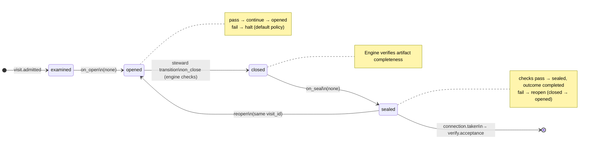
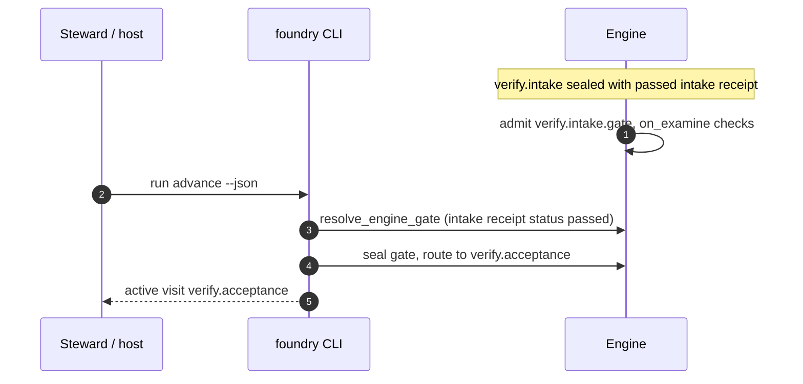

# Node: `verify.intake.gate`

Status: **ok**

Flow: `implementation` in [factory-flow.yaml](../../.cursor/foundry/flows/factory-flow.yaml).

Engine gate after verify.intake when intake receipts are sealed. The host or steward uses run advance to resolve pass from the intake receipt status and route to verify.acceptance. No user gate decide and no worker.

## Contents

- [Lifecycle](#lifecycle)
- [Sequence](#sequence)
- [Ledger excerpt](#ledger-excerpt)
- [References](#references)
- [Permissions](#permissions)
- [Artifacts](#artifacts)
- [Receipts](#receipts)
- [Worker](#worker)
- [Connections](#connections)
- [Check catalog](#check-catalog)
- [Gaps](#gaps)

---

## Lifecycle

Admission is an event (`visit.admitted`), not a lifecycle state. See [visit lifecycle](../concepts/visits-lifecycle.md).

| Hook | Authored checks | Engine-implicit |
|---|---|---|
| `on_examine` | `prior-verify-intake-sealed`, `intake-receipt-sealed` | — |
| `on_open` | *(empty)* | — |
| `on_close` | *(empty)* | Declared artifact completeness |
| `on_seal` | *(empty)* | — |

## Sequence

## References

- **Gate prompt:** `Machine gate. Intake receipt must exit 0 — CLI checks plus agent assessment when configured.`
- **Catalog index:** [verify.intake.gate.index.yaml](../../.cursor/foundry/catalog/nodes/verify.intake.gate.index.yaml)

## Ownership

| Role | Owner |
|---|---|
| **worker** | none |
| **steward** | verify parent / craft steward |
| **engine** | on_examine prior-verify-intake-sealed and intake-receipt-sealed, resolve_engine_gate, route on pass |

## Permissions

### `reads`

| Namespace | Paths |
|---|---|
| — | *(none declared)* |

### `allow`

| Namespace | Grant | Purpose |
|---|---|---|
| — | *(none declared)* | — |

### Engine-only surfaces

| Surface | Trigger | Maps to |
|---|---|---|
| `foundry run create` | New run bootstrap | Admit entry visit, run `on_open` |
| `prior-verify-intake-sealed` | `on_examine` hook | `on_examine` check `prior-verify-intake-sealed` |
| `intake-receipt-sealed` | `on_examine` hook | `on_examine` check `intake-receipt-sealed` |
| Artifact completeness | `close_request` before `closed` | Every `produces.artifacts` declaration satisfied |
| Connection selection | After `visit.sealed` | Routes to `verify.acceptance` |

## Artifacts

_No work artifacts declared._

## Receipts

_No receipts declared._

## Connections

### Incoming

- `verify.intake-to-verify.intake.gate`: [verify.intake](verify.intake.md) → **verify.intake.gate**

### Outgoing

- `verify.intake.gate-to-verify.acceptance-pass`: **verify.intake.gate** → [verify.acceptance](verify.acceptance.md) (`on.outcomes: ['completed']`)

## Check catalog

### `prior-verify-intake-sealed`

| Property | Value |
|---|---|
| **Body** | `when` |
| **Expression** | `history.last('visit.sealed', node_id='verify.intake') != null && history.last('visit.sealed', node_id='verify.intake').outcome == 'completed'` |
| **Hook** | `on_examine` |

### `intake-receipt-sealed`

| Property | Value |
|---|---|
| **Body** | `when` |
| **Expression** | `history.count('receipt.linked', visit_id=visit.id, schema='registry:schemas/intake-receipt.schema.json') >= 1` |
| **Hook** | `on_examine` |
| **on_fail** | `halt` — Verify intake blocked |

## Concepts

- **Lifecycle:** [Visit lifecycle](../concepts/visits-lifecycle.md)
- **Connections:** [Graph and routing](../concepts/graph.md)
- **Checks:** [Control plane](../concepts/control-plane.md)
- **Gate decisions:** [Gate nodes](../concepts/graph.md)

## Node summary

| Field | Value |
|---|---|
| **id** | `verify.intake.gate` |
| **kind** | `gate` |
| **title** | Verify intake blocked check |
