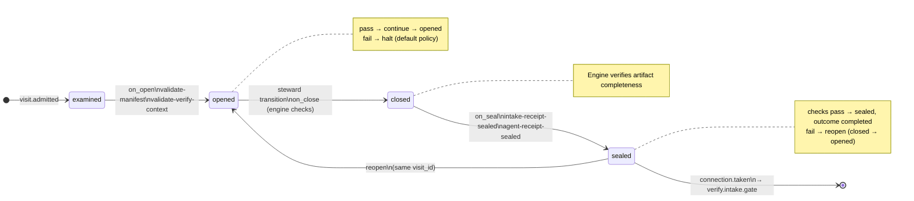

# Node: `verify.intake`

Status: **ok**

Flow: `implementation` in [factory-flow.yaml](../../.cursor/foundry/flows/factory-flow.yaml).

Host-owned deterministic intake at Verify entry. Captures branch diff, validates execute context on admit; seals intake and agent receipts; routes to verify.intake.gate on pass.


## Contents

- [Lifecycle](#lifecycle)
- [Sequence](#sequence)
- [Ledger excerpt](#ledger-excerpt)
- [References](#references)
- [Permissions](#permissions)
- [Artifacts](#artifacts)
- [Receipts](#receipts)
- [Worker](#worker)
- [Connections](#connections)
- [Check catalog](#check-catalog)
- [Gaps](#gaps)

---

## Lifecycle

Admission is an event (`visit.admitted`), not a lifecycle state. See [visit lifecycle](../concepts/visits-lifecycle.md).



| Hook | Authored checks | Engine-implicit |
|---|---|---|
| `on_examine` | `prior-execute-commit-sealed`, `feature-branch-set`, `final-commit-recorded` | — |
| `on_open` | `validate-manifest`, `validate-verify-context` | — |
| `on_close` | *(empty)* | Declared artifact completeness |
| `on_seal` | `intake-receipt-sealed`, `agent-receipt-sealed` | — |

## Sequence

```mermaid
sequenceDiagram
  autonumber
  participant S as Steward
  participant CLI as foundry CLI
  participant E as Engine

  Note over S,E: After execute.commit.gate pass
  CLI->>E: admit verify.intake, on_open validate-manifest + validate-verify-context
  CLI->>E: run advance (opened) → run_verify_intake_complete
  alt execute context and diff valid
    E->>E: assessment PROCEED, publish branch-diff, seal receipts, transition
    CLI-->>S: sealed → verify.intake.gate
  else validation failed
    E->>E: assessment BLOCKED, seal receipts only (no transition)
    CLI-->>S: visit stays opened
  end

  Note over S,E: intake-checker.verify worker is legacy and unbound; happy path does not invoke it.
```

## Ledger excerpt

Fixture `porcelain-0007-v007-record-gate` visit `v-vi` (compact).

| seq | type | summary |
|---:|---|---|
| 1 | `run.status_changed` | running ← (new) |

## References

- **Schemas:**
  - [registry:schemas/agent-receipt.schema.json](../../.cursor/foundry/schemas/agent-receipt.schema.json)
  - [registry:schemas/intake-receipt.schema.json](../../.cursor/foundry/schemas/intake-receipt.schema.json)
- **Catalog index:** [verify.intake.index.yaml](../../.cursor/foundry/catalog/nodes/verify.intake.index.yaml)

## Ownership

| Role | Owner |
|---|---|
| **worker** | legacy intake-checker.verify (unbound — not on happy path) |
| **steward** | verify parent / craft steward — rely on host advance; do not invoke worker for receipts |
| **engine** | on_examine commit sealed + branch checks, on_open manifest + validate-verify-context, run_verify_intake_complete via run advance |

## Permissions

### `reads`

| Namespace | Paths |
|---|---|
| `state` | `approved_ac`, `plan_path`, `feature_branch`, `default_branch`, `execution_graph_id` |
| `artifacts` | `shape.record.plan`, `execute.commit.final-commit` |

### `allow`

| Namespace | Grant | Purpose |
|---|---|---|
| `state` | `verify_diff_scope`, `branch_diff_artifact_path`, `default_branch`, `state.nodes.verify.intake.*` | Domain fields |

### Engine-only surfaces

| Surface | Trigger | Maps to |
|---|---|---|
| `foundry run create` | New run bootstrap | Admit entry visit, run `on_open` |
| `prior-execute-commit-sealed` | `on_examine` hook | `on_examine` check `prior-execute-commit-sealed` |
| `feature-branch-set` | `on_examine` hook | `on_examine` check `feature-branch-set` |
| `final-commit-recorded` | `on_examine` hook | `on_examine` check `final-commit-recorded` |
| `validate-manifest` | `on_open` hook | `command: validate_manifest` → `foundry app validate` |
| `validate-verify-context` | `on_open` hook | `on_open` check `validate-verify-context` |
| `intake-receipt-sealed` | `on_seal` hook | `on_seal` check `intake-receipt-sealed` |
| `agent-receipt-sealed` | `on_seal` hook | `on_seal` check `agent-receipt-sealed` |
| Artifact completeness | `close_request` before `closed` | Every `produces.artifacts` declaration satisfied |
| Connection selection | After `visit.sealed` | Routes to `verify.intake.gate` |

## Artifacts

### Work artifact: `branch-diff`

| Field | Value |
|---|---|
| **Logical id** | `branch-diff` |
| **Qualified ref** | `verify.intake.branch-diff` |
| **Kind** | `document` |
| **URI** | `run:artifacts/{visit_id}/branch.diff` |
| **Media type** | `text/plain` |

#### Downstream consumption

- [verify.acceptance](verify.acceptance.md) reads `verify.intake.branch-diff` via `nearest_sealed_ancestor`
- [verify.code_quality](verify.code_quality.md) reads `verify.intake.branch-diff` via `nearest_sealed_ancestor`
- [verify.code_review](verify.code_review.md) reads `verify.intake.branch-diff` via `nearest_sealed_ancestor`
- [verify.code_review.gate](verify.code_review.gate.md) reads `verify.intake.branch-diff` via `nearest_sealed_ancestor`

## Receipts

| Schema | Role |
|---|---|
| [registry:schemas/agent-receipt.schema.json](../../.cursor/foundry/schemas/agent-receipt.schema.json) | Worker completion evidence (`agent-receipt-sealed` on `on_seal`) |
| [registry:schemas/intake-receipt.schema.json](../../.cursor/foundry/schemas/intake-receipt.schema.json) | Intake evidence (`intake-receipt-sealed` on `on_seal`) |

## Worker

_No worker bound._

## Connections

### Incoming

- `execute.commit.gate-to-verify.intake-pass`: [execute.commit.gate](execute.commit.gate.md) → **verify.intake**

### Outgoing

- `verify.intake-to-verify.intake.gate`: **verify.intake** → [verify.intake.gate](verify.intake.gate.md) (`on.outcomes: ['completed']`)

## Check catalog

### `prior-execute-commit-sealed`

| Property | Value |
|---|---|
| **Body** | `when` |
| **Expression** | `history.last('visit.sealed', node_id='execute.commit') != null && history.last('visit.sealed', node_id='execute.commit').outcome == 'completed'` |
| **Hook** | `on_examine` |

### `feature-branch-set`

| Property | Value |
|---|---|
| **Body** | `when` |
| **Expression** | `state.feature_branch != null` |
| **Hook** | `on_examine` |

### `final-commit-recorded`

| Property | Value |
|---|---|
| **Body** | `when` |
| **Expression** | `state.final_commit_sha != null` |
| **Hook** | `on_examine` |

### `validate-manifest`

| Property | Value |
|---|---|
| **Body** | `command: validate_manifest` |
| **Probe** | `foundry app validate` ([app-manifest.schema.json](../../.cursor/foundry/schemas/app-manifest.schema.json)) |
| **Hook** | `on_open` |

### `validate-verify-context`

| Property | Value |
|---|---|
| **Body** | `command: validate_verify_context` |
| **Hook** | `on_open` |

### `intake-receipt-sealed`

| Property | Value |
|---|---|
| **Body** | `when` |
| **Expression** | `history.count('receipt.linked', visit_id=visit.id, schema='registry:schemas/intake-receipt.schema.json') >= 1` |
| **Hook** | `on_seal` |
| **on_fail** | `reopen` — Verify intake receipt not sealed |

### `agent-receipt-sealed`

| Property | Value |
|---|---|
| **Body** | `when` |
| **Expression** | `history.count('receipt.linked', visit_id=visit.id, schema='registry:schemas/agent-receipt.schema.json') >= 1` |
| **Hook** | `on_seal` |
| **on_fail** | `reopen` — Agent receipt not sealed |

## Gaps

- re-verify loops re-enter after execute.commit.gate; branch diff must remain usable on each pass
- steward markdown packet has no inline diff (artifact linked on host complete)

## Concepts

- **Lifecycle:** [Visit lifecycle](../concepts/visits-lifecycle.md)
- **Connections:** [Graph and routing](../concepts/graph.md)
- **Permissions:** [Reads and allow](../concepts/capabilities.md)
- **Artifacts:** [Artifact publication](../concepts/artifacts.md)
- **Receipts:** [Receipts vs artifacts](../concepts/artifacts.md)
- **Checks:** [Control plane](../concepts/control-plane.md)

## Node summary

| Field | Value |
|---|---|
| **id** | `verify.intake` |
| **kind** | `step` |
| **title** | Verify intake — branch diff, receipts, and plan alignment |
