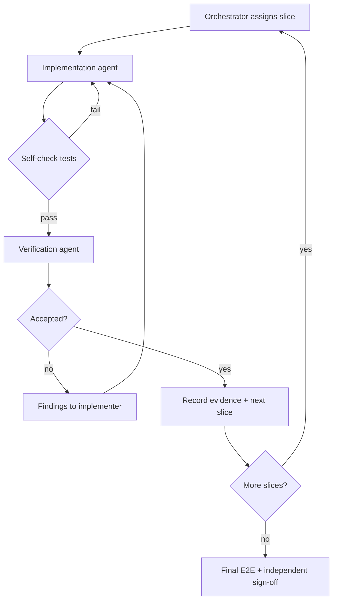

# Remaining nodes — orchestrator runbook

Ordered procedure for completing the implementation workflow (Shape → Execute → Verify → `deliver.stub`). Parent plan: [current-plan-remaining-workflow-02.md](../../current-plan-remaining-workflow-02.md).

**Roles:** orchestrator (sequencing, decisions), implementation agent (code/tests/docs), verification agent (independent review — never the implementer for the same slice).

---

## Step 0 — Baseline and decisions (complete before Step 1 code)

1. Record [workflow-02-baseline.md](workflow-02-baseline.md): `HEAD`, working tree, test commands, untracked plans.
2. Publish [workflow-02-step0-decisions.md](workflow-02-step0-decisions.md); verifier signs off on policy choices.
3. Maintain [node-inventory.md](node-inventory.md) as contracts evolve.
4. Track F1–F9 status against [current-plan-remediation-01.md](../../current-plan-remediation-01.md).

**Exit:** decisions written; baseline reproducible; no Step 1 coding until verifier accepts Step 0.

---

## Step 1 — Shared runtime prerequisites (summary)

Delivery order (detail in parent plan):

1. Host path/ownership; default-path tests reliable.
2. Durable snapshot, ledger, outbox, agent dispatch, idempotency.
3. Strict registry validation, expression evaluation, checks, exact-one routing.
4. User and **engine** gate lifecycles, typed evidence, loop counters.
5. Generic task/operation executor + configured model adapter.
6. Shape E2E including re-examination, present/record, `execute.start` prompt fix.

**Exit:** fresh run completes Shape through user CLI; engine gates and routes obey graph contract; remediation acceptance tests pass on default paths.

---

## Step 2 — Node slices (dependency order)

| Slice | Nodes | Depends on |
| --- | --- | --- |
| **2A** | `execute.intake` → gate → `execute.branch` → `execute.plan` | Step 1 |
| **2B** | `execute.build` → `execute.test` → gates → `execute.repair.limit.gate` | 2A |
| **2C** | `execute.commit` → `execute.commit.gate` | 2B |
| **2D** | `verify.intake` → gate → `verify.acceptance` → gate | 2C |
| **2E** | `verify.code_quality` → gates → `verify.code_review` → gates | 2D |
| **2F** | `verify.complete` → gate → `deliver.stub` | 2E |

Feedback loops (acceptance replan/reshape/rework; quality/review repair) are integrated after forward path works. Recheck evidence ancestry on every return.

---

## Slice handoff template (2A–2F)

Copy for **each** slice; fill bracketed fields.

### Implementation agent assignment

```text
Slice: [2A|2B|2C|2D|2E|2F]
Nodes: [ordered list]
Contract worksheet: [link or inline — identity, authority, task, operations, lifecycle/checks, routing, tests/docs]
Decision records: docs/plans/workflow-02-step0-decisions.md (+ slice-specific amendments)
F1–F9: [relevant findings and commit pointers]
Sources: .cursor/foundry/flows/factory-flow.yaml, nodes/*, docs/concepts/graph.md

Deliverables:
- Author missing registry:steps/* (or nodes/*) instructions for this slice
- Implement/review every check used by these nodes
- Add host/CLI commands required by contracts (help, unit tests, acceptance if user-visible)
- Unit + feature/integration tests defined before or with code
- Regenerate docs; report `dev docs` diff

Report: files changed, behavioral notes, test commands + exit codes, unresolved risks.
Do not self-verify.
```

### Verification agent assignment

```text
Slice: [same]
Original contract: [worksheet + flow refs]
Implementation report: [from implementer]
Diff: [branch or patch]

Tasks:
- Review code and generated docs against contract (not implementer narrative)
- Run focused tests + full evidence gates (below)
- Fresh-workspace user path for slice behavior
- Force ≥1 failure and ≥1 restart at a durable boundary
- Confirm routes and evidence match registry; reject mirror tests

Return: accepted | changes required (file/line, repro commands)
```

### Slice exit record

- Contract signed off
- All refs resolve; `dev docs` clean for touched nodes
- Unit + acceptance suites green
- Verifier `accepted`
- Commit SHA + test log archived in orchestrator notes

---

## Evidence gates (commands)

From repository root (PowerShell; use `python` or repo venv when present):

```powershell
git status --short
python .cursor/foundry/cli/foundry.py dev unit --quiet
python .cursor/foundry/cli/foundry.py dev acceptance --quiet
python .cursor/foundry/cli/foundry.py dev docs
git diff -- docs .cursor/foundry
```

**Expectation:** unit + acceptance `ok=true` (full suite ~293 tests post-remediation). Inspect `dev docs` diff; do not assume success means prose is correct.

**Per-slice iteration:** run focused pytest/behave scenarios while developing; run full gates at slice exit.

**Final acceptance:** clean-workspace E2E through `deliver.stub`; restart/reattach; exercise feedback routes (repair, replan, reshape, rework_execute).

---

## Implement / verify loop



Rules:

- Do not start a dependent slice while a blocker remains.
- Do not change gate semantics or allow missing routes without updating the decision record.
- `deliver.stub` ends Foundry responsibility; user pushes branch or ships product.

---

## References

- [Node inventory](node-inventory.md)
- [Execute/Verify boundary audit](execute-verify-boundary-audit.md) (pre–workflow-02 host behavior)
- [Graph contract](../concepts/graph.md)
- [Control plane](../concepts/control-plane.md)
