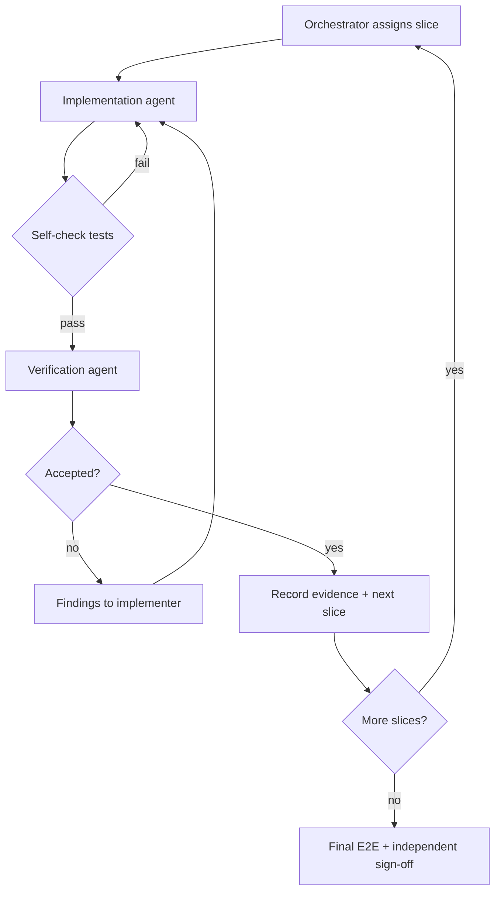

# Remaining nodes — orchestrator runbook

Ordered procedure for completing the implementation workflow (Shape → Execute → Verify → `deliver.stub`).

**Gap closure (current):** [shape-execute-verify-gap-closure-plan.md](shape-execute-verify-gap-closure-plan.md) — findings G1–G10, scenarios, tests.  
**Copy-ready prompts:** [orchestrator-brief.md](orchestrator-brief.md).

**Roles:** orchestrator (sequencing, decisions), implementation agent (code/tests/docs), verification agent (independent review — never the implementer for the same slice).

---

## Step 0 — Baseline and decisions (complete before Step 1 code)

1. Capture baseline once per program: `git rev-parse HEAD`, `git status --short`, and full `dev unit` / `dev acceptance` exit codes (store in slice evidence or commit message; no separate baseline doc required).
2. Publish and maintain [workflow-02-step0-decisions.md](workflow-02-step0-decisions.md); verifier signs off on policy choices (includes F1–F9 closure table).
3. Maintain [node-inventory.md](node-inventory.md) and [execute-verify-boundary-audit.md](execute-verify-boundary-audit.md) as contracts evolve.

**Exit:** decisions written; baseline reproducible; no Step 1 coding until verifier accepts Step 0.

---

## Step 1 — Shared runtime prerequisites (summary)

Delivery order (detail in parent plan):

1. Host path/ownership; default-path tests reliable.
2. Durable snapshot, ledger, outbox, agent dispatch, idempotency.
3. Strict registry validation, expression evaluation, checks, exact-one routing.
4. User and **engine** gate lifecycles, typed evidence, loop counters.
5. Generic task/operation executor + configured model adapter.
6. Shape E2E including re-examination, present/record, `execute.start` prompt fix.

**Exit:** fresh run completes Shape through user CLI; engine gates and routes obey graph contract; remediation acceptance tests pass on default paths.

---

## Step 2 — Node slices (dependency order)

| Slice | Nodes | Depends on |
| --- | --- | --- |
| **2A** | `execute.intake` → gate → `execute.branch` → `execute.plan` | Step 1 |
| **2B** | `execute.build` → `execute.test` → gates → `execute.repair.limit.gate` | 2A |
| **2C** | `execute.commit` → `execute.commit.gate` | 2B |
| **2D** | `verify.intake` → gate → `verify.acceptance` → gate | 2C |
| **2E** | `verify.code_quality` → gates → `verify.code_review` → gates | 2D |
| **2F** | `verify.complete` → gate → `deliver.stub` | 2E |

After host skeleton exists, prioritize **gap plan** slices (G2 → G1 → G3 → …) over re-implementing 2A–2F from scratch.

Feedback loops (acceptance replan/reshape/rework; quality/review repair) are integrated after forward path works. Recheck evidence ancestry on every return.

---

## Slice handoff template (2A–2F or Gap-G*)

Use templates in [orchestrator-brief.md](orchestrator-brief.md). For each slice fill:

- Contract worksheet (below) plus scenarios from [shape-execute-verify-gap-closure-plan.md](shape-execute-verify-gap-closure-plan.md) section D

### Node contract worksheet (per slice)

The implementation agent submits this for every node or tightly coupled step/gate pair. The verifier signs off before accepting code:

1. **Identity and entry:** node ID/kind, predecessors, admissible prior outcomes, visit identity, required state/config/artifacts, and source of each input.
2. **Authority:** which actions are host operations, model judgments, or explicit user decisions; exact CLI capability and actor allowed for each.
3. **Task contract:** when a model is needed, task ID/version, context selection and limits, provider/model configuration, request/result schema, result validation, timeout, retry, and provenance. If no model is needed, say so.
4. **Operation and tooling contract:** command or operation ID, whether existing tooling suffices or a new host/CLI command is needed, inputs, working directory, allowed file/state writes, idempotency key, side effects, output schema, receipt and log references, failure and restart behavior.
5. **Lifecycle and check contract:** every check at open/examine/close/seal, observable evidence, failure semantics; artifact completeness, seal outcome, wait types.
6. **Routing:** table for every routable outcome and gate option, including condition evaluation, target, loop label, and zero/multiple-match error behavior.
7. **Tests and docs:** unit tests for the rule, integration/feature scenarios, failure and recovery cases, authored and generated docs.

Do not hide work behind an `operator` wait. Intentionally manual actions must be explicit, user visible, and covered by a declared capability.

---

## Evidence gates (commands)

From repository root:

```sh
git status --short
.cursor/foundry/cli/.venv/bin/python .cursor/foundry/cli/foundry.py dev unit --quiet
.cursor/foundry/cli/.venv/bin/python .cursor/foundry/cli/foundry.py dev acceptance --quiet
.cursor/foundry/cli/.venv/bin/python .cursor/foundry/cli/foundry.py dev docs
git diff -- docs .cursor/foundry
```

**Per-slice iteration:** focused pytest/behave while developing; full gates at slice exit.

**Final acceptance:** clean-workspace E2E through `deliver.stub` without verify env overrides (gap plan T1); restart/reattach; feedback routes.

---

## Implement / verify loop



Rules:

- Do not start a dependent slice while a blocker remains.
- Do not change gate semantics or allow missing routes without updating the decision record.
- `deliver.stub` ends Foundry responsibility; user pushes branch or ships product.

---

## References

- [Plans index](README.md)
- [Execute/Verify boundary audit](execute-verify-boundary-audit.md) — refresh via `node_capability.audit_rows` after engine changes
- [Graph contract](../concepts/graph.md)
- [Control plane](../concepts/control-plane.md)
