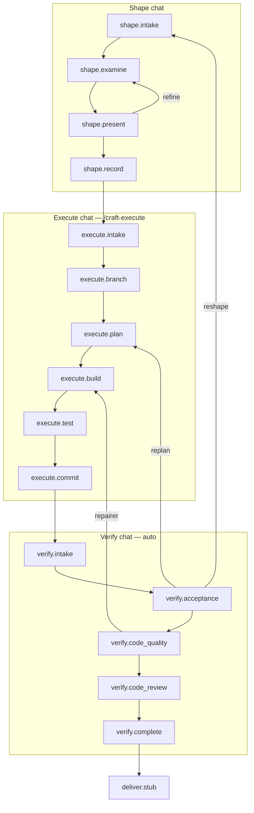

# Foundry v1 — Product Spec

Status: **locked** (grilling + design choices through requirements §95–167)

Repo: `C:\Users\lynnv\src\foundry` — Cursor plugin (`/craft-*` commands) + `foundry.py` CLI engine.

PoC reference: `kwiktrip/.github-private-eval-foundry-approach` (borrow CLI mechanics, eval patterns; new flow, agents, schemas).

Internal naming: **foundry** (CLI, schemas, repo). User-facing commands: **`/craft-*`**.

---

## Charter

| Dimension | Decision |
|-----------|----------|
| **Promise** | Turn any unit of work into a clarified, integrity-checked plan and verified implementation |
| **User** | Developer in their app repo in Cursor; Jira not required |
| **v1 scope** | Implementation flow only |
| **Cut for v1** | Analysis flow, docs step, devops-builder, feature-builder, client-builder, PR/push, Jira |
| **Port strategy** | New flow YAML + phase agents/skills; port `foundry.py` gate engine; rewrite agent prompts |
| **Success bar** | Porcelain dogfood: init + 3+ runs through shape → execute → verify with eval harness |
| **Back compat** | None with PoC `.foundry/app.yaml` |

---

## Plugin commands

| Command | Purpose |
|---------|---------|
| `/craft-init` | User-requested bootstrap; discover → write `.foundry/app.yaml` (hard block on validation failure) |
| `/craft-shape` | Start or continue **shape** phase (new chat) |
| `/craft-execute` | Start **execute** phase (new chat, required after shape) |
| `/craft-resume` | Resume a run in fresh chat or continue in existing phase chat |
| `/craft-status` | Run position, phase/step visualization, decisions, repairs, reroutes, summation |

**Config:** trimmed `default.yaml` in plugin for CLI defaults; **repo-level overrides** in `.foundry/app.yaml` (primary config surface). No user-level profile store in v1. No team profile required.

---

## Run identity & artifacts

| Artifact | Rule |
|----------|------|
| **Run id / slug** | Derived at bootstrap from app id + **auto-incrementing number** |
| **Scope freeze key** | `approved_ac` (name retained) |
| **Living plan** | `{run_dir}/plan.md` — most recent shaped plan; **each reshape appends/records** a version under run history |
| **Run history** | Preserve path taken (phases, steps, reroutes, reshapes) for later summation |
| **`ticket.json`** | `raw_input`, `normalized_translation`, `source_type`, `source_ref` (nullable), `issue_key` (nullable) |

**Reshape:** a single run may be materially reshaped after verify routes to shape; history captures all plan versions.

**Graph schema:** drop `risk_tier`; use `approved_ac` / digest. No PoC `brief_hash` global file. Workflow graph model: [concepts/README.md](concepts/README.md). CLI reference: [cli/index.md](cli/index.md) (generated as commands ship).

---

## Git cleanliness

| Step | Clean tree required? |
|------|---------------------|
| `shape.intake` | **No** — WIP/untracked context may inform shape |
| `execute.intake` | **Yes** |
| `verify.intake` | N/A (work already on branch) |

**Clean definition:** no uncommitted changes to **tracked** files **and** no **untracked** files present (block to avoid accidental overwrite/commit). Intake steps verify via CLI.

---

## Phase model

| Phase | Chat | Human starts? | Human completes? |
|-------|------|---------------|------------------|
| **Shape** | One dedicated chat (`/craft-shape`) | Implicit | `shape.record` |
| **Execute** | **New chat** (`/craft-execute`) | Yes | Runs through `execute.commit` |
| **Verify** | **New chat** (auto after execute; fallback: human CTA) | Auto | `verify.complete` via CLI after user accepts code |
| **Deliver** | Later | Yes | v1: `deliver.stub` terminal only |

**Handoffs:** `run context --markdown` steward packet (reads, allow, produces, worker paths, inlined step instructions). Transition notes (agent-written at CLI `transition`) deferred — no static per-step intro/outro in the flow registry.

**Manifest check:** `app validate` at each phase intake (CLI hard gate).

---

## Intake model (all phases)

Intake = **CLI hard gates** + **agent interpretation** (agent evaluates whether work can proceed; not fully expressible in CLI alone).

### Intake receipt

New schema: `intake-receipt.schema.json`

- Inputs resolved and loaded
- CLI commands run + outputs captured
- Pass/fail per check
- Failure information when blocked
- Agent assessment overlay (when agent ran)

### `shape.intake`

- **Requires:** user work prompt (inline, paste, file, URL, repo inference)
- **CLI:** `app validate`, bootstrap completeness, readable references
- **Agent subagent:** verify project configuration (invoked by shape parent)
- **Git:** not required clean
- **Output:** seal `ticket.json`; intake receipt → `shape.examine` (or fast lane)

### `execute.intake`

- **Primary path:** shaped plan from `shape.record` (`approved_ac`, living `plan.md`)
- **Alternate path:** external plan — may **start a run** if none exists, attach plan, flag `intake_path: non_shaped`. Agent judges sufficiency; cannot substitute full shape artifact set but may proceed if enough to build
- **CLI:** `app validate`, **clean git tree** (tracked + untracked)
- **Human:** user invokes `/craft-execute` (= approval of plan)
- **Verify rework path:** same step or dedicated on-ramp when verify routes to execute with drafted rework (TBD: reuse `execute.intake` with `entry_reason: verify_rework`)

### `verify.intake`

- **Requires:** execute completed (`execute.commit`), `feature_branch` set, commits on branch
- **Diff scope:** `feature_branch` HEAD vs **default branch** (whole branch — all commits on feature branch visible for AC review across rework cycles)
- **CLI:** receipts, graph complete, plan digest, manifest valid
- **Failure:** **block verify entirely**
- **Auto-start:** new verify chat after execute completes (no human start); if automation unavailable, execute parent emits CTA to open verify chat

---

## Flow registry (v1)

```yaml
flows:
  implementation:
    entry: shape.intake

    steps:
      # Shape — parent: shape phase agent; step subagents
      shape.intake:
      shape.examine:       # parent asks questions; subagent for research spikes
      shape.present:       # subagent: succinct present; captures what was shown
      shape.record:        # subagent: records approved_ac + plan version

      # Execute — new chat; parent: execute phase agent
      execute.intake:
      execute.branch:
      execute.plan:        # planner composes graph + phase-scoped internal brief
      execute.build:       # general builder(s) + repairer via traffic cop
      execute.test:        # manifest verification; repair loop if needed
      execute.commit:      # dedicated commit agent — final summarizing commit

      # Verify — new chat (auto); parent: verify phase agent
      verify.intake:
      verify.acceptance:   # automated; failure → replan, skip later verify steps
      verify.code_quality: # when enabled in repo config: lint + bugbot + security (PoC pre-PR depth)
      verify.code_review:  # human, single-turn approve
      verify.complete:     # CLI terminal when user accepts code

      deliver.stub:        # terminal no-op; phase undefined in v1
```

### Diagram



---

## Shape phase

### Parent agent

User starts shape in one chat. **Parent orchestrates**; step work via subagents:

| Step | Subagent role |
|------|----------------|
| `shape.intake` | Verify project configuration |
| `shape.examine` | `codebase-researcher` spikes (narrow); parent asks user questions |
| `shape.present` | Summarize and present succinctly; record presentation artifact |
| `shape.record` | Record `approved_ac` and plan version |

Phase skill: rewritten from PoC `foundry/SKILL.md` — **shape-specific** instructions (separate from execute/verify skills).

### Flow step registry (v1)

| Field | Role |
|-------|------|
| `instructions` | Steward/worker instruction markdown path |
| `worker.prompt` / `worker.contract` / `worker.mode` | Subagent prompt path, capability contract path, and mode key; omit for steward-only steps |
| `receipts` | JSON Schema path (scalar) or paths (array), e.g. `schemas/agent-receipt.schema.json` |
| `actions.on_enter` | Engine hooks at step entry; intake check ids (`validate_manifest`, etc.) are stubs that record `required_intake_checks` — pass/fail is sealed in the intake receipt |
| `state_json.permissions` | Allowed writes to `{run_dir}/state.json` |

Worker capability contracts live at `.cursor/foundry/workers/{worker-id}/contract.yaml` (one file per role). Flow steps reference them explicitly via `worker.contract` alongside `worker.prompt` (`.cursor/agents/{worker}.md`) and `worker.mode`. Directory protocol version lives in `workers/_protocol.yaml`; shape is validated by `schemas/agent-contract.schema.json`. Steward instructions for migrated nodes live at `.cursor/foundry/nodes/{node-id}/instructions.md`.

### Examination

- **No max rounds** — continue until user stops answering or all questions resolved; user may **abort run**
- **Question capture:** `clarifying_questions[]` (structured records with `status`: open | answered | withdrawn), `questions_asked_total` (monotonic), `examination_round` (increments on `continue` gate), `open_clarifying_questions_count` (routing scalar synced from open questions)
- **Fast lane:** agent decides ready **and** `open_clarifying_questions_count == 0` → skip to present
- **Per-round audit:** `examination_decisions[]` records summary and counts for each round
- **Questions:** hybrid structured (`AskQuestion`) or prose — agent chooses
- **Priorities:** operational semantics + repo-encoded expectations always; boundaries, dependency failure, false confidence, AC quality, integrity boundary often
- **Assumptions:** in plan; no separate assumption gate
- **Block:** when ask cannot be completed without clarification

### Present (`shape.present`)

Two CLI steps with captured artifacts:

- **Succinct:** restate proposal, goal, constraints
- **Out of scope:** only when relevant to input
- **Never:** AC count without full content
- Subagent writes what was presented (for audit/resume)

### Record (`shape.record`)

- User confirms shared understanding; CLI records `approved_ac`
- **AC format:** markdown with IDs; each AC tagged with **source** (`intake` | `assumption` | `examination` | …)
- Updates living `plan.md`; append run history entry for this shape version

---

## Execute phase

### Entry

- **`/craft-execute`** in a **new chat** (mandatory v1 — different parent rules than shape)
- Starting execute = approval of frozen plan

### Workers (v1)

| Worker | Role |
|--------|------|
| **general builder** | Replace PoC backend-builder; repo may define custom builders in manifest later |
| **repairer** | Test failures, code quality fixes |
| **planner** | `execute.plan` — graph + phase-scoped internal brief |
| **commit agent** | `execute.commit` — final summarizing commit |
| **codebase-researcher** | Rewrite/port core tenets; spikes only |

**Not ported:** feature-builder, client-builder, devops-builder, documentation-writer (as flow steps).

### `execute.plan`

- Planner composes `execution-graph.json`
- **Internal brief:** phase-scoped artifact (e.g. `{run_dir}/execute/{phase_id}/brief.md`) — **not** global `{run_dir}/brief.md`; supports multiple plan/graph cycles per run
- May delegate codebase-researcher spikes

### `execute.build`

Traffic-cop parent runs graph build nodes.

**Per-builder commit (accountability):**

1. Builder finishes work item; declares done (may commit before tests — traceability intentional)
2. Builder invokes **CLI step transition** with a **short summary** (fixed template + summary text)
3. **CLI performs commit** on `feature_branch` (builder never runs git directly)
4. Commit SHA stored on work item receipt
5. Default template in CLI; later: repo override path in `.foundry/app.yaml`

Intermediate commits: planner may structure multiple build nodes; each builder completion → CLI commit via transition.

### `execute.test`

- Run repo-configured verification after build graph completes
- Repair loop via repairer when tests fail
- Replaces PoC `verification.implementation` / `verification.post_repair` arrays — restructured, not ported verbatim

### `execute.commit`

- **Dedicated commit agent** (subagent under execute parent)
- **One required final commit** at end of execute phase (engine-enforced)
- Summarizes work across branch commits; may be **empty/no-op** commit if all changes already committed — acceptable for PR narrative / traceability
- **Never** amend or squash prior builder commits
- Deliver phase (later) may use last commit message for PR body; GitHub squash-merge preserves history review

### Rework from verify

- Re-run **`execute.plan` + `execute.build` + `execute.test` + `execute.commit`** on **same branch**
- Acceptance failure → **replan** (not just repairer)
- Code quality failure → **repairer**

---

## Verify phase

Specialized assessment phase; **auto-starts in new chat** after execute. Parent agent rules differ from execute parent.

| Step | Behavior |
|------|----------|
| `verify.intake` | Align plan, branch, whole-branch diff vs default, receipts; block if incomplete |
| `verify.acceptance` | Automated AC check; **on failure:** replan or reshape — **skip** `code_quality` and `code_review` |
| `verify.code_quality` | When **enabled in repo config**: lint + Bugbot + security (PoC pre-PR depth); failures → repairer |
| `verify.code_review` | Human, **single-turn** approve |
| `verify.complete` | User accepts code → CLI invoked → verify phase ends |

### Human code review rejection

| Case | Route |
|------|-------|
| AC met but not what user wanted | **reshape** → new AC → execute |
| Code standards / quality | User articulates in chat → **repairer** spin-up |

### Verify notes

Stored in **run verify section** (not in living plan). Plan stays plan; verify captures reviewer notes, polish notes, gap findings.

### Loop limits

Configurable (default **2**): re-shape, re-execute, re-verify. Prompt human when exceeded.

---

## Bootstrap (`/craft-init`)

1. User requests init
2. Discover (no doc-related builder routes in output)
3. Write `.foundry/app.yaml` on success (no `documentation` section)
4. Hard block on validation failure
5. **General builder** route in manifest (not backend-builder specialization); user-defined builders later

---

## Eval harness (v1)

- **Target app:** porcelain
- **Integrity checks (all v1):** step receipts, intake receipts, phase transitions, graph final commit, reroute counters, question/assumption capture, user input capture
- **Dry-run / no-op mode:** explore workflow logic before steps fully implemented; fill in steps incrementally

---

## Agent & skill port plan

| Artifact | Action |
|----------|--------|
| `foundry/SKILL.md` | Rewrite → **phase-specific skills** (shape, execute, verify stewards) |
| `examiner` / shape parent | New; orchestrates shape subagents |
| `codebase-researcher` | Rewrite core tenets from PoC |
| `implementation-validator` | Update for `verify.acceptance` |
| `planner`, `repairer`, general builder, commit agent | Port minimum set; review during bring-up |
| PoC specialized builders | Not ported |

---

## Schemas (port backlog)

| Schema | Change |
|--------|--------|
| `app-manifest.schema.json` | No `documentation`; general builder; repo verification config; commit template path optional |
| `intake-receipt.schema.json` | **New** |
| `execution-graph.schema.json` | Extend `kind` enum; drop `risk_tier`; builder commit SHA on items |
| `factory-run-state.schema.json` | `approved_ac`, plan version history, phase intake receipt IDs, verify notes, `intake_path`, loop counters |
| `ticket.json` | Fields per §A4 |
| PoC `verification.implementation` / `post_repair` | Not ported as-is |

---

## Gates summary

| Gate | Type |
|------|------|
| Init validation | CLI hard block |
| Phase intakes | CLI + agent |
| `shape.record` | Human confirms AC |
| Start execute | `/craft-execute` (new chat) |
| `execute.test` | Machine (tests pass or repair) |
| `execute.commit` | Machine (final commit recorded) |
| `verify.acceptance` fail | Short-circuit verify |
| `verify.code_review` | Human single-turn |
| `verify.complete` | Human accept → CLI |
| `deliver.stub` | Terminal pass |

---

## MVP

| In v1 | Not in v1 |
|-------|-----------|
| `/craft-init`, `/craft-shape`, `/craft-execute`, `/craft-resume`, `/craft-status` | Deliver push/PR |
| Shape / execute / verify with phase intakes + receipts | Analysis flow |
| Builder CLI commits + final commit agent | feature/client/devops builders |
| Eval + dry-run mode | Jira intake |
| Porcelain dogfood | User-level global config |
| Phase-specific steward skills | PoC verification arrays |

---

## Deferred

- Jira intake, `issue_key` population, risk tier
- story-writer pre-examine enricher
- Conditional prompt fragments; profile-attached reference docs
- Documentation as user-invoked builder in graph
- Deliver phase definition + updated `delivery-check`
- Merge shape/execute into one chat
- Rename foundry → craft at CLI level
- User-defined builders beyond initial general builder
- Custom commit message templates (repo path) — schema hook only in v1 default template
