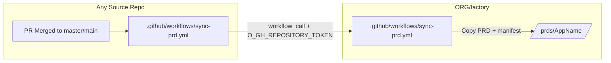

# Documentation workflow

This command guides you through creating comprehensive AGENTS.md documentation for any .NET solution. It ensures all required metadata is captured and generates a unified PRD from the documentation.

**This workflow is designed to work with any repository in conjunction with the `.github-private` organization-level commands.**

### Feature-factory integration

When invoked from **foundry** (implementation path):

- Runs as **Step 7** — **after Step 6 and gated Steps 7b/7c**, **before commit/PR**
- **Mandatory** on every factory run; never skip
- **Skip** the interactive mode prompt at workflow start; auto-select **Full Workflow** if no root `AGENTS.md`, else **Update Existing**
- **Skip Step 9 (commit)** — factory Step 8 commits feature code and documentation together
- **Auto-create `sync-prd.yml`** when missing (Step 7d / `sync-prd-step.md`)
- See `@.cursor/foundry/templates/post-build-steps.md` and `@.cursor/skills/foundry/SKILL.md`
- Use **FactoryConfig** from the parent — skip standalone bootstrap below

### Standalone bootstrap

When **not** launched from foundry, read and follow **[command-bootstrap.md](../foundry/templates/command-bootstrap.md)** with `{bootstrap_role}` = **`documentation-workflow`** before any other step.

---

## Overview

This workflow will:
1. Discover the solution structure and identify entry points
2. **Audit existing AGENTS.md files for required metadata completeness**
3. Gather required application metadata through an interview process (only missing fields)
4. **Discover external service integrations** (APIs consumed by the application)
5. **Discover CI/CD configuration** (pipelines, workflows, deployment environments)
6. Create or update AGENTS.md files for the root and each entry point (including external services and CI/CD)
7. Create the PRD generator prompt file
8. Generate the unified PRD document (including external services and CI/CD in documentation)
9. **Validate PRD content against source AGENTS.md files** to ensure accuracy
10. **Ensure `.github/workflows/sync-prd.yml`** exists (create from org template when missing — Step 7d)

---

## Workflow Modes

At the start of the workflow, ask the developer which mode they want:

> "📋 **Documentation Workflow Options**
> 
> 1. **Full Workflow** - Discover, audit, gather missing info, create/update docs, generate PRD
> 2. **Audit Only** - Check existing AGENTS.md files for completeness and report missing fields
> 3. **Update Existing** - Only update existing AGENTS.md files with missing metadata (skip creation)
> 
> Which mode would you like to run?"

### Mode Behaviors

| Mode | Steps Executed |
|------|----------------|
| **Full Workflow** | All steps (1–10), including external service, CI/CD discovery, and sync-prd caller |
| **Audit Only** | Steps 1-2 only, then report and stop |
| **Update Existing** | Steps 1-6 for existing files only (including external service and CI/CD discovery), then Steps 7–10 |

---

## STEP 1: Discover Solution Structure

**Instructions for Agent:**

### Step 1a: Find the Solution File

Find solution files: `**/*.sln` (typically at the repo root).

### Step 1b: List All Projects

```text
dotnet sln list
```

### Step 1c: Identify Entry Points vs Class Libraries

**Use this classification table (from templates/agents-md-templates.md):**

| Project Type | Pattern Examples | Gets AGENTS.md |
|--------------|------------------|----------------|
| **API/Backend** | `*.Api`, `*.Functions`, `*.Web.Api`, `*.Http.*` | ✅ Yes |
| **Frontend UI** | `*.PWA`, `*.Admin`, `*.Web`, `*.Blazor`, `*.UI` | ✅ Yes |
| **Worker/Service** | `*.Worker`, `*.Jobs`, `*.Processor`, `*.Listener` | ✅ Yes |
| **Console App** | `*.Console`, `*.CLI` | ✅ Yes |
| Class Library | `*.Models`, `*.Data`, `*.Services`, `*.Common`, `*.Shared`, `*.Client` | ❌ No |
| Tests | `*.Tests`, `*.UnitTests`, `*.E2E.Tests` | ❌ No |

### Step 1d: Present Discovery Results

Present the findings to the developer:

> "📋 **Solution Structure Discovered**
> 
> **Solution:** {SolutionName}
> 
> **Entry Points (will get AGENTS.md files):**
> - {EntryPoint1} ({Type: API/Frontend/Worker/Console})
> - {EntryPoint2} ({Type})
> ...
> 
> **Supporting Libraries (documented in parent AGENTS.md):**
> - {Library1} - {Inferred purpose}
> - {Library2} - {Inferred purpose}
> ...
> 
> **Test Projects (no documentation needed):**
> - {TestProject1}
> ...
> 
> Does this look correct? Should I add or remove any entry points?"

**WAIT for developer confirmation before proceeding.**

---

## STEP 2: Check Existing Documentation & Audit for Completeness

### Step 2a: Check for Existing AGENTS.md Files

Find all `**/AGENTS.md` files in the app repo.

### Step 2b: Audit Existing AGENTS.md Files for Required Metadata

**CRITICAL: Even if AGENTS.md files exist, they may be missing required organizational metadata fields.**

For each existing AGENTS.md file found, check for the presence of all 40 required fields:

**Required Metadata Checklist:**

| # | Field | Section to Check | Status |
|---|-------|------------------|--------|
| 1 | Application Name | Application Metadata | ☐ |
| 2 | Description | Application Metadata | ☐ |
| 3 | URL | Application Metadata | ☐ |
| 4 | Tech Owner | Ownership | ☐ |
| 5 | Business Owner | Ownership | ☐ |
| 6 | Department | Ownership | ☐ |
| 7 | Dev Team | Ownership | ☐ |
| 8 | Products/Platforms | Products & Platforms | ☐ |
| 9 | Features | Products & Platforms | ☐ |
| 10 | Framework | Technical Stack | ☐ |
| 11 | Programming Language | Technical Stack | ☐ |
| 12 | Hosting Location | Infrastructure | ☐ |
| 13 | Infrastructure | Infrastructure | ☐ |
| 14 | Source Control | Infrastructure | ☐ |
| 15 | Access Type | Security & Compliance | ☐ |
| 16 | Authentication | Security & Compliance | ☐ |
| 17 | Authorization | Security & Compliance | ☐ |
| 18 | Compliance Requirements | Security & Compliance | ☐ |
| 19 | DAST | Security & Compliance | ☐ |
| 20 | SAST | Security & Compliance | ☐ |
| 21 | Security Controls | Security & Compliance | ☐ |
| 22 | Secret Management | Security & Compliance | ☐ |
| 23 | Data Sensitivity | Data Classification | ☐ |
| 24 | Data Type | Data Classification | ☐ |
| 25 | Users per Month | Business Impact | ☐ |
| 26 | Revenue Impact | Business Impact | ☐ |
| 27 | Criticality | Business Impact | ☐ |
| **28** | **External Services** | **External Service Integrations** | ☐ |
| **29** | **Database Type** | **Database** | ☐ |
| **30** | **Database Name** | **Database** | ☐ |
| **31** | **Database Servers** | **Database** | ☐ |
| **32** | **CI Platform** | **CI/CD** | ☐ |
| **33** | **CI Workflows** | **CI/CD** | ☐ |
| **34** | **CD Workflows** | **CI/CD** | ☐ |
| **35** | **Deployment Environments** | **CI/CD** | ☐ |
| **36** | **Artifacts** | **CI/CD** | ☐ |
| **37** | **Test Harness** | **Test Harness & Dev Tools** | ☐ |
| **38** | **Store Data Source(s)** | **Store Data Scope** | ☐ |
| **39** | **Store Inclusion/Exclusion Rules** | **Store Data Scope** | ☐ |
| **40** | **Environment Data Replication** | **Environment Data Replication** | ☐ |

### Step 2c: Report Status with Completeness Audit

> "📄 **Documentation Status & Completeness Audit**
> 
> **Existing AGENTS.md files:**
> 
> | File | Status | Missing Fields |
> |------|--------|----------------|
> | `AGENTS.md` (root) | ✅ Exists | {list missing fields or "None - Complete"} |
> | `{EntryPoint1}/AGENTS.md` | ✅ Exists | {list missing fields or "None - Complete"} |
> | `{EntryPoint2}/AGENTS.md` | ❌ Missing | N/A - needs creation |
> 
> **Missing AGENTS.md files:**
> - [ ] {list any entry points without AGENTS.md}
> 
> **PRD Generator:**
> - [ ] Documentation/prd-generator-prompt.md
> 
> **Summary:**
> - {X} existing files need metadata updates
> - {Y} new files need to be created
> 
> I'll gather the missing information before updating/creating documentation."

**If existing files have missing metadata:**
> "⚠️ **Existing AGENTS.md files are missing required organizational metadata.**
> 
> The following fields need to be added:
> 
> **Root AGENTS.md missing:**
> - {list missing fields}
> 
> **{EntryPoint}/AGENTS.md missing:**
> - {list missing fields}
> 
> I'll ask about these missing fields in the interview step."

---

## STEP 3: Auto-Discover & Pre-Fill Metadata

**CRITICAL: Automatically discover as much information as possible from the codebase, then confirm with the developer.**

**Strategy:**
1. **Auto-discover** - Analyze codebase to infer metadata values
2. **Pre-fill** - Populate all fields with discovered or inferred values
3. **Confirm** - Present complete metadata table for developer review
4. **Collect only unknowns** - Ask only about fields that cannot be determined from code

### Step 3a: Automatic Discovery from Codebase

**Analyze the following sources to auto-populate metadata:**

| Field | Discovery Method |
|-------|------------------|
| **Application Name** | Solution name from `.sln` file, or root folder name |
| **Description** | README.md first paragraph, or infer from project types |
| **URL** | Check `launchSettings.json`, `appsettings.json`, or Azure deployment configs |
| **Framework** | Parse `.csproj` files for `<TargetFramework>` and package references |
| **Programming Language** | File extensions in solution (`.cs` = C#, `.ts` = TypeScript, etc.) |
| **Hosting Location** | Check for Azure configs (`host.json`, `azure-pipelines.yml`), or infer from project type |
| **Infrastructure** | Parse Azure resource references in configs, Key Vault references, connection strings |
| **Source Control** | Check for `.git` folder, `azure-pipelines.yml`, or GitHub Actions |
| **Authentication** | Search for Okta, Azure AD, IdentityServer packages/configs |
| **Authorization** | Search for `[Authorize]` attributes, role/policy definitions |
| **Secret Management** | Check for Key Vault references, `IConfiguration` patterns, GitHub secrets |
| **Features** | Analyze controller/function names, API endpoints, page names |
| **External Services** | Search for service base URLs, HttpClient registrations, external API patterns |
| **Database Type** | Check for EF Core packages (SQL Server), Cosmos SDK, Azure Table Storage packages |
| **Database Name** | Parse connection strings, `appsettings.json`, Key Vault secret names |
| **Database Servers** | Extract from connection strings or deployment configs (may need manual input per environment) |
| **CI/CD Platform** | Check for `.github/workflows/` (GitHub Actions) or `azure-pipelines.yml` |
| **CI Workflows** | Analyze workflow files triggered on `pull_request` events |
| **CD Workflows** | Analyze workflow files triggered on `push` to main/master |
| **Deployment Environments** | Extract environment names from deployment jobs in CD workflows |

### IoT Team Defaults

**The following fields have organization-wide defaults for the team:**

| Field | Default Value | Can Override |
|-------|---------------|--------------|
| **Tech Owner** | `IoT` | Yes |
| **Dev Team** | `IoT` | Yes |
| **Source Control** | `GitHub` | Yes |

These defaults are pre-populated automatically. The developer can override them if needed during confirmation.

**Discover from the repo (do not shell `find`/`grep`):**

| Goal | Pattern / extract |
|------|-------------------|
| Solution name | `**/*.sln` filename |
| Target framework | `<TargetFramework>` in `*.csproj` |
| Authentication packages | `Okta`, `Azure.Identity`, `IdentityServer`, `Microsoft.AspNetCore.Authentication` in `*.csproj` |
| Secret management | `KeyVault`, `SecretClient`, `IConfiguration` in `*.cs` |
| Azure resources | `azure`, `cosmos`, `signalr`, `servicebus` in `*.json` |
| API endpoints | `[Http`, `.MapGet`, `.MapPost`, `Function(` in `*.cs` |
| Local URLs | `applicationUrl` in `**/Properties/launchSettings.json` |

### Step 3a-DB: Discover Database Configuration

**CRITICAL: Identify database type and server locations for the application.**

Database configuration is essential infrastructure metadata. Some applications use SQL Server, others use Cosmos DB, Azure Table Storage, Access DB, or no database at all. This information must be captured in the AGENTS.md files.

**Discover from the repo (do not shell `find`/`grep`):**

| Goal | Pattern / extract |
|------|-------------------|
| Relational ORM | `Microsoft.EntityFrameworkCore`, `Npgsql`, `Pomelo.EntityFrameworkCore` in `*.csproj` |
| Cosmos | `Microsoft.Azure.Cosmos`, `Microsoft.EntityFrameworkCore.Cosmos` in `*.csproj` |
| Table storage | `Azure.Data.Tables`, `Microsoft.Azure.Cosmos.Table` in `*.csproj` |
| Connection keys | `ConnectionStrings`, `SqlConnection`, `DefaultConnection`, `DatabaseConnection` in `*.json` |
| EF usage | `DbContext` in `*.cs` |
| Database name | `Database=`, `Initial Catalog=`, `DatabaseName` in `*.json` / `*.cs` |
| SQL provider | `UseSqlServer` in `*.cs` |
| Cosmos client | `UseCosmos`, `CosmosClient`, `CosmosDbContext` in `*.cs` |
| Secret names | `SqlConnectionString`, `DbConnectionString`, `CosmosConnectionString` in `*.json` / `*.cs` |
| Key Vault | `KeyVault`, `VaultUri`, `vault.azure.net` in `*.json` / `*.cs` |

### Step 3a-DB-KV: Discover Database from Azure Key Vault (If Available)

**If Azure Key Vault access is available, attempt to pull database connection information directly:**

> ⚠️ **CRITICAL SECURITY WARNING:**
> 
> When extracting database information from Key Vault or connection strings:
> - ✅ **ONLY extract:** Server names, Database names
> - ❌ **NEVER extract or display:** Passwords, User IDs, credentials, authentication tokens
> - ❌ **NEVER output:** Full connection strings or any credential-containing values
> 
> **All commands below are designed to extract ONLY server and database names.**

> "🔐 **Attempting Azure Key Vault Discovery**
> 
> I can attempt to pull database connection information from Azure Key Vault if you have access.
> 
> **Do you want me to query Key Vault for database server and database names?**
> - This requires `az login` and appropriate Key Vault permissions
> - I'll extract **ONLY** server names and database names (no credentials)
> 
> Reply **yes** to proceed or **skip** to enter manually."

**If user confirms, run Key Vault discovery:**

```text
az account show --query name -o tsv
az keyvault list --query "[].name" -o tsv
```

If `az account show` fails, the operator is not logged in — run `az login` first.

**For each environment Key Vault (e.g., devkv*, qakv*, prodkv*):**

```text
az keyvault secret list --vault-name {vault-name} --query "[?contains(name, 'Connection') || contains(name, 'Sql') || contains(name, 'Cosmos') || contains(name, 'Database') || contains(name, 'DB')].name" -o tsv
```

Fetch each secret **into a shell variable**, parse, and print **only** server and database names. Never `az keyvault secret show ... -o tsv` as a standalone command (full value lands in Shell transcripts). Run **only** the fence for the current shell:

```powershell
$secret = az keyvault secret show --vault-name {vault-name} --name {secret-name} --query "value" -o tsv
$server = ''
$db = ''
if ($secret -match 'Server=tcp:([^,;]+)') { $server = $Matches[1] }
elseif ($secret -match 'Data Source=([^;]+)') { $server = $Matches[1] }
if ($secret -match 'Initial Catalog=([^;]+)') { $db = $Matches[1] }
elseif ($secret -match 'Database=([^;]+)') { $db = $Matches[1] }
$secret = $null
Write-Output $server
Write-Output $db
```

```bash
SECRET_VALUE=$(az keyvault secret show --vault-name {vault-name} --name {secret-name} --query "value" -o tsv)
SERVER=$(printf '%s\n' "$SECRET_VALUE" | sed -n 's/.*Server=tcp:\([^,;]*\).*/\1/p' | sed -n '1p')
if [ -z "$SERVER" ]; then
  SERVER=$(printf '%s\n' "$SECRET_VALUE" | sed -n 's/.*Data Source=\([^;]*\).*/\1/p' | sed -n '1p')
fi
DATABASE=$(printf '%s\n' "$SECRET_VALUE" | sed -n 's/.*Initial Catalog=\([^;]*\).*/\1/p' | sed -n '1p')
if [ -z "$DATABASE" ]; then
  DATABASE=$(printf '%s\n' "$SECRET_VALUE" | sed -n 's/.*Database=\([^;]*\).*/\1/p' | sed -n '1p')
fi
unset SECRET_VALUE
printf '%s\n' "$SERVER"
printf '%s\n' "$DATABASE"
```

Never echo the full connection string, User ID, or password.

**Present Key Vault discovery results:**

> "🔐 **Key Vault Database Discovery Results**
> 
> ⚠️ **Security Note:** Only server names and database names are displayed below. No credentials or connection strings are stored or shown.
> 
> | Environment | Key Vault | Secret Name | Server | Database |
> |-------------|-----------|-------------|--------|----------|
> | Dev | `{devkv-name}` | `{secret-name}` | `{server}.database.windows.net` | `{db-name}` |
> | QA | `{qakv-name}` | `{secret-name}` | `{server}.database.windows.net` | `{db-name}` |
> | Prod | `{prodkv-name}` | `{secret-name}` | `{server}.database.windows.net` | `{db-name}` |
> 
> *(If Key Vault access denied or not available: "Could not access Key Vault - please provide database information manually")*"

**Identify the following for database configuration:**

| Field | What to Discover | ⚠️ Security |
|-------|------------------|-------------|
| **Database Type** | SQL Server, Cosmos DB, Azure Table Storage, PostgreSQL, Access DB, None | ✅ Safe |
| **Database Name(s)** | The database name(s) from connection strings or configuration | ✅ Safe |
| **Server Locations** | Server names per environment (dev, qa, prod) | ✅ Safe |
| **Connection Pattern** | Direct connection string, Key Vault reference, Managed Identity | ✅ Safe |
| **ORM/Data Access** | Entity Framework Core, Dapper, raw ADO.NET, Cosmos SDK | ✅ Safe |
| ❌ **User ID/Username** | **NEVER extract or document** | 🚫 PROHIBITED |
| ❌ **Password** | **NEVER extract or document** | 🚫 PROHIBITED |
| ❌ **Full Connection String** | **NEVER store, display, or document** | 🚫 PROHIBITED |

**Present discovered database configuration:**

> "🗄️ **Discovered Database Configuration**
> 
> **Database Type:** {SQL Server / Cosmos DB / Azure Table Storage / Access DB / None}
> 
> **Database Details:**
> 
> | Field | Value |
> |-------|-------|
> | **Type** | {SQL Server / Cosmos DB / Access DB / None / etc.} |
> | **Database Name** | {DatabaseName} |
> | **ORM/Data Access** | {Entity Framework Core / Dapper / Cosmos SDK / None} |
> | **Connection Pattern** | {Key Vault / Direct / Managed Identity} |
> 
> **Server Locations by Environment:**
> 
> | Environment | Server Name | Notes |
> |-------------|-------------|-------|
> | dev | `{server}.database.windows.net` | Azure SQL |
> | qa | `{server}.database.windows.net` | Azure SQL |
> | prod | `{server}.database.windows.net` | Azure SQL |
> 
> *(If no database: "This application does not use a database")*
> 
> **Please confirm or correct this database information.**"

### Step 3a-CICD: Discover CI/CD Configuration

**CRITICAL: Identify CI/CD pipelines and deployment configuration for the application.**

CI/CD configuration is essential operational metadata that documents how the application is built, tested, and deployed. This information must be captured in the AGENTS.md files.

**Discover CI/CD from files (do not shell `find`/`ls`/`grep`):**

| Goal | Pattern / extract |
|------|-------------------|
| GitHub Actions workflows | `.github/workflows/*.{yml,yaml}` |
| Azure Pipelines | `azure-pipelines*.yml` |
| CI (PR) | `pull_request` in workflow YAML |
| CD (merge) | `push:` targeting `main` or `master` |
| Environments | `environment-name:` / `environment:` |
| Deploy jobs | job names containing Deploy |
| Docker | `docker`, `Dockerfile`, `container` |
| NuGet | `nuget push`, `dotnet pack` |
| Reusable workflows | `uses:` pointing at `.github/workflows` |

**Analyze workflow files to extract:**

| Field | What to Discover |
|-------|------------------|
| **CI Platform** | GitHub Actions, Azure DevOps, Jenkins, etc. |
| **CI Workflow(s)** | Workflow names triggered on PR (build, test, scan) |
| **CD Workflow(s)** | Workflow names triggered on merge (deploy, publish) |
| **Build Steps** | Build, test, package, Docker build, security scan |
| **Deployment Environments** | dev, qa, staging, prod - extract from workflow jobs |
| **Deployment Strategy** | Sequential (dev→qa→prod), parallel, manual gates |
| **Artifacts** | Docker images, NuGet packages, binaries |
| **Container Registry** | GHCR, ACR, Docker Hub, etc. |

**Present discovered CI/CD configuration:**

> "🔄 **Discovered CI/CD Configuration**
> 
> **CI Platform:** {GitHub Actions / Azure DevOps / etc.}
> 
> **Workflow Files Found:**
> | File | Type | Trigger | Purpose |
> |------|------|---------|---------|
> | `ci-main.yml` | CI | `pull_request` | Build, Test, Security Scan |
> | `cd-main.yml` | CD | `push: main` | Deploy to dev → qa → prod |
> | `_build-docker.yml` | Reusable | Called | Docker image build |
> 
> **Deployment Environments:**
> | Environment | Deployment Order | Notes |
> |-------------|------------------|-------|
> | dev | 1st (auto) | Automatic on merge |
> | qa | 2nd (auto) | After dev succeeds |
> | prod | 3rd (auto) | After qa succeeds |
> 
> **Artifacts Published:**
> - Docker images to `ghcr.io/{org}/{repo}-web-app`
> - NuGet packages to `gh_org_feed` feed
> 
> **Please confirm or correct this CI/CD information.**"

### Step 3a-EXT: Discover External Service Integrations

**CRITICAL: Identify all external services that the application consumes.**

External service integrations are APIs, microservices, or third-party services that the application calls. These must be documented in both the root AGENTS.md and entry point AGENTS.md files.

**Discover from the repo (do not shell `grep`):**

| Goal | Pattern / extract |
|------|-------------------|
| Service URLs | `ServiceBaseUrl`, `ServiceUrl`, `BaseUrl`, `ApiUrl`, `Endpoint` in `*.json` / `*.cs` |
| HTTP clients | `AddHttpClient`, `IHttpClientFactory`, `HttpClient` in `*.cs` |
| Service interfaces | `I*Service` in `*.cs` |
| API keys (names only) | `ServiceFunctionKey`, `ServiceKey`, `ApiKey`, `FunctionKey` in `*.json` / `*.cs` |
| Service classes | `class *Service` in `*.cs` |
| Org service names | `StoreService`, `CoworkerService`, `InventoryService`, `PricingService` in `*.cs` |

**Identify the following for each external service:**

| Field | What to Discover |
|-------|------------------|
| **Service Name** | e.g., "Store Service API", "Coworker Service API" |
| **Purpose** | What data/functionality does it provide? |
| **Config Key** | Configuration key for the base URL |
| **Auth Key** | Configuration key for authentication (API key, function key) |
| **Endpoints Used** | Which specific endpoints does this application call? |
| **Used By** | Which components/services in this app consume it? |

**Present discovered external services:**

> "🔌 **Discovered External Service Integrations**
> 
> | Service | Config Key | Auth | Used By |
> |---------|------------|------|---------|
> | {ServiceName1} | `{ConfigKey}` | Function Key | {Component1, Component2} |
> | {ServiceName2} | `{ConfigKey}` | API Key | {Component3} |
> | ❓ *Unknown* | {ConfigKey found but purpose unclear} | - | - |
> 
> **Please review and provide details for any unknown services.**"

### Step 3a-TEST: Discover Test Harness & Development Tools

**CRITICAL: Identify test harness functionality for developers and QA.**

Test harnesses are development/QA tools that allow simulation of various scenarios (sync failures, time manipulation, environment toggling) without affecting production data. These should be documented in entry point AGENTS.md files.

**Discover from the repo (do not shell `grep`):**

| Goal | Pattern / extract |
|------|-------------------|
| Test panel pages | `@page` + test, `TestPanel`, `DevTools` in `*.razor` / `*.cs` |
| Seed / simulate | `Seed`, `Harness`, `SimulateError`, `TestData`, `MockData`, `ClearQueue` in `*.cs` |
| Test buttons | `data-test-id`, `test-button`, `seed-*-queue` in `*.razor` |
| Time offset | `TimeProvider`, `SetOffset`, `ClearOffset`, `OffsetHours` in `*.cs` |
| Settings toggles | `MetaSettings`, `SettingsService`, `SaveSettings` in `*.cs` |
| E2E selectors | `data-test-id` in `*.razor` |

**Identify the following for each test harness:**

| Field | What to Discover |
|-------|------------------|
| **Harness Name** | e.g., "Offline Queue Harness", "Time Testing" |
| **Purpose** | What scenarios does it simulate? |
| **Route/Location** | Where is it accessed (e.g., `/testPanel`) |
| **Visibility** | Dev-only, QA, Debug mode, etc. |
| **Key Actions** | Seed data, clear data, toggle settings |
| **Related Tests** | Which E2E/Playwright tests use it? |

**Present discovered test harness:**

> "🧪 **Discovered Test Harness & Dev Tools**
> 
> | Harness | Route | Purpose | Visibility |
> |---------|-------|---------|------------|
> | {HarnessName1} | `/testPanel` | Simulate sync failures | Dev/Debug mode |
> | {HarnessName2} | `/devtools` | Environment settings | Dev mode |
> | None | - | No test harness found | - |
> 
> **Test Harness Features:**
> - Offline Queue Harness: Seeds invalid data to test "Needs Attention" workflow
> - Time Testing: Manipulate time offset for midnight boundary testing
> - Metadata Settings: Toggle auth, telemetry, recalls, etc.
> 
> **E2E Test Integration:**
> - Test selectors: `[data-test-id="seed-waste-queue"]`, `[data-test-id="clear-waste-queue"]`
> 
> **Please confirm or correct this test harness information.**"

### Step 3a-STORE: Discover Store Data Scope

**CRITICAL: Identify how this application sources, includes, and excludes store data.**

Many IoT applications serve specific subsets of stores based on region, zone, district, site type, or explicit store number lists. This information must be documented to understand each application's operational scope.

**Discover from the repo (do not shell `grep`):**

| Goal | Pattern / extract |
|------|-------------------|
| Store config keys | `StoreNumber`, `SiteNumber`, `StoreService`, `SitesApi`, `StoreFilter`, include/exclude lists in `*.json` / `*.cs` |
| Store sources | `AzureStoreService`, `Sites/rest`, `KTServiceLibrary`, `IStoreService`, `ISiteService` in `*.cs` |
| Region/zone | `Region`, `Zone`, `District`, `SiteType` in `*.cs` / `*.json` |
| Env store lists | `STORE_NUMBERS`, `EXCLUDED_STORES`, `INCLUDED_STORES`, `ExcludedDistricts` in `*.json` / `*.cs` |
| Filter logic | `FilterStores`, `IsStoreIncluded`, `ShouldProcessStore` in `*.cs` |
| Store service URLs | `StoreServiceBaseUrl`, `AzureStoreServiceBaseUrl`, `SitesApiBaseUrl` in `*.json` |

**Identify the following:**

| Field | What to Discover |
|-------|------------------|
| **Store Data Source(s)** | Sites API, Azure Store Service, KTServiceLibrary, Direct DB query, None |
| **Store Inclusion Rules** | All stores, specific store numbers (env var/config), by region, by zone, by district, by site type |
| **Store Exclusion Rules** | By region, zone, food service district, district, store number, site type code, store status (recently opened/closed) |
| **Filtering Mechanism** | Env variable, app config, database-driven, runtime logic, hardcoded |

**Present discovered store data scope:**

> "🏪 **Discovered Store Data Scope**
> 
> **Store Data Source(s):**
> 
> | Source | Usage | Config Key |
> |--------|-------|------------|
> | {Source1} | {Primary store list / filtering / validation} | `{ConfigKey}` |
> | {Source2} | {Secondary usage} | `{ConfigKey}` |
> | None | This application does not use store data | N/A |
> 
> **Store Inclusion Rules:**
> 
> | Rule Type | Value | Mechanism |
> |-----------|-------|-----------|
> | {All Stores / Specific Stores / By Region / By Zone / By District / By Site Type / Other} | {values} | {mechanism} |
> 
> **Store Exclusion Rules:**
> 
> | Rule Type | Value | Mechanism |
> |-----------|-------|-----------|
> | {Region / Zone / District / Food Service District / Store Number / Site Type Code / Store Status / None} | {values} | {mechanism} |
> 
> **Please confirm or correct this store data scope information.**"

### Step 3a-REPLICATION: Discover Environment Data Replication

**CRITICAL: Determine whether this application copies production reference data into non-production environments (Environment Data Refresh / replication orchestration).**

**Discover from the repo (do not shell `grep`):**

| Goal | Pattern / extract |
|------|-------------------|
| Admin UI | `environmentdatarefresh`, `EnvironmentDataRefresh`, `ProductionDataRefresh` in `*.cs` / `*.razor` / `*.tsx` / `*.ts` |
| Orchestrators | `ProductionDataRefresh`, `DataRefreshOrchestrator`, `HasDataReplicationFromProduction` in `*.cs` |
| Config gates (key names only) | `HasDataReplicationFromProduction`, `Production*Cosmos`, `DataReplication`, `ProdRefreshHistory` in `*.json` / `*.cs` |

**Identify the following:**

| Field | What to Discover |
|-------|------------------|
| **Applicable?** | Yes — replication/refresh implemented / No — not applicable |
| **Purpose** | What production data is copied and why |
| **Trigger** | Admin UI route, API endpoints, concurrency rules |
| **Orchestration stages** | Ordered pipeline stages (expect 4 when applicable) |
| **Replicated entities** | Ordered list of storage entities (expect 8 containers/tables when applicable) |
| **Configuration gates** | Config key names that enable/disable replication |
| **Status & notifications** | History store, polling, email/webhook on completion |

**Present discovered replication scope:**

> "🔄 **Discovered Environment Data Replication**
> 
> **Applicable:** {Yes / No}
> 
> {If Yes — summarize purpose, trigger, stage count, entity count, gate key names}
> {If No — state "Not Applicable" and skip detailed tables}
> 
> **Please confirm or correct this replication information.**"

### Step 3b: Pre-Fill All 40 Fields

Based on discovery, pre-fill ALL fields with either:
- ✅ **Discovered** - Value found in codebase
- 🔍 **Inferred** - Value reasonably guessed from context  
- ❓ **Unknown** - Cannot determine, needs developer input

**Present the pre-filled metadata to the developer:**

> "🤖 **Auto-Discovered Metadata**
> 
> I've analyzed the codebase and pre-filled as much as possible. Please review and correct any values.
> 
> | # | Field | Value | Source |
> |---|-------|-------|--------|
> | | **IDENTITY** | | |
> | 1 | Application Name | `{SolutionName}` | ✅ Solution file |
> | 2 | Description | {inferred from README or project types} | 🔍 Inferred |
> | 3 | URL | `{url from launchSettings}` | ✅ launchSettings.json |
> | | **OWNERSHIP** | | |
> | 4 | Tech Owner | `IoT` | 📋 IoT Default |
> | 5 | Business Owner | ❓ *Need input* | ❓ Unknown |
> | 6 | Department | ❓ *Need input* | ❓ Unknown |
> | 7 | Dev Team | `IoT` | 📋 IoT Default |
> | | **PLATFORM** | | |
> | 8 | Products/Platforms | ❓ *Need input* | ❓ Unknown |
> | 9 | Features | {list from API endpoints/pages} | 🔍 Inferred |
> | | **TECHNICAL** | | |
> | 10 | Framework | `.NET 8`, `Blazor Server`, `Azure Functions` | ✅ .csproj files |
> | 11 | Programming Language | `C#` | ✅ File analysis |
> | 12 | Hosting Location | `Azure` | 🔍 Inferred from configs |
> | 13 | Infrastructure | `Cosmos DB`, `Azure Functions`, `SignalR` | ✅ Package references |
> | 14 | Source Control | `GitHub` | 📋 IoT Default |
> | | **SECURITY** | | |
> | 15 | Access Type | `Private` | 🔍 Inferred |
> | 16 | Authentication | `Okta` | ✅ Package references |
> | 17 | Authorization | `Role-based` | 🔍 Inferred from attributes |
> | 18 | Compliance Requirements | ❓ *Need input* | ❓ Unknown |
> | 19 | DAST | ❓ *Need input* | ❓ Unknown |
> | 20 | SAST | ❓ *Need input* | ❓ Unknown |
> | 21 | Security Controls | ❓ *Need input* | ❓ Unknown |
> | 22 | Secret Management | `Azure Key Vault` | ✅ Config references |
> | | **DATA** | | |
> | 23 | Data Sensitivity | ❓ *Need input* | ❓ Unknown |
> | 24 | Data Type | ❓ *Need input* | ❓ Unknown |
> | | **BUSINESS** | | |
> | 25 | Users per Month | ❓ *Need input* | ❓ Unknown |
> | 26 | Revenue Impact | ❓ *Need input* | ❓ Unknown |
> | 27 | Criticality | ❓ *Need input* | ❓ Unknown |
> | | **INTEGRATION** | | |
> | 28 | External Services | {list of external APIs consumed} | ✅ Code analysis |
> | | **DATABASE** | | |
> | 29 | Database Type | `SQL Server` / `Cosmos DB` / `Access DB` / `None` | ✅ Package/code analysis |
> | 30 | Database Name | `{DatabaseName}` | ✅ Config analysis |
> | 31 | Database Servers | dev: `{server}`, qa: `{server}`, prod: `{server}` | ❓ Need input |
> | | **CI/CD** | | |
> | 32 | CI Platform | `GitHub Actions` | ✅ Workflow files |
> | 33 | CI Workflows | `ci-main.yml` (build, test, scan) | ✅ Workflow analysis |
> | 34 | CD Workflows | `cd-main.yml` (deploy dev→qa→prod) | ✅ Workflow analysis |
> | 35 | Deployment Environments | `dev`, `qa`, `prod` | ✅ Workflow analysis |
> | 36 | Artifacts | Docker images, NuGet packages | ✅ Workflow analysis |
> | | **TEST HARNESS** | | |
> | 37 | Test Harness | {list of dev tools/harnesses} | ✅ Code analysis |
> | | **STORE DATA** | | |
> | 38 | Store Data Source(s) | {Sites API / Azure Store Service / KTServiceLibrary / None} | ✅ Code analysis |
> | 39 | Store Inclusion/Exclusion Rules | {All stores / Filtered by region/zone/district/store number/site type} | 🔍 Inferred |
> | | **ENVIRONMENT REPLICATION** | | |
> | 40 | Environment Data Replication | {Not Applicable / Manual refresh with N stages & M entities} | ✅ Code analysis |
> 
> **Legend:** ✅ Discovered from code | 🔍 Inferred | 📋 IoT Default | ❓ Needs your input"

### Step 3c: Collect Only Unknown Fields

**Ask ONLY about fields marked as ❓ Unknown (defaults already applied for Tech Owner, Dev Team, Source Control):**

> "📝 **Please provide the following information:**
> 
> **Pre-filled with IoT Defaults (confirm or override):**
> - Tech Owner: `IoT` *(Change if different)*
> - Dev Team: `IoT` *(Change if different)*
> - Source Control: `GitHub` *(Change if different)*
> 
> **Ownership (need input):**
> - Business Owner: *(Who owns this on the business side?)*
> - Department: *(Which department does this support?)*
> 
> **Platform:**
> - Products/Platforms: *(AMS, Sales Force, Maximo, or standalone?)*
> 
> **Compliance:**
> - Compliance Requirements: *(PCI, HIPAA, SOX, None)*
> - DAST enabled: *(Yes/No)*
> - SAST enabled: *(Yes/No)*
> - Security Controls: *(WAF, Firewall, etc.)*
> 
> **Data:**
> - Data Sensitivity: *(Public / Internal / Confidential / Restricted)*
> - Data Type: *(Financial records, sales, proprietary, PII, etc.)*
> 
> **Database (if applicable):**
> - Database Type: *(SQL Server / Cosmos DB / Azure Table Storage / PostgreSQL / Access DB / None)*
> - Database Name: *(Name of the database, or N/A if none)*
> - Database Servers by Environment:
>   - Dev: *(e.g., `devsqlserver.database.windows.net` or N/A)*
>   - QA: *(e.g., `qasqlserver.database.windows.net` or N/A)*
>   - Prod: *(e.g., `prodsqlserver.database.windows.net` or N/A)*
> 
> **Store Data (if applicable):**
> - Store Data Source: *(Sites API / Azure Store Service / KTServiceLibrary / Direct DB / None)*
> - Store Scope: *(All stores / Specific subset)*
> - Inclusion criteria: *(All active stores / Specific store numbers / By region / By zone / By district / By site type / Other)*
> - Exclusion criteria: *(None / By region / By zone / By food service district / By district / By store number / By site type code / By store status)*
> - Filtering mechanism: *(Env variable / App config / Database-driven / Runtime logic)*
> 
> **Environment Data Replication (if applicable):**
> - Applicable: *(Yes — document replication / No — "Not Applicable")*
> - Purpose & environments: *(What is copied; non-production only)*
> - Trigger: *(Admin route and/or API endpoints)*
> - Orchestration stages: *(List 4 stages in order, or N/A)*
> - Replicated entities: *(List 8 entities in replication order, or N/A)*
> - Configuration gates: *(Config key names only, or N/A)*
> 
> **Business:**
> - Users per Month: *(Approximate number)*
> - Revenue Impact: *(Impact if application breaks)*
> - Criticality: *(Critical / High / Medium / Low)*"

### Step 3d: Confirm Final Metadata

After developer provides the unknown values, present the complete table:

> "✅ **Complete Metadata - Please Confirm**
> 
> | Category | Field | Value |
> |----------|-------|-------|
> | **Identity** | Application Name | {value} |
> | | Description | {value} |
> | | URL | {value} |
> | **Ownership** | Tech Owner | {value} |
> | | Business Owner | {value} |
> | | Department | {value} |
> | | Dev Team | {value} |
> | **Platform** | Products/Platforms | {value} |
> | | Features | {value} |
> | **Technical** | Framework | {value} |
> | | Language | {value} |
> | | Hosting | {value} |
> | | Infrastructure | {value} |
> | | Source Control | {value} |
> | **Security** | Access Type | {value} |
> | | Authentication | {value} |
> | | Authorization | {value} |
> | | Compliance | {value} |
> | | DAST | {value} |
> | | SAST | {value} |
> | | Security Controls | {value} |
> | | Secret Management | {value} |
> | **Data** | Sensitivity | {value} |
> | | Type | {value} |
> | **Database** | Type | {value or "None"} |
> | | Name | {value or "N/A"} |
> | | Server (Dev) | {value or "N/A"} |
> | | Server (QA) | {value or "N/A"} |
> | | Server (Prod) | {value or "N/A"} |
> | **Store Data** | Source(s) | {value or "None"} |
> | | Inclusion Rules | {value or "All Stores"} |
> | | Exclusion Rules | {value or "None"} |
> | **Replication** | Environment Data Replication | {value or "Not Applicable"} |
> | **Business** | Users/Month | {value} |
> | | Revenue Impact | {value} |
> | | Criticality | {value} |
> 
> **Is this correct?** Reply with any corrections, or confirm to proceed."

**WAIT for developer confirmation before proceeding.**

---

## STEP 4: Create or Update Root AGENTS.md

**Reference:** Use template from `templates/agents-md-templates.md` > Root AGENTS.md Template

### Step 4a: Determine Action

Based on Step 2 findings:
- **If root AGENTS.md does NOT exist:** Create new file with all gathered metadata
- **If root AGENTS.md EXISTS but is missing fields:** Update the existing file to add missing sections
- **Always required on root AGENTS.md:** `## Environment Data Replication` (full section from template when applicable, or the **Not Applicable** single-table stub from Step 4b when Step 3a-REPLICATION says No). Step 7b treats a missing heading as a failure — never skip this section.

### Step 4b: Create New Root AGENTS.md (if doesn't exist)

Using the gathered metadata and the template, create `{SolutionRoot}/AGENTS.md`:

**Include ALL of the following sections with the gathered metadata.** Use the **same section order** as `templates/agents-md-templates.md` > Root AGENTS.md Template (Database → Store Data Scope → Environment Data Replication → Business Impact → CI/CD, then System Overview and integration sections).

1. **Application Metadata** - Name, Description, URL
2. **Ownership** - Tech Owner, Business Owner, Department, Dev Team
3. **Products & Platforms** - Platforms supported, Features
4. **Technical Stack** - Framework, Language
5. **Infrastructure** - Hosting, Resources, Source Control
6. **Security & Compliance** - Access, Auth, Compliance, DAST, SAST, Controls
7. **Secret Management** - How secrets are managed
8. **Data Classification** - Sensitivity, Type
9. **Business Impact** - Users, Revenue Impact, Criticality
10. **Database** - Database type, name, and server locations per environment (see template below)
11. **Store Data Scope** - Store data sources, inclusion/exclusion rules (see template below)
12. **Environment Data Replication** - Replication purpose, stages, entities, config gates, or Not Applicable (see template below)
13. **CI/CD** - Platform, workflows, deployment environments (see template below)
14. **System Overview** - Architecture description (include external services in diagram)
15. **External Service Integrations** - Table of external APIs consumed (see template below)
16. **Entry Point Index** - Table of entry points with AGENTS.md locations
17. **Supporting Libraries** - Table of class libraries and their purposes
18. **Quick Reference** - Development ports and commands
19. **Policy** - Standard policies

**External Service Integrations Section Template:**

```markdown
## External Service Integrations

The {Application Name} integrates with external services for data and functionality:

### {Service Name 1}

| Field | Value |
|-------|-------|
| **Purpose** | {What data/functionality does it provide?} |
| **Config Key** | `{ConfigKeyForBaseUrl}` |
| **Authentication** | {Auth type} (`{AuthConfigKey}`) |
| **Endpoints Used** | `{HTTP Method} {endpoint path}` |

### {Service Name 2}

| Field | Value |
|-------|-------|
| **Purpose** | {Purpose description} |
| **Config Key** | `{ConfigKeyForBaseUrl}` |
| **Authentication** | {Auth type} (`{AuthConfigKey}`) |
| **Endpoints Used** | `{HTTP Method} {endpoint path}` |

### Usage in {Application Name}

| Service | Used By | Purpose |
|---------|---------|---------|
| {Service1} | {Component1}, {Component2} | {Brief purpose} |
| {Service2} | {Component3} | {Brief purpose} |
```

**Database Section Template:**

```markdown
## Database

| Field | Value |
|-------|-------|
| **Database Type** | {SQL Server / Cosmos DB / Azure Table Storage / PostgreSQL / Access DB / None} |
| **Database Name** | {DatabaseName or N/A} |
| **ORM/Data Access** | {Entity Framework Core / Dapper / Cosmos SDK / None} |
| **Connection Pattern** | {Azure Key Vault / Direct Connection String / Managed Identity} |

### Server Locations

| Environment | Server Name | Notes |
|-------------|-------------|-------|
| **Dev** | `{dev-server}.database.windows.net` | {Azure SQL / Cosmos endpoint / Access DB / etc.} |
| **QA** | `{qa-server}.database.windows.net` | {Azure SQL / Cosmos endpoint / Access DB / etc.} |
| **Prod** | `{prod-server}.database.windows.net` | {Azure SQL / Cosmos endpoint / Access DB / etc.} |

**If application does NOT use a database:**

```markdown
## Database

| Field | Value |
|-------|-------|
| **Database Type** | None |
| **Notes** | This application does not use a persistent database. {Optional: describe data storage if applicable, e.g., "Uses Azure Blob Storage for file storage only"} |
```

**Store Data Scope Section Template:**

```markdown
## Store Data Scope

### Store Data Source(s)

| Source | Usage | Config Key |
|--------|-------|------------|
| {Sites API / Azure Store Service / KTServiceLibrary / Direct DB / None} | {Primary store list, filtering, validation, etc.} | `{ConfigKey or N/A}` |

### Store Inclusion Rules

| Rule Type | Value | Mechanism |
|-----------|-------|-----------|
| {All Stores / Specific Stores / By Region / By Zone / By District / By Site Type / Other} | {values or "All"} | {Env Variable / App Config / Database / Hardcoded / N/A} |

### Store Exclusion Rules

| Rule Type | Value | Mechanism |
|-----------|-------|-----------|
| {Region / Zone / Food Service District / District / Store Number / Site Type Code / Store Status / None} | {values or "None"} | {Env Variable / App Config / Database / Runtime Logic / N/A} |

```

**If application does NOT interact with store data:**

```markdown
## Store Data Scope

| Field | Value |
|-------|-------|
| **Store Data** | Not Applicable - This application does not interact with store-specific data |
```

**Environment Data Replication Section Template:**

Use the full section from `templates/agents-md-templates.md` > Root AGENTS.md Template > `## Environment Data Replication` when discovery indicates replication is implemented.

**If application does NOT implement environment data replication:**

```markdown
## Environment Data Replication

| Field | Value |
|-------|-------|
| **Environment Data Replication** | Not Applicable — This application does not copy production reference data into non-production environments |
```

**CI/CD Section Template:**

```markdown
## CI/CD

| Field | Value |
|-------|-------|
| **Platform** | {GitHub Actions / Azure DevOps} |
| **Repository** | {GitHub repo URL} |

### Workflows

| Workflow | File | Trigger | Purpose |
|----------|------|---------|---------|
| **CI** | `ci-main.yml` | `pull_request` | Build, Test, Security Scan |
| **CD** | `cd-main.yml` | `push: main` | Build, Publish, Deploy |

### CI Pipeline (Pull Requests)

| Step | Description |
|------|-------------|
| **Build** | Compile solution, restore packages |
| **Test** | Run unit/integration tests |
| **Docker Build** | Build container image (not pushed) |
| **Security Scan** | Scan Docker image for vulnerabilities |

### CD Pipeline (Merge to Main)

| Step | Description |
|------|-------------|
| **Version** | Generate semantic version number |
| **Docker Publish** | Build and push to container registry |
| **NuGet Publish** | Pack and push client packages (if applicable) |
| **Deploy** | Deploy to environments sequentially |

### Deployment Environments

| Environment | Order | Trigger | Notes |
|-------------|-------|---------|-------|
| **dev** | 1st | Automatic | Deployed on merge |
| **qa** | 2nd | After dev | Requires dev success |
| **prod** | 3rd | After qa | Requires qa success |

### Artifacts

| Artifact | Registry/Location | Naming |
|----------|-------------------|--------|
| **Docker Image** | `ghcr.io/{org}/{repo}-web-app` | `latest`, `{version}` |
| **NuGet Packages** | `gh_org_feed` | Version from CI |

### Required Secrets

| Secret | Purpose | Scope |
|--------|---------|-------|
| `AZURE_CLIENT_ID` | Azure deployment auth | Environment |
| `AZURE_CLIENT_SECRET` | Azure deployment auth | Environment |
| `AZURE_TENANT_ID` | Azure AD tenant | Organization |
| `AZURE_SUBSCRIPTION_ID` | Target subscription | Environment |
| `O_NUGET_GH_*` | NuGet feed access | Organization |
```

### Step 4c: Update Existing Root AGENTS.md (if missing fields)

If the root AGENTS.md exists but is missing required metadata sections:

1. **Read the existing file** to preserve all current content
2. **Identify the appropriate insertion points** for missing sections
3. **Add the missing sections** while maintaining the existing structure

**Section Insertion Order** (match `templates/agents-md-templates.md` > Root AGENTS.md Template):

1. Application Metadata → Ownership → Products & Platforms → Technical Stack → Infrastructure
2. Security & Compliance → Secret Management → Data Classification
3. **Database** — after Data Classification, before Store Data Scope
4. **Store Data Scope** — after Database
5. **Environment Data Replication** — after Store Data Scope (mandatory; use Not Applicable stub when not implemented)
6. **Business Impact** — after Environment Data Replication
7. **CI/CD** — after Business Impact
8. Preserve all existing sections (System Overview, External Service Integrations, Entry Point Index, etc.)

When field **#40 Environment Data Replication** is missing from audit, **always** add `## Environment Data Replication` using Step 3a-REPLICATION results and the templates in Step 4b — do not wait for developer to request it.

**Example update for missing Environment Data Replication (Not Applicable):**

```markdown
## Environment Data Replication

| Field | Value |
|-------|-------|
| **Environment Data Replication** | Not Applicable — This application does not copy production reference data into non-production environments |
```

**Example update for missing Ownership section:**

```markdown
## Ownership

| Field | Value |
|-------|-------|
| **Tech Owner** | {gathered value} |
| **Business Owner** | {gathered value} |
| **Department** | {gathered value} |
| **Dev Team** | {gathered value} |
```

### Step 4d: Confirm Root AGENTS.md Action

**If created:**
> "✅ Created `AGENTS.md` at the solution root with all required metadata."

**If updated:**
> "✅ Updated `AGENTS.md` at the solution root with the following sections:
> - Added: {list of added sections}
> - Existing sections preserved: {list}"

---

## STEP 5: Create or Update Entry Point AGENTS.md Files

**Reference:** Use template from `templates/agents-md-templates.md` > Entry Point AGENTS.md Template

### Step 5a: For Each Entry Point

For each entry point identified in Step 1c:

1. **Check if AGENTS.md exists** for this entry point
2. **If exists:** Audit for missing sections (similar to Step 2c)
3. **If missing or incomplete:** Gather the required information

**Entry Point Required Sections Checklist:**
- [ ] Application Metadata (Component name, type, description)
- [ ] Features list
- [ ] Technical Stack (Framework, language, key libraries)
- [ ] Architecture (layers and related projects)
- [ ] Project Structure (folder purposes)
- [ ] Authentication & Authorization
- [ ] External Interfaces (APIs exposed AND consumed - see below)
- [ ] Data Contracts (key models)
- [ ] Key Patterns
- [ ] Test Harness & Dev Tools (if applicable - see below)
- [ ] Common Tasks
- [ ] Local Development
- [ ] Deployment

**⚠️ External Interfaces MUST include both:**
1. **APIs Exposed** - Endpoints this component provides
2. **APIs Consumed** - External services this component calls (from Step 3a-EXT discovery)

### Step 5b: Auto-Discover Entry Point Information

**For each entry point, automatically discover:**

**For each `{EntryPoint}` (do not shell `find`/`grep`):**

| Goal | Pattern / extract |
|------|-------------------|
| Project / TFM | `{EntryPoint}/*.csproj` (`<Project>`, `<TargetFramework>`) |
| Packages | `<PackageReference>` in that csproj |
| API endpoints | `[Http`, `.Map`, `Function(` in `{EntryPoint}/**/*.cs` |
| Blazor routes | `@page`, `RouteAttribute` in `{EntryPoint}/**/*.razor` / `*.cs` |
| Auth | `[Authorize`, `AuthenticationStateProvider`, `IAccessTokenProvider` |
| HTTP clients | `HttpClient`, `IHttpClientFactory`, `RestClient` |
| Injected services | `private readonly I*Service`, constructor `I*Service` |
| Models | `public class` / `public record` |
| Folder layout | directories under `{EntryPoint}/` (depth 2) |
| Test harness | `TestPanel`, `DevTools`, `Harness`, `Seed*Queue`, `data-test-id` |

**Present pre-filled entry point metadata:**

> "🤖 **Auto-Discovered: {EntryPoint}**
> 
> | Field | Value | Source |
> |-------|-------|--------|
> | **Component Type** | {API/Frontend/Worker} | ✅ Project analysis |
> | **Description** | {inferred from name/structure} | 🔍 Inferred |
> | **Framework** | {from .csproj} | ✅ Package references |
> | **Key Libraries** | {MudBlazor, FluentValidation, etc.} | ✅ Package references |
> | **Authentication** | {Okta/Azure AD/API Key} | ✅ Code analysis |
> | **APIs Exposed** | {list of endpoints} | ✅ Code analysis |
> | **APIs Consumed** | {list of external services} | ✅ Code analysis |
> | **Key Models** | {list of main models} | ✅ Code analysis |
> | **Folder Structure** | {discovered folders} | ✅ Directory listing |
> | **Test Harness** | {list of dev tools/test panels} | ✅ Code analysis |
> 
> **🔌 External Services Consumed by {EntryPoint}:**
> 
> | External Service | Service Interface | Purpose |
> |------------------|-------------------|---------|
> | {ServiceName1} | `I{ServiceName1}` | {Purpose from Step 3a-EXT} |
> | {ServiceName2} | `I{ServiceName2}` | {Purpose from Step 3a-EXT} |
> | None | - | This component does not consume external services |
> 
> **Legend:** ✅ Discovered | 🔍 Inferred | ❓ Unknown"

### Step 5c: Confirm Entry Point Information

> "📝 **{EntryPoint} - Please Review**
> 
> **Pre-filled information:**
> - Component Description: {inferred description}
> - Key Features: {list from discovered endpoints/pages}
> - Framework/Libraries: {discovered packages}
> - Auth Method: {discovered auth}
> - APIs Exposed: {discovered endpoints}
> - Key Data Models: {discovered models}
> 
> **🔌 External Services Consumed:**
> 
> | Service | Purpose | Endpoints Used |
> |---------|---------|----------------|
> | {ServiceName1} | {purpose} | `POST api/v1/endpoint` |
> | {ServiceName2} | {purpose} | `GET api/v2/resource` |
> 
> *(If no external services: "This component does not consume external services")*
> 
> **Is this correct?** Make any corrections or additions, especially for external services."

### Step 5d: Create New Entry Point AGENTS.md (if doesn't exist)

Create `{EntryPointFolder}/AGENTS.md` for entry points without documentation:

1. **Application Metadata** - Component name, type, description
2. **Features** - Component-specific features
3. **Technical Stack** - Framework, language, key libraries
4. **Architecture** - Layers and related projects
5. **Project Structure** - Folder purposes
6. **Authentication & Authorization** - Component-specific auth
7. **External Interfaces** - APIs exposed AND consumed (see template below)
8. **Data Contracts** - Key models
9. **Key Patterns** - Important patterns and conventions
10. **Common Tasks** - How to add new features
11. **Local Development** - Running locally, configuration
12. **Deployment** - Environments and URLs

**External Interfaces Section Template (for entry points):**

```markdown
## External Interfaces

### APIs Exposed

| Endpoint | Method | Description |
|----------|--------|-------------|
| `/api/v1/resource` | GET | {Description} |
| `/api/v1/resource` | POST | {Description} |

### APIs Consumed (External Services)

This component integrates with the following external services:

| Service | Purpose | Endpoints Used |
|---------|---------|----------------|
| **{ServiceName1}** | {What data/functionality it provides} | `POST api/v1/endpoint` |
| **{ServiceName2}** | {What data/functionality it provides} | `GET api/v2/resource` |

**Configuration:**
- `{ServiceName1}` base URL: `{ConfigKey}` setting
- `{ServiceName1}` auth key: `{AuthConfigKey}` setting
```

**If no external services are consumed:**

```markdown
### APIs Consumed (External Services)

This component does not consume external services directly.
```

**Test Harness & Dev Tools Section Template (for entry points with dev tools):**

```markdown
## Test Harness & Development Tools

This component includes development/QA tools for testing scenarios. **Only visible in Dev/Debug mode.**

### Test Panel Overview

| Feature | Purpose | Location |
|---------|---------|----------|
| **{HarnessName1}** | {What it simulates/tests} | `/testPanel` |
| **{HarnessName2}** | {What it simulates/tests} | `/devtools` |

### {HarnessName1}

**Purpose:** {Detailed description of what the harness does}

**Key Actions:**

| Action | Button/Method | Result |
|--------|---------------|--------|
| Seed Data | `SeedDataAsync()` | Creates test entries for validation |
| Clear Data | `ClearDataAsync()` | Removes all test data |

**Test Workflow:**

1. Navigate to `{route}` (dev mode required)
2. {Step 2 description}
3. {Step 3 description}

**E2E Test Integration:**

| Selector | Purpose |
|----------|---------|
| `[data-test-id="seed-waste-queue"]` | Playwright selector for seed button |
| `[data-test-id="clear-waste-queue"]` | Playwright selector for clear button |

**Console Logging:**
The harness outputs detailed logging prefixed with `[Harness]` for debugging.
```

**If no test harness exists:**

```markdown
## Test Harness & Development Tools

This component does not include development/QA test harness tools.
```

### Step 5e: Update Existing Entry Point AGENTS.md (if missing sections)

For entry point AGENTS.md files missing required sections:

1. **Read the existing file** to preserve all current content
2. **Identify missing sections** from the checklist
3. **Add the missing sections** while maintaining the existing structure
4. **Preserve all existing content** - do not remove or modify existing sections

**Example update for missing Authentication section:**

```markdown
---

## Authentication & Authorization

| Field | Value |
|-------|-------|
| **Auth Method** | {gathered value} |
| **Auth Flow** | {gathered value} |
| **Required Roles** | {gathered value} |
```

### Step 5f: Confirm Entry Point AGENTS.md Actions

Present a summary of all actions taken:

> "✅ **Entry Point Documentation Summary**
> 
> | Entry Point | Action | Details |
> |-------------|--------|---------|
> | {EntryPoint1}/AGENTS.md | Created | All sections |
> | {EntryPoint2}/AGENTS.md | Updated | Added: Authentication, External Interfaces |
> | {EntryPoint3}/AGENTS.md | No changes | Already complete |
> ..."

---

## STEP 6: Create or Update PRD Generator

**Reference:** Use template from `templates/prd-generator-template.md`

### Step 6a: Create Documentation Folder (if needed)

Create `Documentation/` if it does not exist.

### Step 6b: Check for Existing PRD Generator

Look for `Documentation/prd-generator-prompt.md`.

**If file exists, audit for required extraction rules:**

| # | Required Extraction Rule | Section | Status |
|---|-------------------------|---------|--------|
| 1 | Application Metadata | Root AGENTS.md | ☐ |
| 2 | Ownership | Root AGENTS.md | ☐ |
| 3 | Technical Stack | Root AGENTS.md | ☐ |
| 4 | Infrastructure | Root AGENTS.md | ☐ |
| 5 | Security & Compliance | Root AGENTS.md | ☐ |
| 6 | Business Impact | Root AGENTS.md | ☐ |
| **7** | **Database** | **Root AGENTS.md** | ☐ |
| **8** | **CI/CD** | **Root AGENTS.md** | ☐ |
| 9 | External Interfaces | Entry Point AGENTS.md | ☐ |
| 10 | Data Contracts | Entry Point AGENTS.md | ☐ |
| 11 | Deployment | Entry Point AGENTS.md | ☐ |
| **12** | **Test Harness & Dev Tools** | **Entry Point AGENTS.md** | ☐ |
| **13** | **Store Data Scope** | **Root AGENTS.md** | ☐ |
| **14** | **Environment Data Replication** | **Root AGENTS.md** | ☐ |

### Step 6c: Create New PRD Generator (if doesn't exist)

Create `Documentation/prd-generator-prompt.md` using the template, customized with:

1. **Application Name** - From gathered metadata
2. **Input Files** - List all AGENTS.md files discovered:
   - `/AGENTS.md`
   - `/{EntryPoint1}/AGENTS.md`
   - `/{EntryPoint2}/AGENTS.md`
   - etc.
3. **Extraction Rules** - Include Database and CI/CD extraction rules mapping to PRD sections
4. **Integration Diagram** - Customize Mermaid diagram based on actual components
5. **Output Location** - `Documentation/prd-{application-name-lowercase}-generated.md`

### Step 6d: Update Existing PRD Generator (if missing CI/CD)

**If existing prd-generator-prompt.md is missing CI/CD extraction rules, add them:**

1. **Read existing file** to preserve all current content
2. **Find the extraction rules section** (typically "### From Root AGENTS.md")
3. **Add CI/CD extraction rule** if missing:

```markdown
- CI/CD → PRD Section 8 (Deployment & Infrastructure)
```

4. **Update PRD Structure section** to mention CI/CD if missing:

```markdown
8. **Deployment & Infrastructure** - Environments, CI/CD pipelines, deployment process
```

**Example update to Extraction Rules:**

```markdown
### From Root AGENTS.md

Extract the following sections:
- Application Metadata → PRD Section 1 (System Identity)
- Ownership → PRD Section 1 (System Identity)
- Technical Stack → PRD Section 2 (Technical Architecture)
- Infrastructure → PRD Section 2 (Technical Architecture)
- Security & Compliance → PRD Section 5 (Security & Compliance)
- Secret Management → PRD Section 5 (Security & Compliance)
- Data Classification → PRD Section 4 (Data Architecture)
- Business Impact → PRD Section 1 (System Identity)
- **Database → PRD Section 4 (Data Architecture) or Section 2 (Technical Architecture)**
- **CI/CD → PRD Section 8 (Deployment & Infrastructure)**
- **Store Data Scope → PRD Section 4 (Data Architecture) §4.4**
- **Environment Data Replication → PRD Section 4 (Data Architecture) §4.5**
- System Overview → PRD Section 2 (Technical Architecture)
- Entry Point Index → PRD Section 6 (Component Architecture)
- Supporting Libraries → PRD Section 6 (Component Architecture)

### From Entry Point AGENTS.md

Extract the following sections:
- External Interfaces → PRD Section 3 (External Interfaces)
- Data Contracts → PRD Section 4 (Data Architecture)
- Deployment → PRD Section 8 (Deployment & Infrastructure)
- **Test Harness & Dev Tools → PRD Section 9 (Development Guidelines) or Appendix**
```

### Step 6e: Confirm PRD Generator Status

**If created:**
> "✅ Created `Documentation/prd-generator-prompt.md` with Database, CI/CD, Store Data Scope, and Environment Data Replication extraction rules"

**If updated:**
> "✅ Updated `Documentation/prd-generator-prompt.md` to add Database, CI/CD, Store Data Scope, and/or Environment Data Replication extraction rules"

**If no changes needed:**
> "✅ `Documentation/prd-generator-prompt.md` already includes Database, CI/CD, Store Data Scope, and Environment Data Replication extraction rules"

---

## STEP 7: Generate the PRD

### Step 7a: Execute PRD Generation

**Read and execute the instructions in the newly created `Documentation/prd-generator-prompt.md`:**

1. Read all AGENTS.md files identified in the generator
2. Extract content per the extraction rules
3. **Generate the integration diagram INCLUDING external services**
4. **Populate External Interfaces section with both exposed and consumed APIs**
5. Write the PRD to the output location

**⚠️ CRITICAL for External Services in PRD:**

The PRD must include:

1. **Technical Architecture Diagram** - Show external services as separate nodes:
   ```mermaid
   flowchart TB
       subgraph "External Services"
           EXT1[Service Name 1]
           EXT2[Service Name 2]
       end
       
       subgraph "Application Components"
           API[HTTP API]
       end
       
       API --> EXT1
       API --> EXT2
   ```

2. **External Interfaces Section** - Include a subsection for consumed services:
   ```markdown
   ### External Services Consumed
   
   | Service | Purpose | Components Using It |
   |---------|---------|---------------------|
   | {ServiceName1} | {Purpose} | {Component1, Component2} |
   ```

3. **Component Details** - Each component that consumes external services should list them

### Step 7b: Validate PRD Content

**CRITICAL: Before confirming completion, validate that the generated PRD accurately captured all content from the source AGENTS.md files.**

**Pre-check (block validation if this fails):** Root `AGENTS.md` must contain `## Environment Data Replication`. If absent, return to **Step 4c**, insert the section (Not Applicable or full content per Step 3a-REPLICATION), regenerate the PRD in Step 7a, then continue.

**Validation Process:**

1. **Re-read all source AGENTS.md files** that were used as input
2. **Read the generated PRD** from `Documentation/prd-{application-name}-generated.md`
3. **Compare and validate** the following:

**Validation Checklist:**

| # | Validation Check | Source | PRD Section | Status |
|---|------------------|--------|-------------|--------|
| 1 | Application Name matches | Root AGENTS.md | Section 1.1 | ☐ |
| 2 | Description matches | Root AGENTS.md | Section 1.1 | ☐ |
| 3 | Tech Owner matches | Root AGENTS.md | Section 1.1 | ☐ |
| 4 | Business Owner matches | Root AGENTS.md | Section 1.1 | ☐ |
| 5 | Department matches | Root AGENTS.md | Section 1.1 | ☐ |
| 6 | Dev Team matches | Root AGENTS.md | Section 1.1 | ☐ |
| 7 | All entry points listed | Root AGENTS.md Entry Point Index | Section 1.2 | ☐ |
| 8 | Users per Month matches | Root AGENTS.md | Section 1.3 | ☐ |
| 9 | Criticality matches | Root AGENTS.md | Section 1.3 | ☐ |
| 10 | Revenue Impact matches | Root AGENTS.md | Section 1.3 | ☐ |
| 11 | Framework/Language correct | All AGENTS.md Technical Stack | Section 2.1 | ☐ |
| 12 | Infrastructure listed | Root AGENTS.md | Section 2.2 | ☐ |
| 13 | All APIs Exposed included | Entry Point AGENTS.md files | Section 3.1 | ☐ |
| 14 | All External Services included | Root + Entry Point AGENTS.md | Section 3.2 | ☐ |
| 15 | External services in diagram | Generated Mermaid diagram | Section 2.3/3.3 | ☐ |
| 16 | Data Sensitivity matches | Root AGENTS.md | Section 4.1 | ☐ |
| 17 | Data Types match | Root AGENTS.md | Section 4.1 | ☐ |
| **18** | **Database Type matches** | **Root AGENTS.md Database** | **Section 4.x** | ☐ |
| **19** | **Database Name matches** | **Root AGENTS.md Database** | **Section 4.x** | ☐ |
| **20** | **Database Servers documented** | **Root AGENTS.md Database** | **Section 4.x** | ☐ |
| 21 | Key Data Models included | Entry Point AGENTS.md files | Section 4.2 | ☐ |
| 22 | Authentication per component | Entry Point AGENTS.md files | Section 5.1 | ☐ |
| 23 | Compliance requirements match | Root AGENTS.md | Section 5.2 | ☐ |
| 24 | DAST/SAST status matches | Root AGENTS.md | Section 5.2 | ☐ |
| 25 | Secret Management matches | Root AGENTS.md | Section 5.3 | ☐ |
| 26 | All components have subsections | Each Entry Point AGENTS.md | Section 6.x | ☐ |
| 27 | Deployment info included | Entry Point AGENTS.md files | Section 8.1 | ☐ |
| **28** | **CI Platform matches** | **Root AGENTS.md CI/CD** | **Section 8.x** | ☐ |
| **29** | **CI Workflows documented** | **Root AGENTS.md CI/CD** | **Section 8.x** | ☐ |
| **30** | **CD Workflows documented** | **Root AGENTS.md CI/CD** | **Section 8.x** | ☐ |
| **31** | **Deployment Environments listed** | **Root AGENTS.md CI/CD** | **Section 8.x** | ☐ |
| **32** | **Test Harness documented** | **Entry Point AGENTS.md** | **Section 9.x/Appendix** | ☐ |
| **33** | **Store Data Source(s) documented** | **Root AGENTS.md Store Data Scope** | **Section 4.4** | ☐ |
| **34** | **Store Inclusion Rules documented** | **Root AGENTS.md Store Data Scope** | **Section 4.4** | ☐ |
| **35** | **Store Exclusion Rules documented** | **Root AGENTS.md Store Data Scope** | **Section 4.4** | ☐ |
| **36** | **Environment Data Replication section present** | **Root AGENTS.md** | **Section 4.5** | ☐ |
| **37** | **Replication purpose & scope documented** | **Root AGENTS.md Environment Data Replication** | **Section 4.5** | ☐ |
| **38** | **Orchestration stages (4) or N/A** | **Root AGENTS.md Environment Data Replication** | **Section 4.5** | ☐ |
| **39** | **Replicated entities (8 in order) or N/A** | **Root AGENTS.md Environment Data Replication** | **Section 4.5** | ☐ |
| **40** | **Configuration gates (key names) or N/A** | **Root AGENTS.md Environment Data Replication** | **Section 4.5** | ☐ |

**Validation (read files; do not shell `find`/`grep`):**

- Confirm every `**/AGENTS.md` was included.
- Count `##` / `###` headings in `Documentation/prd-*-generated.md`.
- Confirm external services / integrations are mentioned.
- Root `AGENTS.md` must have `## Environment Data Replication` before PRD checks 36–40 apply.
- PRD Data Architecture §4.5 (or explicit Not Applicable) must be present.
- For each AGENTS.md, verify Application Name, Tech Owner, and other critical fields appear in the PRD.

**Present Validation Results:**

> "🔍 **PRD Validation Results**
> 
> **Source Files Checked:**
> - ✅ `/AGENTS.md` (root)
> - ✅ `/{EntryPoint1}/AGENTS.md`
> - ✅ `/{EntryPoint2}/AGENTS.md`
> 
> **Validation Summary:**
> 
> | Category | Checks | Passed | Issues |
> |----------|--------|--------|--------|
> | System Identity | 6 | {X}/6 | {list any issues} |
> | Technical Architecture | 3 | {X}/3 | {list any issues} |
> | External Interfaces | 3 | {X}/3 | {list any issues} |
> | Data Architecture | 3 | {X}/3 | {list any issues} |
> | **Database** | **3** | **{X}/3** | {list any issues} |
> | Security & Compliance | 4 | {X}/4 | {list any issues} |
> | Component Architecture | {N} | {X}/{N} | {list any issues} |
> | **CI/CD** | **4** | **{X}/4** | {list any issues} |
> | **Store Data Scope** | **3** | **{X}/3** | {list any issues} |
> | **Environment Data Replication** | **5** | **{X}/5** | {list any issues} |
> | **TOTAL** | **{Total}** | **{Passed}/{Total}** | |
> 
> **Issues Found (if any):**
> 
> | Issue # | Field | Expected (from AGENTS.md) | Found in PRD | Action |
> |---------|-------|---------------------------|--------------|--------|
> | 1 | {Field} | {Expected value} | {Actual or Missing} | {Fix needed} |
> 
> **External Services Validation:**
> - Expected: {X} service(s) from AGENTS.md
> - Found in PRD: {Y} service(s) documented
> - In Architecture Diagram: {Yes/No}
> 
> **Database Validation:**
> - Database Type documented: {Yes/No/Not Applicable}
> - Database Name documented: {Yes/No/Not Applicable}
> - Server locations documented: {Yes/No - per environment}
> - *(If "None": Database section correctly indicates no database)*
> 
> **CI/CD Validation:**
> - CI Platform documented: {Yes/No}
> - CI Workflows listed: {X} workflow(s)
> - CD Workflows listed: {X} workflow(s)
> - Deployment environments: {dev, qa, prod}
> 
> **Test Harness Validation:**
> - Test harness documented: {Yes/No/Not Applicable}
> - Dev tools pages listed: {X} page(s)
> - E2E test selectors documented: {Yes/No}
> 
> **Store Data Scope Validation:**
> - Store data source(s) documented: {Yes/No/Not Applicable}
> - Store inclusion rules documented: {Yes/No - or "All Stores"}
> - Store exclusion rules documented: {Yes/No - or "None"}
> - *(If "Not Applicable": Store Data Scope section correctly indicates no store data)*
>
> **Environment Data Replication Validation:**
> - Root AGENTS.md `## Environment Data Replication` section present: {Yes/No}
> - Orchestration stages documented (4 stages): {Yes/No}
> - Replicated entities table (8 containers, correct order): {Yes/No}
> - Configuration gates documented (key names only): {Yes/No}
> - PRD §4.5 / User Workflows §6.4 cross-reference present: {Yes/No/N/A}
> - *(If root AGENTS.md says Not Applicable: PRD §4.5 must state Not Applicable — checks 37–39 are N/A)*
> 
> {If all passed}
> ✅ **All validations passed!** PRD accurately reflects source AGENTS.md content.
> 
> {If issues found}
> ⚠️ **Validation issues detected.** The following need to be addressed:
> - {List specific issues}
> 
> **Options:**
> 1. **Fix and regenerate** - Update the source AGENTS.md file(s) and regenerate PRD
> 2. **Manual correction** - Fix the PRD directly (not recommended - will be overwritten)
> 3. **Proceed with issues** - Continue to developer review with known gaps"

**If validation fails:**

1. Identify whether the issue is in the source AGENTS.md or the extraction
2. If AGENTS.md is missing content → Go back to Step 4/5 to update
3. If extraction failed → Re-run Step 7a with corrected extraction
4. Re-validate after fixes

**WAIT for validation to complete before proceeding.**

---

### Step 7c: Confirm PRD Generated

> "✅ Generated `Documentation/prd-{application-name}-generated.md`
> 
> **Sections populated:**
> - System Identity ✅
> - Technical Architecture ✅ (includes external services in diagram)
> - External Interfaces ✅
>   - APIs Exposed ✅
>   - External Services Consumed ✅
> - Data Architecture ✅
> -   Store Data Scope ✅ (if applicable)
> -   Environment Data Replication ✅ (if applicable or Not Applicable)
> - Security & Compliance ✅
> - Component Architecture ✅
> - User Workflows {✅ or TBD}
> - Deployment & Infrastructure ✅
> - Appendices ✅
> 
> **Validation Status:** {✅ All checks passed | ⚠️ {X} issues noted}
> 
> **External Services Summary:**
> - {X} external service(s) documented
> - Used by {Y} component(s)
> 
> **Store Data Scope Summary:**
> - Data Source(s): {Sites API / Azure Store Service / None / etc.}
> - Inclusion: {All stores / Filtered by ...}
> - Exclusion: {None / By region/zone/district/etc.}
> 
> **Environment Data Replication Summary:**
> - Applicable: {Yes / Not Applicable}
> - Stages documented: {4 / N/A}
> - Entities documented: {8 in order / N/A}
> 
> **Any TBD sections should be updated in the source AGENTS.md files.**"

---

### Step 7d: Ensure PRD sync caller workflow

**After Step 7c**, ensure the app repo can sync PRDs to `ORG/factory/prds/` on merge.

Follow **`{factory_root}/.cursor/foundry/templates/sync-prd-step.md`** (or `templates.sync_prd_step` in team-variables).

Look for `.github/workflows/sync-prd.yml`. Follow **`sync-prd-step.md`**: Read+Write the template when missing or drifted (never hand-write).

**When present**, verify it still calls:

`ORG/factory/.github/workflows/sync-prd.yml@main`

passes **only** `O_GH_REPOSITORY_TOKEN`, and includes a top-level `permissions: contents: read` block before `jobs:`. If drifted, re-Read+Write the template.

**Validation gate (required):** from `{app_folder}`, resolve **`{org_repo_path}`** (WORKSPACE.md / Foundry variables contract), then run **only** the command for the current shell:

```text
powershell -NoProfile -File "{org_repo_path}/.cursor/foundry/scripts/validate-sync-prd-caller.ps1"
```

```text
bash "{org_repo_path}/.cursor/foundry/scripts/validate-sync-prd-caller.sh"
```

Must exit **0** before Step 8 developer review or factory Pre-Step-8 checklist. Step 7b PRD validation does **not** cover this file.

**Document** the workflow in root `AGENTS.md` CI/CD table (see sync-prd-step.md).

> "🔄 **PRD Sync Workflow**
> 
> | Status | Detail |
> |--------|--------|
> | **Caller file** | `.github/workflows/sync-prd.yml` — {created / already present / updated} |
> | **Permissions** | `contents: read` — {present / added / validated} |
> | **Validation** | `validate-sync-prd-caller.ps1` / `.sh` — {pass / fail} |
> | **Trigger** | `push` to `main`/`master` when `Documentation/prd-*-generated.md` changes |
> | **Destination** | `ORG/factory/prds/{AppName}/` |
> 
> **Note:** App repo needs org secret `O_GH_REPOSITORY_TOKEN` for sync to run in GitHub Actions (one-time setup)."

**Do not skip** when a PRD was generated or updated in this run.

---

## STEP 8: Developer Review

### Step 8a: Show Summary of Created Files

> "📋 **Documentation Created - Summary**
> 
> **Files Created:**
> - `AGENTS.md` (root)
> - `{EntryPoint1}/AGENTS.md`
> - `{EntryPoint2}/AGENTS.md`
> - `Documentation/prd-generator-prompt.md`
> - `Documentation/prd-{application-name}-generated.md`
> - `.github/workflows/sync-prd.yml` (if created in Step 7d)
> 
> **Please review the generated documentation.**
> 
> **Options:**
> - **Approve** - Documentation is complete
> - **Request changes** - Tell me what needs to be modified
> - **Show specific file** - I can display any file for detailed review

### Step 8b: Handle Feedback

If changes are requested:
1. Make the requested modifications to AGENTS.md files
2. Regenerate the PRD if AGENTS.md files were changed
3. Return to Step 8a

**WAIT for developer approval before proceeding.**

---

## STEP 9: Commit Documentation (Optional)

**Only if requested by the developer:**

### Step 9a: Stage Files

Stage root `AGENTS.md`, every `**/AGENTS.md`, and `Documentation/`.

```text
git add -- AGENTS.md Documentation ":(glob)**/AGENTS.md"
```

### Step 9b: Commit

Run **only** the fence that matches the current shell.

```powershell
git commit -m @"
docs: Add AGENTS.md documentation and PRD generator

- Created root AGENTS.md with application metadata
- Created AGENTS.md for each entry point
- Added PRD generator prompt
- Generated initial PRD

Application: {Application Name}
Criticality: {Criticality Level}
"@
```

```bash
git commit -m "docs: Add AGENTS.md documentation and PRD generator

- Created root AGENTS.md with application metadata
- Created AGENTS.md for each entry point
- Added PRD generator prompt
- Generated initial PRD

Application: {Application Name}
Criticality: {Criticality Level}"
```

### Step 9c: Push (if requested)

```text
git push
```

---

## Workflow Complete! 🎉

Summary of what was accomplished:

### Full Workflow Summary

1. ✅ Discovered solution structure and identified entry points
2. ✅ Audited existing AGENTS.md files for completeness
3. ✅ Gathered all required/missing application metadata (40 fields)
4. ✅ Created/updated root AGENTS.md with full organizational metadata
5. ✅ Created/updated AGENTS.md for each entry point
6. ✅ Created PRD generator prompt file
7. ✅ Generated unified PRD document
8. ✅ **Validated PRD content against source AGENTS.md files**
9. ✅ Developer reviewed and approved

### If Audit Only Mode

> "📊 **Audit Complete**
> 
> **Documentation Completeness Report:**
> 
> | File | Complete | Missing Fields |
> |------|----------|----------------|
> | `AGENTS.md` (root) | {X}/40 | {list or "None"} |
> | `{EntryPoint1}/AGENTS.md` | {Y}/12 | {list or "None"} |
> | `{EntryPoint2}/AGENTS.md` | ❌ Missing | N/A |
> 
> **Recommendation:** Run the full workflow or update mode to address missing documentation."

### Maintenance

- **Run this workflow periodically** to audit existing documentation for completeness
- **Update AGENTS.md files** when application changes
- **Regenerate PRD** after AGENTS.md updates using:
  ```
  Generate the PRD from all AGENTS.md files
  ```
- **Use Audit Only mode** to quickly check documentation health without making changes
- Use the AGENTS.md files as authoritative documentation for LLM agents

---

## Quick Reference: Required Metadata Fields

For organizational compliance, these 40 fields must be documented:

| # | Field | Category | Default |
|---|-------|----------|---------|
| 1 | Application Name | Identity | Auto-discovered |
| 2 | Description | Identity | Auto-discovered |
| 3 | URL | Identity | Auto-discovered |
| 4 | Tech Owner | Ownership | **`IoT`** |
| 5 | Business Owner | Ownership | - |
| 6 | Department | Ownership | - |
| 7 | Dev Team | Ownership | **`IoT`** |
| 8 | Products/Platforms | Platform | - |
| 9 | Features | Platform | Auto-discovered |
| 10 | Framework | Technical | Auto-discovered |
| 11 | Programming Language | Technical | Auto-discovered |
| 12 | Hosting Location | Technical | Auto-discovered |
| 13 | Infrastructure | Technical | Auto-discovered |
| 14 | Source Control | Technical | **`GitHub`** |
| 15 | Access Type | Security | Auto-discovered |
| 16 | Authentication | Security | Auto-discovered |
| 17 | Authorization | Security | Auto-discovered |
| 18 | Compliance Requirements | Security | - |
| 19 | DAST | Security | - |
| 20 | SAST | Security | - |
| 21 | Security Controls | Security | - |
| 22 | Secret Management | Security | Auto-discovered |
| 23 | Data Sensitivity | Data | - |
| 24 | Data Type | Data | - |
| 25 | Users per Month | Business | - |
| 26 | Revenue Impact | Business | - |
| 27 | Criticality | Business | - |
| **28** | **External Services** | **Integration** | **Auto-discovered** |
| **29** | **Database Type** | **Database** | **Auto-discovered** |
| **30** | **Database Name** | **Database** | **Auto-discovered** |
| **31** | **Database Servers** | **Database** | - |
| **32** | **CI Platform** | **CI/CD** | **Auto-discovered** |
| **33** | **CI Workflows** | **CI/CD** | **Auto-discovered** |
| **34** | **CD Workflows** | **CI/CD** | **Auto-discovered** |
| **35** | **Deployment Environments** | **CI/CD** | **Auto-discovered** |
| **36** | **Artifacts** | **CI/CD** | **Auto-discovered** |
| **37** | **Test Harness** | **Dev Tools** | **Auto-discovered** |
| **38** | **Store Data Source(s)** | **Store Data** | **Auto-discovered** |
| **39** | **Store Inclusion/Exclusion Rules** | **Store Data** | **Auto-discovered** |
| **40** | **Environment Data Replication** | **Replication** | **Auto-discovered** |

### IoT Team Defaults

These defaults are automatically applied for all the team projects:

| Field | Default Value |
|-------|---------------|
| Tech Owner | `IoT` |
| Dev Team | `IoT` |
| Source Control | `GitHub` |

Developers can override these defaults during the confirmation step if needed.

---

## CI/CD Integration: Organization PRD Sync

PRDs generated by this workflow are automatically synced to the organization's central documentation repository (`ORG/factory/prds/`) using the same reusable-workflow pattern as [ORG/factory](https://github.com/ORG/factory).

### How It Works



**Per-repo caller + org reusable workflow.** GitHub PRD sync lives in `ORG/factory/.github/workflows/sync-prd.yml`. App callers pass `O_GH_REPOSITORY_TOKEN` alone.

When a PR is merged that changes `Documentation/prd-*-generated.md`:
1. The source repo's caller workflow runs on push to `master`/`main`
2. It calls the reusable workflow in `.github-private`
3. The reusable workflow detects the PRD file and extracts the app name
4. Copies PRD to `.github-private/prds/{AppName}/`
5. Writes `.manifest.json` and pushes to `main`

### Setup (One-Time, Organization Level)

1. Ensure `.github/workflows/sync-prd.yml` exists in `ORG/factory` (mirror of `ORG/factory/.github/workflows/sync-prd.yml` with org name updated)
2. Set repository **Actions → General → Access** to **Accessible from repositories in the `ORG` organization**
3. Set repository visibility to **internal** (required for `internal` app repos to call the reusable workflow)
4. Remove `ORG/factory` from the org ruleset **Default Branch - No Build** so Actions can push to `main` without a PR
5. Ensure the organization secret `O_GH_REPOSITORY_TOKEN` exists (see below)

### Required Secret (app callers)

Ensure the organization secret `O_GH_REPOSITORY_TOKEN` exists with:
- **Scope:** `repo` (full control of private repositories)
- **Access:** Write access to `ORG/factory`

### Adding a New Repo

**Automatic (foundry / this workflow):** Step **7d** creates `.github/workflows/sync-prd.yml` from the org template when the file is missing. No manual copy required for factory runs.

**Manual reference** (same content as `{factory_root}/.cursor/foundry/templates/sync-prd-caller.yml`):

```yaml
name: Sync PRD

# Triggers on PRD changes and calls the org-level workflow.
# All GitHub sync logic lives in .github-private/.github/workflows/sync-prd.yml

on:
  push:
    branches: [master, main]
    paths:
      - 'Documentation/prd-*-generated.md'
      - 'docs/prd-*-generated.md'
      - '**/Documentation/prd-*-generated.md'
      - '**/docs/prd-*-generated.md'
  workflow_dispatch:
    # Manual trigger for testing - will sync current PRD files

# REQUIRED — do not omit (CodeQL / restrictive default GITHUB_TOKEN permissions)
permissions:
  contents: read

jobs:
  sync:
    uses: ORG/factory/.github/workflows/sync-prd.yml@main
    secrets:
      O_GH_REPOSITORY_TOKEN: ${{ secrets.O_GH_REPOSITORY_TOKEN }}
```

Document the workflow in the app repo's root `AGENTS.md` CI/CD table:

| Workflow | File | Trigger | Purpose |
|----------|------|---------|---------|
| **PRD Sync** | `sync-prd.yml` | `push: master/main` (PRD changes) | Sync PRD to `.github-private/prds/` |

### Viewing Synced PRDs

After sync, PRDs are available at:
```
.github-private/
└── prds/
    ├── Kamino/
    │   ├── prd-kamino-generated.md
    │   └── .manifest.json  # Sync metadata
    └── OtherApp/
        ├── prd-otherapp-generated.md
        └── .manifest.json
```

