# Ticket workflow Diagram

```mermaid
flowchart TD
    subgraph Step1["📋 STEP 1: Fetch Sprint Tickets"]
        A1[Get Current User Info<br/>from Jira MCP] --> A2[Store Developer Name<br/>& Account ID]
        A2 --> A3[Search Jira for<br/>sprint tickets]
        A3 --> A4[Display To Do &<br/>In Progress Tickets]
    end

    subgraph Step2["🎯 STEP 2: Analyze Ticket"]
        B1{Ticket Status?}
        B1 -->|To Do| B2[Assign to Developer]
        B2 --> B3[Transition to<br/>In Progress]
        B1 -->|In Progress| B4[Already Assigned]
        B3 --> B5[Fetch Full Details<br/>& Acceptance Criteria]
        B4 --> B5
    end

    subgraph Step3["📄 STEP 3: Verify AGENTS.md"]
        C1[Discover Solution<br/>Structure] --> C2[Identify Entry<br/>Point Projects]
        C2 --> C3{AGENTS.md<br/>Files Exist?}
        C3 -->|No| C4[Create AGENTS.md<br/>from Templates]
        C3 -->|Yes| C5[Check for Conflicts<br/>with Requirements]
        C4 --> C5
        C5 --> C6{Conflicts<br/>Found?}
        C6 -->|Yes| C7[Present Options:<br/>Proceed/Clarify/Choose Different]
        C6 -->|No| C8[Ready to Proceed]
    end

    subgraph Step4["🌿 STEP 4: Create Branch"]
        D1[Detect Default Branch<br/>main/master] --> D2[Checkout & Pull Latest]
        D2 --> D3["Create Feature Branch<br/>{Name}/{JiraTicketNumber}"]
    end

    subgraph Step5["💻 STEP 5: Implement"]
        E1[Follow AGENTS.md<br/>Patterns] --> E2[Make Code Changes]
        E2 --> E3[Run dotnet build]
        E3 --> E4{Build<br/>Success?}
        E4 -->|No| E2
        E4 -->|Yes| E5[Confirm with Developer]
    end

    subgraph Step6["🧪 STEP 6: Add Tests"]
        F1[Discover Test Projects] --> F2[Add Unit Tests]
        F2 --> F3[Add Integration Tests]
        F3 --> F4[Add E2E Tests<br/>if applicable]
    end

    subgraph Step7["▶️ STEP 7: Run Tests"]
        G1[Run dotnet test] --> G2{All Tests<br/>Pass?}
        G2 -->|No| G3[Fix Failing Tests]
        G3 --> G1
        G2 -->|Yes| G4[Tests Passing]
    end

    subgraph Step8["📝 STEP 8: Update Docs"]
        H1[Update Entry Point<br/>AGENTS.md] --> H2[Update Root<br/>AGENTS.md if needed]
    end

    subgraph Step9["📋 STEP 9: Generate PRD"]
        I1{PRD Generator<br/>Exists?}
        I1 -->|No| I2[Create PRD Generator<br/>from Template]
        I1 -->|Yes| I3[Execute PRD<br/>Generation]
        I2 --> I3
        I3 --> I4[Output: prd-*-generated.md]
    end

    subgraph Step10["👀 STEP 10: Code Review"]
        J1[Show Change Summary] --> J2[Display git diff]
        J2 --> J3{Developer<br/>Approves?}
        J3 -->|Request Changes| J4[Make Modifications]
        J4 --> J1
        J3 -->|Approve| J5[Approved]
    end

    subgraph Step11["📤 STEP 11: Commit & Push"]
        K1[git add .] --> K2["git commit -m<br/>'feat(JIRA): description'"]
        K2 --> K3[git push -u origin<br/>feature-branch]
    end

    subgraph Step12["🔗 STEP 12: Create PR"]
        L1{GitHub CLI<br/>Available?}
        L1 -->|Yes| L2["gh pr create<br/>JIRA - description"]
        L1 -->|No| L3[Generate PR URL<br/>with Description]
        L2 --> L4[PR Created]
        L3 --> L4
    end

    subgraph Step13["🎫 STEP 13: Update Jira"]
        M1[Get Available<br/>Transitions] --> M2[Transition to<br/>Ready for Peer Review]
        M2 --> M3[Workflow Complete!]
    end

    Step1 --> Step2
    Step2 --> Step3
    C7 -->|Proceed| Step4
    C8 --> Step4
    Step4 --> Step5
    E5 -->|Approved| Step6
    Step6 --> Step7
    G4 --> Step8
    Step8 --> Step9
    Step9 --> Step10
    J5 --> Step11
    Step11 --> Step12
    Step12 --> Step13
```

## Decision Points

| Step | Decision | Options |
|------|----------|---------|
| Step 2 | Ticket Status | To Do → Assign & Transition \| In Progress → Already Assigned |
| Step 3 | AGENTS.md Exists | No → Create from Templates \| Yes → Check Conflicts |
| Step 3 | Conflicts Found | Yes → Present Options \| No → Proceed |
| Step 5 | Build Success | No → Fix & Retry \| Yes → Continue |
| Step 7 | Tests Pass | No → Fix & Retry \| Yes → Continue |
| Step 10 | Developer Approves | Request Changes → Modify \| Approve → Continue |
| Step 12 | GitHub CLI Available | Yes → gh pr create \| No → Generate URL |

